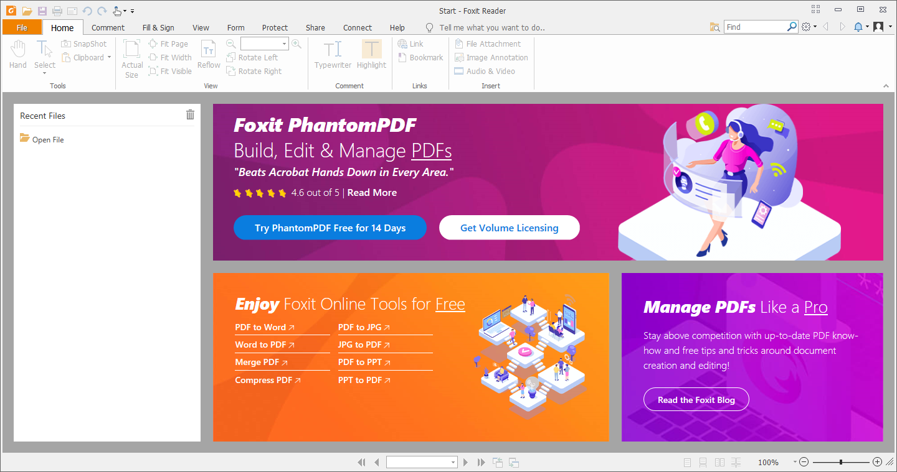

---
title: FoxitReader.exe | Foxit Reader 10.0
---

# FoxitReader.exe 

* File Path: `C:\program files (x86)\Foxit Software\Foxit Reader\FoxitReader.exe`
* Description: Foxit Reader 10.0

## Screenshot

## Hashes

Type | Hash
-- | --
MD5 | `DFDCCAC013E4EABC7DE39773C5113788`
SHA1 | `C45B1C5528B6555F260D292C557D8522DA8F8FD7`
SHA256 | `B32FCFE1B4AA4A789DC2F153F41C5AAC63C6F2B1A982220926224D404B6A98D8`
SHA384 | `0DBB2CAEDD85AEFB1ABF8C41DDE33B6E8714801BF4CA7DA3C7A70427F94C4E644779E0A399A2670A44C902FBEF22F143`
SHA512 | `9F5DD26147F46D9EE39B9D2DCE9AB26B41DEE5F3D4A70C685D04619F4448A9E8FB488CF37BB856CE5FA703294A487DD6DEE25D6CE75F539807BDC9C2DA0B634C`
SSDEEP | `1572864:Gv5pt8NKgCbHGtVHDmgG9toiOHoHPFhn1kL:Cpp2VHjdI12`

## Runtime Data

### Child Processes:
cmd.exe

### Window Title:
Foxit Reader

### Open Handles:

Path | Type
-- | --
(R-D)   C:\Windows\SysWOW64\en-US\msvfw32.dll.mui | File
(RW-)   C:\Users\user\Documents | File
(RW-)   C:\Windows | File
(RW-)   C:\Windows\WinSxS\x86_microsoft.windows.common-controls_6595b64144ccf1df_6.0.19041.1_none_fd031af45b0106f2 | File
(RW-)   C:\Windows\WinSxS\x86_microsoft.windows.gdiplus_6595b64144ccf1df_1.1.19041.450_none_4294d6e08a97344a | File
\BaseNamedObjects\__ComCatalogCache__ | Section
\BaseNamedObjects\NLS_CodePage_1252_3_2_0_0 | Section
\BaseNamedObjects\NLS_CodePage_437_3_2_0_0 | Section
\BaseNamedObjects\windows_shell_global_counters | Section
\Sessions\1\BaseNamedObjects\windows_shell_global_counters | Section
\Sessions\1\Windows\Theme4048709601 | Section
\Windows\Theme603176458 | Section

### Loaded Modules:

Path |
-- |
C:\program files (x86)\Foxit Software\Foxit Reader\FoxitReader.exe |
C:\Windows\SYSTEM32\ntdll.dll |
C:\Windows\System32\wow64.dll |
C:\Windows\System32\wow64cpu.dll |
C:\Windows\System32\wow64win.dll |

## Signature

* Status: Signature verified.
* Serial: `08404767E0D6C26CBD443F664AEF0A5C`
* Thumbprint: `45C6EB08FB79930455F7C26198AB61C7952B5447`
* Issuer: CN=DigiCert EV Code Signing CA, OU=www.digicert.com, O=DigiCert Inc, C=US
* Subject: CN=FOXIT SOFTWARE INC., O=FOXIT SOFTWARE INC., L=Fremont, S=California, C=US, SERIALNUMBER=C3105953, OID.2.5.4.15=Private Organization, OID.1.3.6.1.4.1.311.60.2.1.2=California, OID.1.3.6.1.4.1.311.60.2.1.3=US

## File Metadata

* Original Filename: Foxit Reader.EXE
* Product Name: Foxit Reader
* Company Name: Foxit Software Inc.
* File Version: 10.0.1.35811
* Product Version: 10.0.1.35811
* Language: Language Neutral
* Legal Copyright: Copyright  2004-2020 Foxit Software Inc. All Rights Reserved. 

MIT License. Copyright (c) 2020 Strontic.

