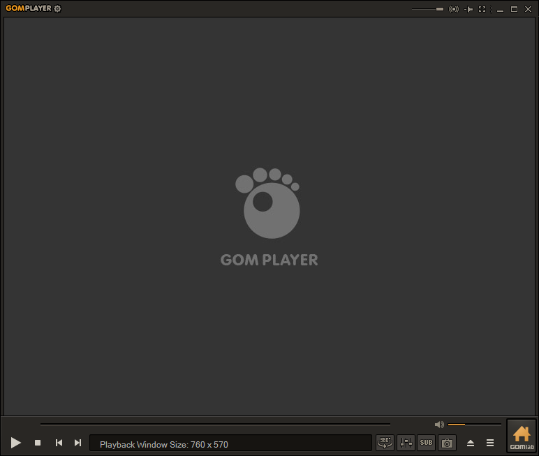

---
title: GOM.EXE | GOM Player
---

# GOM.EXE 

* File Path: `C:\program files (x86)\GRETECH\GomPlayer\GOM.EXE`
* Description: GOM Player

## Screenshot

## Hashes

Type | Hash
-- | --
MD5 | `A40CA1384C5CFC664262E51F64A92A05`
SHA1 | `713CAB1653FB077A75730C5085CD3CCE300EFD5D`
SHA256 | `6A6B79E55A6BF6370BF6C2837574CE81A17BC610A141809880ABE48D5C8E95F7`
SHA384 | `D010E11461FEF896290B9301E423D3A4AB07A33ABEBE45B7B820D214FB5299C7382D0F54E8C339343649AACFB61E09C5`
SHA512 | `B1CC49F891F8218AB4B972D1011F8E8BF8D82075B9AE5DFED001BA216D0EC2C745809E3191CDC51977DD1C63C8F09F5F84279D1504F0A0A4CD6D4256EC8FB5B0`
SSDEEP | `98304:e6bru9aA4lt/OcPcbm6n1yKvyckjuqdBTVJVKdTZ7Gz/qNBG39qdTogjLhKa2GmF:e6Xu2cm6n/6gdtnlJpKa2GVrHg`

## Runtime Data

### Child Processes:
GrLauncher.exe

### Window Title:
GOM Player

### Open Handles:

Path | Type
-- | --
(R-D)   C:\Windows\apppatch\DirectXApps_FOD.sdb | File
(R-D)   C:\Windows\Fonts\StaticCache.dat | File
(R-D)   C:\Windows\System32\en-US\ieframe.dll.mui | File
(R-D)   C:\Windows\System32\en-US\mshtml.dll.mui | File
(R-D)   C:\Windows\System32\en-US\mswsock.dll.mui | File
(R-D)   C:\Windows\System32\en-US\wdmaud.drv.mui | File
(R-D)   C:\Windows\SysWOW64\en-US\urlmon.dll.mui | File
(R-D)   C:\Windows\SysWOW64\ieframe.dll | File
(R-D)   C:\Windows\SysWOW64\stdole2.tlb | File
(RW-)   C:\ProgramData\GRETECH\GomPlayer\gomplayer.db | File
(RW-)   C:\Users\user\AppData\Local\Microsoft\Windows\INetCache\IE\LHC7XUA3\ad_txt[1].htm | File
(RW-)   C:\Users\user\AppData\Local\Microsoft\Windows\INetCache\IE\LHC7XUA3\update_eng[1].htm | File
(RW-)   C:\Users\user\Documents | File
(RW-)   C:\Windows | File
(RW-)   C:\Windows\WinSxS\x86_microsoft.windows.common-controls_6595b64144ccf1df_6.0.19041.1_none_fd031af45b0106f2 | File
(RW-)   C:\Windows\WinSxS\x86_microsoft.windows.gdiplus_6595b64144ccf1df_1.1.19041.450_none_4294d6e08a97344a | File
(RWD)   C:\Windows\Fonts\arialbd.ttf | File
(RWD)   C:\Windows\Fonts\micross.ttf | File
\BaseNamedObjects\__ComCatalogCache__ | Section
\BaseNamedObjects\F932B6C7-3A20-46A0-B8A0-8894AA421973 | Section
\BaseNamedObjects\NLS_CodePage_1252_3_2_0_0 | Section
\BaseNamedObjects\NLS_CodePage_437_3_2_0_0 | Section
\BaseNamedObjects\windows_shell_global_counters | Section
\Sessions\1\BaseNamedObjects\18c8HWNDInterface:1a028e | Section
\Sessions\1\BaseNamedObjects\18c8HWNDInterface:3702c4 | Section
\Sessions\1\BaseNamedObjects\18c8HWNDInterface:9e038e | Section
\Sessions\1\BaseNamedObjects\18c8HWNDInterface:a005c2 | Section
\Sessions\1\BaseNamedObjects\MSIMGSIZECacheMap | Section
\Sessions\1\BaseNamedObjects\UrlZonesSM_user | Section
\Sessions\1\BaseNamedObjects\windows_ie_global_counters | Section
\Sessions\1\BaseNamedObjects\windows_shell_global_counters | Section
\Sessions\1\BaseNamedObjects\windows_webcache_counters_{9B6AB5B3-91BC-4097-835C-EA2DEC95E9CC}_S-1-5-21-2047949552-857980807-821054962-504 | Section
\Sessions\1\Windows\Theme4048709601 | Section
\Windows\Theme603176458 | Section

### Loaded Modules:

Path |
-- |
C:\program files (x86)\GRETECH\GomPlayer\GOM.EXE |
C:\Windows\SYSTEM32\ntdll.dll |
C:\Windows\System32\wow64.dll |
C:\Windows\System32\wow64cpu.dll |
C:\Windows\System32\wow64win.dll |

## Signature

* Status: Signature verified.
* Serial: `59B4F88AACBE29B5C1AE3340C2C0F244`
* Thumbprint: `27CBF6A879C267D0DE44D0E0E5BF74DEFAF6A959`
* Issuer: CN=Symantec Class 3 SHA256 Code Signing CA, OU=Symantec Trust Network, O=Symantec Corporation, C=US
* Subject: CN=GRETECH, O=GRETECH, L=Gangnam-gu, S=Seoul, C=KR

## File Metadata

* Original Filename: Gom.EXE
* Product Name: GOMPLAYER
* Company Name: Gretech Corp.
* File Version: 2, 3, 14, 5270
* Product Version: 2, 3, 14, 5270
* Language: Korean (Korea)
* Legal Copyright: Copyright(C) Gretech Corp. All rights reserved. Since 2003

MIT License. Copyright (c) 2020 Strontic.

