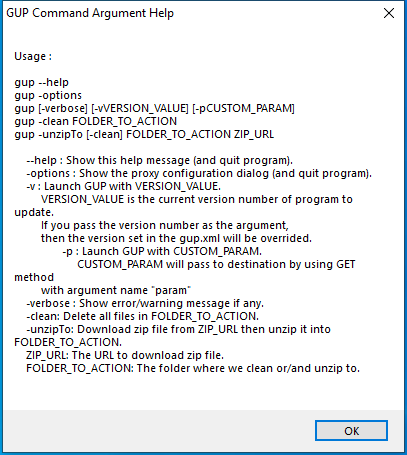

---
title: GUP.exe | WinGup for Notepad++
---

# GUP.exe 

* File Path: `C:\program files (x86)\Notepad++\updater\GUP.exe`
* Description: WinGup for Notepad++

## Screenshot

## Hashes

Type | Hash
-- | --
MD5 | `6C7A654714374E2CC0BEF20FD8CEE7A8`
SHA1 | `B8C9ECEE61595E2BE5448F29AD1B018B16522719`
SHA256 | `CE0685BEDEB6904488615F45764E8304CE1DD4DA4AE0200A4B2F6D14C1B91D49`
SHA384 | `E28E1D32338CD35724326EFB6161FBC409737438349C27195B0E4BCA76CD24AB157A65927B3C4EF6B38A33435546B531`
SHA512 | `50F58A629CEDF006030A03386DB204A6AD0AA60095B05A6B7308654C0BB4B535C5BF63467611549280E4EF51231D8A8FE2A0F86A62C80811448B8DA6DA60729C`
SSDEEP | `12288:punghTI6t+YN23yqb/f4J0MfWU5g2AefHqDRnCkbe583f+gzTrqQh2MvOuj:4nR3yE4J0IVS2AePWCkbJvTrqQhzWuj`

## Runtime Data

### Window Title:
GUP Command Argument Help

### Open Handles:

Path | Type
-- | --
(R-D)   C:\Windows\Fonts\StaticCache.dat | File
(RW-)   C:\Users\user\Documents | File
(RW-)   C:\Windows | File
(RW-)   C:\Windows\WinSxS\x86_microsoft.windows.common-controls_6595b64144ccf1df_6.0.19041.1_none_fd031af45b0106f2 | File
\BaseNamedObjects\NLS_CodePage_1252_3_2_0_0 | Section
\BaseNamedObjects\NLS_CodePage_437_3_2_0_0 | Section
\Sessions\1\Windows\Theme4048709601 | Section
\Windows\Theme603176458 | Section

### Loaded Modules:

Path |
-- |
C:\program files (x86)\Notepad++\updater\GUP.exe |
C:\Windows\SYSTEM32\ntdll.dll |
C:\Windows\System32\wow64.dll |
C:\Windows\System32\wow64cpu.dll |
C:\Windows\System32\wow64win.dll |

## Signature

* Status: Signature verified.
* Serial: `01342592A0010CB1109C11C0519CFD24`
* Thumbprint: `7649DC70ECA74657C1BAE0128492098AE47097FF`
* Issuer: CN=DigiCert SHA2 Assured ID Code Signing CA, OU=www.digicert.com, O=DigiCert Inc, C=US
* Subject: CN="Notepad++", O="Notepad++", L=Saint Cloud, S=Ile-de-France, C=FR

## File Metadata

* Original Filename: gup.exe
* Product Name: WinGup for Notepad++
* Company Name: Don HO don.h@free.fr
* File Version: 5.11
* Product Version: 5.11
* Language: English (United States)
* Legal Copyright: Copyright 2018 by Don HO

## Possible Misuse

*The following table contains possible examples of `GUP.exe` being misused. While `GUP.exe` is **not** inherently malicious, its legitimate functionality can by abused for malicious purposes.*

Source | Source File | Example | License
-- | -- | -- | --
[sigma](https://github.com/Neo23x0/sigma) | [win_susp_gup.yml](https://github.com/Neo23x0/sigma/blob/master/rules/windows/process_creation/win_susp_gup.yml) | `Image: '*\GUP.exe'` | [DRL 1.0](https://github.com/Neo23x0/sigma/blob/master/LICENSE.Detection.Rules.md)
[sigma](https://github.com/Neo23x0/sigma) | [win_susp_gup.yml](https://github.com/Neo23x0/sigma/blob/master/rules/windows/process_creation/win_susp_gup.yml) | `- 'C:\Users\\*\AppData\Local\Notepad++\updater\gup.exe'` | [DRL 1.0](https://github.com/Neo23x0/sigma/blob/master/LICENSE.Detection.Rules.md)
[sigma](https://github.com/Neo23x0/sigma) | [win_susp_gup.yml](https://github.com/Neo23x0/sigma/blob/master/rules/windows/process_creation/win_susp_gup.yml) | `- 'C:\Users\\*\AppData\Roaming\Notepad++\updater\gup.exe'` | [DRL 1.0](https://github.com/Neo23x0/sigma/blob/master/LICENSE.Detection.Rules.md)
[sigma](https://github.com/Neo23x0/sigma) | [win_susp_gup.yml](https://github.com/Neo23x0/sigma/blob/master/rules/windows/process_creation/win_susp_gup.yml) | `- 'C:\Program Files\Notepad++\updater\gup.exe'` | [DRL 1.0](https://github.com/Neo23x0/sigma/blob/master/LICENSE.Detection.Rules.md)
[sigma](https://github.com/Neo23x0/sigma) | [win_susp_gup.yml](https://github.com/Neo23x0/sigma/blob/master/rules/windows/process_creation/win_susp_gup.yml) | `- 'C:\Program Files (x86)\Notepad++\updater\gup.exe'` | [DRL 1.0](https://github.com/Neo23x0/sigma/blob/master/LICENSE.Detection.Rules.md)
[sigma](https://github.com/Neo23x0/sigma) | [win_susp_gup.yml](https://github.com/Neo23x0/sigma/blob/master/rules/windows/process_creation/win_susp_gup.yml) | `- Execution of tools named GUP.exe and located in folders different than Notepad++\updater` | [DRL 1.0](https://github.com/Neo23x0/sigma/blob/master/LICENSE.Detection.Rules.md)
[malware-ioc](https://github.com/eset/malware-ioc) | [amavaldo](https://github.com/eset/malware-ioc/blob/master/amavaldo/README.adoc) | `\| `FC37AC7523CF3B4020EC46D6A47BC26957E3C054` \| gup.exe           \| Abused legitimate application    \| Clean file                             \|` | [© ESET 2014-2018](https://github.com/eset/malware-ioc/blob/master/LICENSE)
[atomic-red-team](https://github.com/redcanaryco/atomic-red-team) | [index.md](https://github.com/redcanaryco/atomic-red-team/blob/master/atomics/Indexes/Indexes-Markdown/index.md) |   - Atomic Test #1: DLL Side-Loading using the Notepad++ GUP.exe binary [windows] | [MIT License. © 2018 Red Canary](https://github.com/redcanaryco/atomic-red-team/blob/master/LICENSE.txt)
[atomic-red-team](https://github.com/redcanaryco/atomic-red-team) | [windows-index.md](https://github.com/redcanaryco/atomic-red-team/blob/master/atomics/Indexes/Indexes-Markdown/windows-index.md) |   - Atomic Test #1: DLL Side-Loading using the Notepad++ GUP.exe binary [windows] | [MIT License. © 2018 Red Canary](https://github.com/redcanaryco/atomic-red-team/blob/master/LICENSE.txt)
[atomic-red-team](https://github.com/redcanaryco/atomic-red-team) | [T1574.002.md](https://github.com/redcanaryco/atomic-red-team/blob/master/atomics/T1574.002/T1574.002.md) | - [Atomic Test #1 - DLL Side-Loading using the Notepad++ GUP.exe binary](#atomic-test-1---dll-side-loading-using-the-notepad-gupexe-binary) | [MIT License. © 2018 Red Canary](https://github.com/redcanaryco/atomic-red-team/blob/master/LICENSE.txt)
[atomic-red-team](https://github.com/redcanaryco/atomic-red-team) | [T1574.002.md](https://github.com/redcanaryco/atomic-red-team/blob/master/atomics/T1574.002/T1574.002.md) | ## Atomic Test #1 - DLL Side-Loading using the Notepad++ GUP.exe binary | [MIT License. © 2018 Red Canary](https://github.com/redcanaryco/atomic-red-team/blob/master/LICENSE.txt)
[atomic-red-team](https://github.com/redcanaryco/atomic-red-team) | [T1574.002.md](https://github.com/redcanaryco/atomic-red-team/blob/master/atomics/T1574.002/T1574.002.md) | \| gup_executable \| GUP is an open source signed binary used by Notepad++ for software updates \| path \| PathToAtomicsFolder&#92;T1574.002&#92;bin&#92;GUP.exe\| | [MIT License. © 2018 Red Canary](https://github.com/redcanaryco/atomic-red-team/blob/master/LICENSE.txt)
[atomic-red-team](https://github.com/redcanaryco/atomic-red-team) | [T1574.002.md](https://github.com/redcanaryco/atomic-red-team/blob/master/atomics/T1574.002/T1574.002.md) | ##### Description: Gup.exe binary must exist on disk at specified location (#{gup_executable}) | [MIT License. © 2018 Red Canary](https://github.com/redcanaryco/atomic-red-team/blob/master/LICENSE.txt)
[atomic-red-team](https://github.com/redcanaryco/atomic-red-team) | [T1574.002.md](https://github.com/redcanaryco/atomic-red-team/blob/master/atomics/T1574.002/T1574.002.md) | Invoke-WebRequest "https://github.com/redcanaryco/atomic-red-team/blob/master/atomics/T1574.002/bin/GUP.exe" -OutFile "#{gup_executable}" | [MIT License. © 2018 Red Canary](https://github.com/redcanaryco/atomic-red-team/blob/master/LICENSE.txt)

MIT License. Copyright (c) 2020 Strontic.

