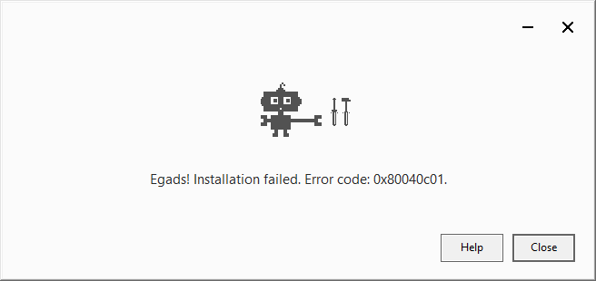

---
title: GoogleUpdate.exe | Google Installer
excerpt: What is GoogleUpdate.exe?
---

# GoogleUpdate.exe 

* File Path: `C:\Program Files (x86)\Google\Update\GoogleUpdate.exe`
* Description: Google Installer

## Screenshot

## Hashes

Type | Hash
-- | --
MD5 | `0BCA3F16DD527B4150648EC1E36CB22A`
SHA1 | `842AE39880C3C0BC501007B42949950C3D3B7ED3`
SHA256 | `B60E92004D394D0B14A8953A2BA29951C79F2F8A6C94F495E3153DFBBEF115B6`
SHA384 | `A1257A0BF9BA3661676092ADA2AF2150A0B6B0FDED103F99E5B67C79316624B50A02D2B94C802C2CB0B535006854F936`
SHA512 | `516E1C9313AAF1D49223A3C06677BDBE5E4F9DF392C12696A9EEB086634CF60C42A9C330E2D1095F1E6FDD1F16D2A6A13C9D28110155469159F0959897DFF164`
SSDEEP | `3072:UAt2Sk2m5oyiTOZQvfSERdX9Zk8AtB+llojrWTMK12XdjWtVAlR8yVciqFltCT34:IxwjRsB+Fqo`
IMP | `7DF1816239C5BC855600D41210406C5B`
PESHA1 | `42596256C2B9532A871A70303D5819FCB3716F6D`
PE256 | `6C38B49D18CDD85F379E75FF08D524E7F048A75A3AAF5E9A514F219017BE654A`

## Runtime Data

### Window Title:
Google Update Installer

### Open Handles:

Path | Type
-- | --
(R-D)   C:\Windows\Fonts\StaticCache.dat | File
(R-D)   C:\Windows\SysWOW64\en-US\user32.dll.mui | File
(RW-)   C:\Program Files (x86)\Google\Update\1.3.35.452 | File
(RW-)   C:\Windows | File
(RW-)   C:\Windows\WinSxS\x86_microsoft.windows.common-controls_6595b64144ccf1df_6.0.19041.488_none_11b1e5df2ffd8627 | File
\BaseNamedObjects\NLS_CodePage_1252_3_2_0_0 | Section
\BaseNamedObjects\NLS_CodePage_437_3_2_0_0 | Section
\Sessions\1\BaseNamedObjects\windows_shell_global_counters | Section
\Sessions\1\Windows\Theme2547664911 | Section
\Windows\Theme3854699184 | Section

### Loaded Modules:

Path |
-- |
C:\Program Files (x86)\Google\Update\GoogleUpdate.exe |
C:\Windows\SYSTEM32\ntdll.dll |
C:\Windows\System32\wow64.dll |
C:\Windows\System32\wow64cpu.dll |
C:\Windows\System32\wow64win.dll |

## Signature

* Status: Signature verified.
* Serial: `06AEA76BAC46A9E8CFE6D29E45AAF033`
* Thumbprint: `A3958AE522F3C54B878B20D7B0F63711E08666B2`
* Issuer: CN=DigiCert Assured ID Code Signing CA-1, OU=www.digicert.com, O=DigiCert Inc, C=US
* Subject: CN=Google LLC, O=Google LLC, L=Mountain View, S=California, C=US

## File Metadata

* Original Filename: GoogleUpdate.exe
* Product Name: Google Update
* Company Name: Google LLC
* File Version: 1.3.35.451
* Product Version: 1.3.35.451
* Language: English (United States)
* Legal Copyright: Copyright 2018 Google LLC
* Machine Type: 32-bit

## File Scan

* VirusTotal Detections: 0/70
* VirusTotal Link: https://www.virustotal.com/gui/file/b60e92004d394d0b14a8953a2ba29951c79f2f8a6c94f495e3153dfbbef115b6/detection/

## File Similarity (ssdeep match)

File | Score
-- | --
[C:\Program Files (x86)\Google\Update\1.3.35.452\GoogleUpdate.exe](GoogleUpdate.exe-0BCA3F16DD527B4150648EC1E36CB22A.md) | 100

## Possible Misuse

*The following table contains possible examples of `GoogleUpdate.exe` being misused. While `GoogleUpdate.exe` is **not** inherently malicious, its legitimate functionality can by abused for malicious purposes.*

Source | Source File | Example | License
-- | -- | -- | --
[sigma](https://github.com/Neo23x0/sigma) | [win_alert_lsass_access.yml](https://github.com/Neo23x0/sigma/blob/master/rules/windows/builtin/win_alert_lsass_access.yml) | `- Google Chrome GoogleUpdate.exe` | [DRL 1.0](https://github.com/Neo23x0/sigma/blob/master/LICENSE.Detection.Rules.md)
[sigma](https://github.com/Neo23x0/sigma) | [win_apt_apt29_tor.yml](https://github.com/Neo23x0/sigma/blob/master/rules/windows/builtin/win_apt_apt29_tor.yml) | `description: This method detects malicious services mentioned in APT29 report by FireEye. The legitimate path for the Google update service is C:\Program Files (x86)\Google\Update\GoogleUpdate.exe` | [DRL 1.0](https://github.com/Neo23x0/sigma/blob/master/LICENSE.Detection.Rules.md)
[sigma](https://github.com/Neo23x0/sigma) | [win_apt_apt29_tor.yml](https://github.com/Neo23x0/sigma/blob/master/rules/windows/builtin/win_apt_apt29_tor.yml) | `- 'C:\Program Files(x86)\Google\GoogleUpdate.exe'` | [DRL 1.0](https://github.com/Neo23x0/sigma/blob/master/LICENSE.Detection.Rules.md)
[LOLBAS](https://github.com/LOLBAS-Project/LOLBAS) | [Wmic.yml](https://github.com/LOLBAS-Project/LOLBAS/blob/master/yml/OSBinaries/Wmic.yml) | `- Command: wmic.exe /node:REMOTECOMPUTERNAME PROCESS call create "at 9:00PM c:\GoogleUpdate.exe ^> c:\notGoogleUpdateResults.txt"` | 
[LOLBAS](https://github.com/LOLBAS-Project/LOLBAS) | [Wmic.yml](https://github.com/LOLBAS-Project/LOLBAS/blob/master/yml/OSBinaries/Wmic.yml) | `Description: Create a scheduled execution of C:\GoogleUpdate.exe to run at 9pm.` | 
[malware-ioc](https://github.com/eset/malware-ioc) | [misp-machete-event.json](https://github.com/eset/malware-ioc/blob/master/machete/misp-machete-event.json) | `"value": "GoogleUpdate.exe",` | [© ESET 2014-2018](https://github.com/eset/malware-ioc/blob/master/LICENSE)
[malware-ioc](https://github.com/eset/malware-ioc) | [machete](https://github.com/eset/malware-ioc/blob/master/machete/README.adoc) | `=== GoogleUpdate.exe` | [© ESET 2014-2018](https://github.com/eset/malware-ioc/blob/master/LICENSE)
[signature-base](https://github.com/Neo23x0/signature-base) | [gen_google_anomaly.yar](https://github.com/Neo23x0/signature-base/blob/master/yara/gen_google_anomaly.yar) | description = "Detects suspicious unsigned GoogleUpdate.exe" | [CC BY-NC 4.0](https://github.com/Neo23x0/signature-base/blob/master/LICENSE)
[signature-base](https://github.com/Neo23x0/signature-base) | [gen_google_anomaly.yar](https://github.com/Neo23x0/signature-base/blob/master/yara/gen_google_anomaly.yar) | /* OriginalName GoogleUpdate.exe */ | [CC BY-NC 4.0](https://github.com/Neo23x0/signature-base/blob/master/LICENSE)

MIT License. Copyright (c) 2020 Strontic.

