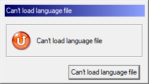

---
title: GrLauncher.exe | GrLauncher
excerpt: What is GrLauncher.exe?
---

# GrLauncher.exe 

* File Path: `C:\Program Files (x86)\GRETECH\GomPlayer\GrLauncher.exe`
* Description: GrLauncher

## Screenshot

## Hashes

Type | Hash
-- | --
MD5 | `C814F03DF271718377D1AB5A6BAC84D2`
SHA1 | `EAF531CDFB1FF814F9B6586AF43A3BD98DB413DB`
SHA256 | `CF59178409BA74C50D38B21D2EE02EA8F52F9AD955E35D455338DD85AF270CCA`
SHA384 | `735257D3876155CA0C0FC98849C72098A6C24D434FB022CEB2A5B9AF18EAB6010F411D6BE83460F3F94341277B4650EF`
SHA512 | `4A79EC7C6C52B763C76C1453FFB86FB8DA2BAD75C07DECFD55809ECA5DACD9E867737339278398A69B3A4C64A2C32B52C04B8E9510BD481EC1D1434C2F1CBD78`
SSDEEP | `49152:MIyddRh55Lv/EJysoON96j4+p2d7HH27TAklktncVfknOh:MtvRh55L3EJsON96j4+p2dy7TtlktncZ`
IMP | `A69C8F28BC664CB6661733193E3E9AAD`
PESHA1 | `5EB843184F5BA762F756A1BBC4A749FDC8B4689D`
PE256 | `B745B74025C6EC3EAFD7358C3F46536D602B4F9B3BD916EB8DEA66D21D79B40F`

## Runtime Data

### Window Title:
Can't load language file

### Open Handles:

Path | Type
-- | --
(R-D)   C:\Windows\Fonts\StaticCache.dat | File
(RW-)   C:\Program Files (x86)\GRETECH\GomPlayer | File
(RW-)   C:\Windows | File
(RW-)   C:\Windows\WinSxS\x86_microsoft.windows.common-controls_6595b64144ccf1df_5.82.19041.488_none_89e6152f0b32762e | File
\BaseNamedObjects\NLS_CodePage_1252_3_2_0_0 | Section
\BaseNamedObjects\NLS_CodePage_437_3_2_0_0 | Section
\Sessions\1\Windows\Theme2547664911 | Section
\Windows\Theme3854699184 | Section

### Loaded Modules:

Path |
-- |
C:\Program Files (x86)\GRETECH\GomPlayer\GrLauncher.exe |
C:\Windows\SYSTEM32\ntdll.dll |
C:\Windows\System32\wow64.dll |
C:\Windows\System32\wow64cpu.dll |
C:\Windows\System32\wow64win.dll |

## Signature

* Status: Signature verified.
* Serial: `59B4F88AACBE29B5C1AE3340C2C0F244`
* Thumbprint: `27CBF6A879C267D0DE44D0E0E5BF74DEFAF6A959`
* Issuer: CN=Symantec Class 3 SHA256 Code Signing CA, OU=Symantec Trust Network, O=Symantec Corporation, C=US
* Subject: CN=GRETECH, O=GRETECH, L=Gangnam-gu, S=Seoul, C=KR

## File Metadata

* Original Filename: GrLaunch.exe
* Product Name: GrLauncher
* Company Name: Gretech Corporation
* File Version: 2.1.0.7
* Product Version: 2.1.0.7
* Language: Korean (Korea)
* Legal Copyright: Copyright(C) Gretech Corp. All rights reserved. Since 2003
* Machine Type: 32-bit

## File Scan

* VirusTotal Detections: 0/71
* VirusTotal Link: https://www.virustotal.com/gui/file/cf59178409ba74c50d38b21d2ee02ea8f52f9ad955e35d455338dd85af270cca/detection/

MIT License. Copyright (c) 2020-2021 Strontic.

