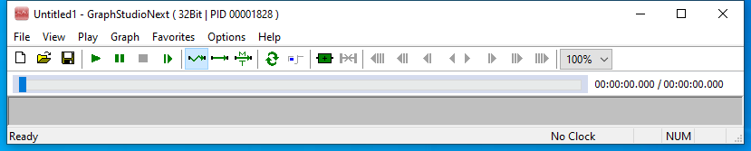

---
title: GraphStudioNext.exe | GraphStudioNext
excerpt: What is GraphStudioNext.exe?
---

# GraphStudioNext.exe 

* File Path: `C:\Program Files (x86)\K-Lite Codec Pack\Tools\GraphStudioNext.exe`
* Description: GraphStudioNext

## Screenshot

## Hashes

Type | Hash
-- | --
MD5 | `DADF6116745CA6D510860BEAA8ED0F77`
SHA1 | `81D545E1A88D9747D597F23B9A230036D698E250`
SHA256 | `011623C1DBC6054A911AE88E892CCB454AAD402240D6A94DAF23BB9AA8971C10`
SHA384 | `7FED9993EAA4E817761EE1E287E7F79FBE600C5DF7DCB19471E41AE6369896EF20EC7263495CCF71882AF63501C91FE0`
SHA512 | `17A00823CBE536F553D10356AB0371CAC79C53F561A15E4A7D801EB66F18C49258DE18C32C75F69E616C4B847614C3B52A862D9BF833D8A125DD5989BBB4A8FA`
SSDEEP | `98304:Vq8BRavLUbkzepHQiEDP9FvMjDwEoJdZIx9bOTFFrG:VTMvIAlDPrMPadZIxoTTr`
IMP | `6490C9E3D4C4C39CAE2280D81A9D1456`
PESHA1 | `70E9CAA317B1AA3AE1EE90386A8F633DEDC28F09`
PE256 | `47E1ED1D9C8406411D062D9C0A0B86097D792795F5C176CF3FC76E19AC9DE988`

## Runtime Data

### Window Title:
Untitled1 - GraphStudioNext ( 32Bit | PID 000006cc )

### Open Handles:

Path | Type
-- | --
(R-D)   C:\Windows\Fonts\StaticCache.dat | File
(R-D)   C:\Windows\SystemResources\imageres.dll.mun | File
(R-D)   C:\Windows\SysWOW64\en-US\msvfw32.dll.mui | File
(RW-)   C:\Windows | File
(RW-)   C:\Windows\WinSxS\x86_microsoft.windows.common-controls_6595b64144ccf1df_6.0.19041.488_none_11b1e5df2ffd8627 | File
(RW-)   C:\Windows\WinSxS\x86_microsoft.windows.gdiplus_6595b64144ccf1df_1.1.19041.508_none_429cdbca8a8ffa94 | File
(RW-)   C:\xCyclopedia | File
\BaseNamedObjects\__ComCatalogCache__ | Section
\BaseNamedObjects\NLS_CodePage_1252_3_2_0_0 | Section
\BaseNamedObjects\NLS_CodePage_437_3_2_0_0 | Section
\Sessions\1\BaseNamedObjects\AMResourceMapping3-0000-0x000780 | Section
\Sessions\1\Windows\Theme2547664911 | Section
\Windows\Theme3854699184 | Section

### Loaded Modules:

Path |
-- |
C:\Program Files (x86)\K-Lite Codec Pack\Tools\GraphStudioNext.exe |
C:\Windows\SYSTEM32\ntdll.dll |
C:\Windows\System32\wow64.dll |
C:\Windows\System32\wow64cpu.dll |
C:\Windows\System32\wow64win.dll |

## Signature

* Status: The file C:\Program Files (x86)\K-Lite Codec Pack\Tools\GraphStudioNext.exe is not digitally signed. You cannot run this script on the current system. For more information about running scripts and setting execution policy, see about_Execution_Policies at https:/go.microsoft.com/fwlink/?LinkID=135170
* Serial: ``
* Thumbprint: ``
* Issuer: 
* Subject: 

## File Metadata

* Original Filename: graphstudionext.exe
* Product Name: 
* Company Name: 
* File Version: 0.7.1.59
* Product Version: 0.7.1.59
* Language: English
* Legal Copyright: 
* Machine Type: 32-bit

## File Scan

* VirusTotal Detections: 0/67
* VirusTotal Link: https://www.virustotal.com/gui/file/011623c1dbc6054a911ae88e892ccb454aad402240d6a94daf23bb9aa8971c10/detection/

MIT License. Copyright (c) 2020 Strontic.

