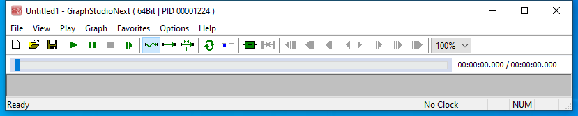

---
title: GraphStudioNext64.exe | GraphStudioNext
excerpt: What is GraphStudioNext64.exe?
---

# GraphStudioNext64.exe 

* File Path: `C:\Program Files (x86)\K-Lite Codec Pack\Tools\GraphStudioNext64.exe`
* Description: GraphStudioNext

## Screenshot

## Hashes

Type | Hash
-- | --
MD5 | `C383DEF4CB81FB1FA74E0D9FC8C2F76B`
SHA1 | `639348067775022D22BE41624E1B538CD590C160`
SHA256 | `2B1AFEF8DA6E022C5F4A7BD54001523BEBAF0904E6B342BF81ED1C6DBAB8D368`
SHA384 | `F95B86A049A28536A80D9BED7A59C34DC8CA12548C81440D5006BE2B05D3CD410D075C4B0D428FC674EDB10B2107632D`
SHA512 | `0BE5F5D6ADE82939F5CF9BA5DFDA861F2E9D1BE6C89B5623DF75B6B34AA0A8F27B7E5EC0D819A74D1B324F9B54DB69C27C9CA5E551E3725BD1E584A3A2DF4B67`
SSDEEP | `49152:IHBg9CFE46mt0aLIGVwdeZZnO26azTlxxmGxKui4Xr8dNhB+ELVpjyGo6bBnlLdR:a7nrX8dNPVLVQef5cEd/KA`
IMP | `0816F70D245BD37C5A2BDB92CF806F0E`
PESHA1 | `9E4826FFD2F4E2CAD160C64C05449ABFA1C923DE`
PE256 | `3CE8FB165B24DE129D51194892A3915F923EBA4171B424DE654783BE618E8219`

## Runtime Data

### Window Title:
Untitled1 - GraphStudioNext ( 64Bit | PID 000012d4 )

### Open Handles:

Path | Type
-- | --
(R-D)   C:\Windows\Fonts\StaticCache.dat | File
(R-D)   C:\Windows\SystemResources\imageres.dll.mun | File
(RW-)   C:\Windows\WinSxS\amd64_microsoft.windows.common-controls_6595b64144ccf1df_6.0.19041.488_none_ca04af081b815d21 | File
(RW-)   C:\Windows\WinSxS\amd64_microsoft.windows.gdiplus_6595b64144ccf1df_1.1.19041.508_none_faefa4f37613d18e | File
(RW-)   C:\xCyclopedia | File
\BaseNamedObjects\__ComCatalogCache__ | Section
\BaseNamedObjects\NLS_CodePage_1252_3_2_0_0 | Section
\BaseNamedObjects\NLS_CodePage_437_3_2_0_0 | Section
\Sessions\1\BaseNamedObjects\AMResourceMapping3-0x09-0x000780 | Section
\Sessions\1\Windows\Theme2547664911 | Section
\Windows\Theme3854699184 | Section

### Loaded Modules:

Path |
-- |
C:\Program Files (x86)\K-Lite Codec Pack\Tools\GraphStudioNext64.exe |
C:\Windows\System32\ADVAPI32.dll |
C:\Windows\System32\bcrypt.dll |
C:\Windows\System32\combase.dll |
C:\Windows\System32\GDI32.dll |
C:\Windows\System32\gdi32full.dll |
C:\Windows\System32\IMM32.dll |
C:\Windows\System32\KERNEL32.DLL |
C:\Windows\System32\KERNELBASE.dll |
C:\Windows\SYSTEM32\msdmo.dll |
C:\Windows\SYSTEM32\MSIMG32.dll |
C:\Windows\System32\msvcp_win.dll |
C:\Windows\System32\msvcrt.dll |
C:\Windows\SYSTEM32\ntdll.dll |
C:\Windows\System32\ole32.dll |
C:\Windows\SYSTEM32\OLEACC.dll |
C:\Windows\System32\OLEAUT32.dll |
C:\Windows\SYSTEM32\oledlg.dll |
C:\Windows\System32\PSAPI.DLL |
C:\Windows\SYSTEM32\QUARTZ.dll |
C:\Windows\System32\RPCRT4.dll |
C:\Windows\System32\sechost.dll |
C:\Windows\System32\SHELL32.dll |
C:\Windows\System32\SHLWAPI.dll |
C:\Windows\System32\ucrtbase.dll |
C:\Windows\System32\USER32.dll |
C:\Windows\SYSTEM32\UxTheme.dll |
C:\Windows\SYSTEM32\VERSION.dll |
C:\Windows\System32\win32u.dll |
C:\Windows\SYSTEM32\windows.storage.dll |
C:\Windows\SYSTEM32\WINMM.dll |
C:\Windows\SYSTEM32\WINSPOOL.DRV |
C:\Windows\SYSTEM32\Wldp.dll |
C:\Windows\System32\WS2_32.dll |
C:\Windows\SYSTEM32\XmlLite.dll |
C:\Windows\WinSxS\amd64_microsoft.windows.common-controls_6595b64144ccf1df_6.0.19041.488_none_ca04af081b815d21\COMCTL32.dll |
C:\Windows\WinSxS\amd64_microsoft.windows.gdiplus_6595b64144ccf1df_1.1.19041.508_none_faefa4f37613d18e\gdiplus.dll |

## Signature

* Status: The file C:\Program Files (x86)\K-Lite Codec Pack\Tools\GraphStudioNext64.exe is not digitally signed. You cannot run this script on the current system. For more information about running scripts and setting execution policy, see about_Execution_Policies at https:/go.microsoft.com/fwlink/?LinkID=135170
* Serial: ``
* Thumbprint: ``
* Issuer: 
* Subject: 

## File Metadata

* Original Filename: graphstudionext.exe
* Product Name: 
* Company Name: 
* File Version: 0.7.1.59
* Product Version: 0.7.1.59
* Language: English
* Legal Copyright: 
* Machine Type: 64-bit

## File Scan

* VirusTotal Detections: 0/69
* VirusTotal Link: https://www.virustotal.com/gui/file/2b1afef8da6e022c5f4a7bd54001523bebaf0904e6b342bf81ed1c6dbab8d368/detection/

MIT License. Copyright (c) 2020-2021 Strontic.

