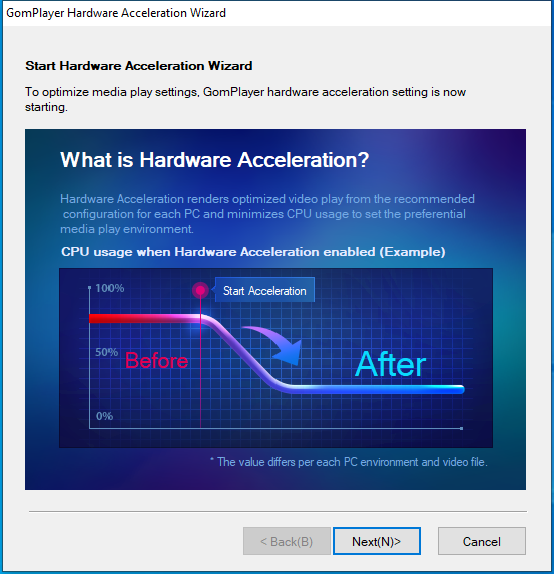

---
title: HWAccelWzd.exe | Hardwear Accelerator Wizard
excerpt: What is HWAccelWzd.exe?
---

# HWAccelWzd.exe 

* File Path: `C:\Program Files (x86)\GRETECH\GomPlayer\HWAccelWzd.exe`
* Description: Hardwear Accelerator Wizard

## Screenshot

## Hashes

Type | Hash
-- | --
MD5 | `8FB346D9F02DC1DD704BC57495A3C6ED`
SHA1 | `856B941C2A195A4B5F61D1F0D7AAB44F04816F8F`
SHA256 | `F9BF6C89B443EA12D4AF8A6A58FEFF064542FEEC3E482DFD265D6B245D994F1D`
SHA384 | `72AD3AFDC8268E6D81B5110013B243ACF3381CA552EC7073DCE4812653B66B848B38C2E00CBDB51177F14CCE9BC2E735`
SHA512 | `A0A02DA562AD97FA22449E7BEDFB30CDCBF9DA012EA152225440AA856C8415B0A6E148B67C45B92110B518BEE654BFEDCB4441EBC49DD5E1B523411C845FA193`
SSDEEP | `98304:sfFi9E41XHL7r1sppNp9vsxBGaXUFLOAkGkzdnEVomFHKnPR3:SFoJMsxBGaXUFLOyomFHKnPR3`
IMP | `C1B38156B522164CFA7318D40ED54396`
PESHA1 | `67C74DA2893241076CF7F8B0102D33EFC79C2F0E`
PE256 | `C2DC4BE263C5BD8343487E1EBDAB8E9B60F3449DDD1BF8CD1C82B01F6289E297`

## Runtime Data

### Window Title:
GomPlayer Hardware Acceleration Wizard

### Open Handles:

Path | Type
-- | --
(R-D)   C:\Windows\Fonts\StaticCache.dat | File
(RW-)   C:\Windows | File
(RW-)   C:\Windows\WinSxS\x86_microsoft.windows.common-controls_6595b64144ccf1df_6.0.19041.488_none_11b1e5df2ffd8627 | File
(RW-)   C:\Windows\WinSxS\x86_microsoft.windows.gdiplus_6595b64144ccf1df_1.1.19041.508_none_429cdbca8a8ffa94 | File
(RW-)   C:\xCyclopedia | File
\BaseNamedObjects\NLS_CodePage_1252_3_2_0_0 | Section
\BaseNamedObjects\NLS_CodePage_437_3_2_0_0 | Section
\Sessions\1\BaseNamedObjects\windows_shell_global_counters | Section
\Sessions\1\Windows\Theme2547664911 | Section
\Windows\Theme3854699184 | Section

### Loaded Modules:

Path |
-- |
C:\Program Files (x86)\GRETECH\GomPlayer\HWAccelWzd.exe |
C:\Windows\SYSTEM32\ntdll.dll |
C:\Windows\System32\wow64.dll |
C:\Windows\System32\wow64cpu.dll |
C:\Windows\System32\wow64win.dll |

## Signature

* Status: Signature verified.
* Serial: `59B4F88AACBE29B5C1AE3340C2C0F244`
* Thumbprint: `27CBF6A879C267D0DE44D0E0E5BF74DEFAF6A959`
* Issuer: CN=Symantec Class 3 SHA256 Code Signing CA, OU=Symantec Trust Network, O=Symantec Corporation, C=US
* Subject: CN=GRETECH, O=GRETECH, L=Gangnam-gu, S=Seoul, C=KR

## File Metadata

* Original Filename: HWAccelWzd.exe
* Product Name: Hardwear Accelerator Wizard
* Company Name: Gretech Corp.
* File Version: 1.1.0.1
* Product Version: 1.1.0.1
* Language: English (United States)
* Legal Copyright: Copyright(c) Gretech Corp.  All rights reserved.
* Machine Type: 32-bit

## File Scan

* VirusTotal Detections: 0/66
* VirusTotal Link: https://www.virustotal.com/gui/file/f9bf6c89b443ea12d4af8a6a58feff064542feec3e482dfd265d6b245d994f1d/detection/

## File Similarity (ssdeep match)

File | Score
-- | --
[C:\Program Files (x86)\CutePDF Writer\CutePDFWriter.exe](CutePDFWriter.exe-E668E5AA2F72153E51B9483C8F16F984.md) | 36

MIT License. Copyright (c) 2020-2021 Strontic.

