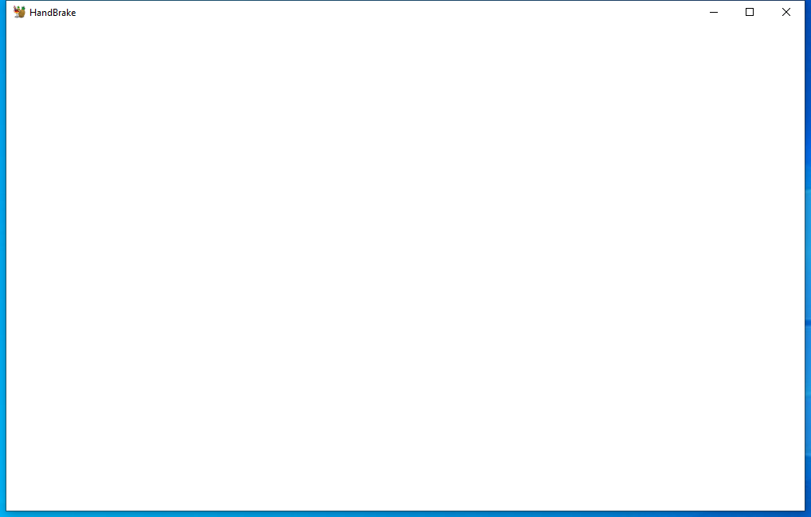

---
title: HandBrake.exe | HandBrake
excerpt: What is HandBrake.exe?
---

# HandBrake.exe 

* File Path: `C:\Program Files\HandBrake\HandBrake.exe`
* Description: HandBrake
* Comments: HandBrake is an open-source, GPL-licensed, multiplatform,video transcoder.

## Screenshot

## Hashes

Type | Hash
-- | --
MD5 | `59AA1817D1C8FC64000FA6E73DB2A66F`
SHA1 | `7DFF68362FCC7FA0DB52A35D296716DAF9670F0E`
SHA256 | `22B30EF8DBC10BB21098E372CB15825711773B86403E7294A501404E5F642AD2`
SHA384 | `69508F3AD9663F5C4E02F1586F73766C8550130708B20C78AAA2019EE6DBC98FCFF1626ECF1C0FCC81C36C5CA20DABAA`
SHA512 | `02809535610FD29163E6E41C3C286ABFF7F1887FECED045BA1D3BE907ADD5B35F9D1E2A81D6E422E6F48CA099AC0DA8E12719061BA2C9060B62B12B92EAC8C34`
SSDEEP | `12288:CeWNKub9l5JCLZUA5EgsIH5iqsFARJJo9Y5MkvpEaun7Y5MkvpEkG:tWNKuhYNzEgsIpRJJo9iyTiykG`
PESHA1 | `A4BDD7DDC9B942D391D2D086B113D6A82840AA9F`
PE256 | `463AA0D939647E7F281822ECDC44D7A86E1C62B79D21846F1689564224DE34B8`

## Runtime Data

### Open Handles:

Path | Type
-- | --
(R--)   C:\Users\user\AppData\Roaming\HandBrake\logs\activity_log1304.txt | File
(R-D)   C:\Program Files\HandBrake\Caliburn.Micro.dll | File
(R-D)   C:\Program Files\HandBrake\Caliburn.Micro.Platform.Core.dll | File
(R-D)   C:\Program Files\HandBrake\Caliburn.Micro.Platform.dll | File
(R-D)   C:\Program Files\HandBrake\GongSolutions.WPF.DragDrop.dll | File
(R-D)   C:\Program Files\HandBrake\HandBrake.Interop.dll | File
(R-D)   C:\Program Files\HandBrake\Newtonsoft.Json.dll | File
(R-D)   C:\Program Files\HandBrake\System.Windows.Interactivity.dll | File
(R-D)   C:\Windows\Microsoft.NET\assembly\GAC_64\System.Data\v4.0_4.0.0.0__b77a5c561934e089\System.Data.dll | File
(R-D)   C:\Windows\Microsoft.NET\assembly\GAC_MSIL\PresentationFramework.Aero2\v4.0_4.0.0.0__31bf3856ad364e35\PresentationFramework.Aero2.dll | File
(R-D)   C:\Windows\Microsoft.NET\assembly\GAC_MSIL\PresentationFramework-SystemData\v4.0_4.0.0.0__b77a5c561934e089\PresentationFramework-SystemData.dll | File
(R-D)   C:\Windows\Microsoft.NET\assembly\GAC_MSIL\PresentationFramework-SystemXml\v4.0_4.0.0.0__b77a5c561934e089\PresentationFramework-SystemXml.dll | File
(R-D)   C:\Windows\Microsoft.NET\assembly\GAC_MSIL\System.Collections\v4.0_4.0.0.0__b03f5f7f11d50a3a\System.Collections.dll | File
(R-D)   C:\Windows\Microsoft.NET\assembly\GAC_MSIL\System.Linq.Expressions\v4.0_4.0.0.0__b03f5f7f11d50a3a\System.Linq.Expressions.dll | File
(R-D)   C:\Windows\Microsoft.NET\assembly\GAC_MSIL\System.Linq\v4.0_4.0.0.0__b03f5f7f11d50a3a\System.Linq.dll | File
(R-D)   C:\Windows\Microsoft.NET\assembly\GAC_MSIL\System.Management\v4.0_4.0.0.0__b03f5f7f11d50a3a\System.Management.dll | File
(R-D)   C:\Windows\Microsoft.NET\assembly\GAC_MSIL\System.ObjectModel\v4.0_4.0.0.0__b03f5f7f11d50a3a\System.ObjectModel.dll | File
(R-D)   C:\Windows\Microsoft.NET\assembly\GAC_MSIL\System.Reflection.Extensions\v4.0_4.0.0.0__b03f5f7f11d50a3a\System.Reflection.Extensions.dll | File
(R-D)   C:\Windows\Microsoft.NET\assembly\GAC_MSIL\System.Reflection\v4.0_4.0.0.0__b03f5f7f11d50a3a\System.Reflection.dll | File
(R-D)   C:\Windows\Microsoft.NET\assembly\GAC_MSIL\System.Resources.ResourceManager\v4.0_4.0.0.0__b03f5f7f11d50a3a\System.Resources.ResourceManager.dll | File
(R-D)   C:\Windows\Microsoft.NET\assembly\GAC_MSIL\System.Runtime.Serialization.Primitives\v4.0_4.0.0.0__b03f5f7f11d50a3a\System.Runtime.Serialization.Primitives.dll | File
(R-D)   C:\Windows\Microsoft.NET\assembly\GAC_MSIL\System.Runtime\v4.0_4.0.0.0__b03f5f7f11d50a3a\System.Runtime.dll | File
(R-D)   C:\Windows\Microsoft.NET\assembly\GAC_MSIL\System.Text.RegularExpressions\v4.0_4.0.0.0__b03f5f7f11d50a3a\System.Text.RegularExpressions.dll | File
(R-D)   C:\Windows\Microsoft.NET\assembly\GAC_MSIL\System.Threading.Tasks\v4.0_4.0.0.0__b03f5f7f11d50a3a\System.Threading.Tasks.dll | File
(R-D)   C:\Windows\Microsoft.NET\assembly\GAC_MSIL\System.Threading\v4.0_4.0.0.0__b03f5f7f11d50a3a\System.Threading.dll | File
(R-D)   C:\Windows\System32\en-US\msctfui.dll.mui | File
(R-D)   C:\Windows\System32\en-US\UIAutomationCore.dll.mui | File
(RW-)   C:\Windows\System32 | File
(RW-)   C:\xCyclopedia | File
\...\Cor_SxSPublic_IPCBlock | Section
\BaseNamedObjects\__ComCatalogCache__ | Section
\BaseNamedObjects\Cor_Private_IPCBlock_v4_1304 | Section
\BaseNamedObjects\NLS_CodePage_1252_3_2_0_0 | Section
\BaseNamedObjects\NLS_CodePage_437_3_2_0_0 | Section
\Sessions\1\BaseNamedObjects\518HWNDInterface:4b08a4 | Section
\Sessions\1\BaseNamedObjects\windows_shell_global_counters | Section
\Sessions\1\Windows\Theme2547664911 | Section
\Windows\Theme3854699184 | Section

### Loaded Modules:

Path |
-- |
C:\Program Files\HandBrake\HandBrake.exe |
C:\Windows\Microsoft.NET\Framework64\v4.0.30319\clr.dll |
C:\Windows\Microsoft.NET\Framework64\v4.0.30319\mscoreei.dll |
C:\Windows\System32\ADVAPI32.dll |
C:\Windows\System32\GDI32.dll |
C:\Windows\System32\gdi32full.dll |
C:\Windows\System32\IMM32.DLL |
C:\Windows\SYSTEM32\kernel.appcore.dll |
C:\Windows\System32\KERNEL32.dll |
C:\Windows\System32\KERNELBASE.dll |
C:\Windows\SYSTEM32\MSCOREE.DLL |
C:\Windows\System32\msvcp_win.dll |
C:\Windows\System32\msvcrt.dll |
C:\Windows\SYSTEM32\ntdll.dll |
C:\Windows\System32\RPCRT4.dll |
C:\Windows\System32\sechost.dll |
C:\Windows\System32\SHLWAPI.dll |
C:\Windows\System32\ucrtbase.dll |
C:\Windows\SYSTEM32\ucrtbase_clr0400.dll |
C:\Windows\System32\USER32.dll |
C:\Windows\SYSTEM32\VCRUNTIME140_CLR0400.dll |
C:\Windows\SYSTEM32\VERSION.dll |
C:\Windows\System32\win32u.dll |

## Signature

* Status: The file C:\Program Files\HandBrake\HandBrake.exe is not digitally signed. You cannot run this script on the current system. For more information about running scripts and setting execution policy, see about_Execution_Policies at https:/go.microsoft.com/fwlink/?LinkID=135170
* Serial: ``
* Thumbprint: ``
* Issuer: 
* Subject: 

## File Metadata

* Original Filename: HandBrake.exe
* Product Name: HandBrake
* Company Name: HandBrake Team
* File Version: 1.3.3.0
* Product Version: 1.3.3.0
* Language: Language Neutral
* Legal Copyright: Copyright  2003-2019 HandBrake Team 
* Machine Type: 64-bit

## File Scan

* VirusTotal Detections: 0/70
* VirusTotal Link: https://www.virustotal.com/gui/file/22b30ef8dbc10bb21098e372cb15825711773b86403e7294a501404e5f642ad2/detection/

MIT License. Copyright (c) 2020-2021 Strontic.

