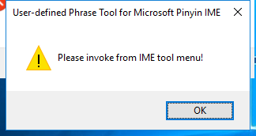

---
title: IMCCPHR.exe | IMCCPHR.exe
---

# IMCCPHR.exe 

* File Path: `C:\Windows\SysWOW64\IME\shared\IMCCPHR.exe`
* Description: IMCCPHR.exe

## Screenshot

## Hashes

Type | Hash
-- | --
MD5 | `5F460128535875F3B86AE6B7D9AB39F4`
SHA1 | `8D8EAE963BF9426E31B6091AED4CA3E934536913`
SHA256 | `0AF80B99555749B2A43EF6480826F99B03F64A4B5073AA9C13A7056C163FCB0E`
SHA384 | `D48462C19BF198A9FFD012910B14B65BB967279486F69FB737E96396329941CD48E284AFB18BC24883D1A5D8E8B822D2`
SHA512 | `1ECD84E4550B554BE52695E9E2A6945731FEF71AB9E9DC9A78A9C27F1B0389E75CCC0F293AFA82E319D83DB59623895BF37F23337810A0A98877F96C010FF3A7`
SSDEEP | `6144:Vxo8/rDRDL0q7UVt6F/Sg5BxyOLvr8SjOj95qOlx8uSXmCPwP6k+kc8DZ5n4:VxNvWtSBxyWvr8SjOBSuSXmH6k+kcuv`

## Runtime Data

### Window Title:
User-defined Phrase Tool for Microsoft Pinyin IME

### Open Handles:

Path | Type
-- | --
(R-D)   C:\Windows\Fonts\StaticCache.dat | File
(R-D)   C:\Windows\System32\en-US\imageres.dll.mui | File
(RW-)   C:\Users\Administrator\Documents | File
(RW-)   C:\Windows | File
(RW-)   C:\Windows\WinSxS\x86_microsoft.windows.common-controls_6595b64144ccf1df_6.0.17763.1397_none_26237c0767c2fee2 | File
\BaseNamedObjects\NLS_CodePage_1252_3_2_0_0 | Section
\BaseNamedObjects\NLS_CodePage_437_3_2_0_0 | Section
\Sessions\2\Windows\Theme4283305886 | Section
\Windows\Theme1956823608 | Section

### Loaded Modules:

Path |
-- |
C:\Windows\SYSTEM32\ntdll.dll |
C:\Windows\System32\wow64.dll |
C:\Windows\System32\wow64cpu.dll |
C:\Windows\System32\wow64win.dll |
C:\Windows\SysWOW64\IME\shared\IMCCPHR.exe |

## Signature

* Status: Signature verified.
* Serial: `3300000266BD1580EFA75CD6D3000000000266`
* Thumbprint: `A4341B9FD50FB9964283220A36A1EF6F6FAA7840`
* Issuer: CN=Microsoft Windows Production PCA 2011, O=Microsoft Corporation, L=Redmond, S=Washington, C=US
* Subject: CN=Microsoft Windows, O=Microsoft Corporation, L=Redmond, S=Washington, C=US

## File Metadata

* Original Filename: IMCCPHR.exe
* Product Name: Microsoft Windows Operating System
* Company Name: Microsoft Corporation
* File Version: 10.0.17763.1075 (WinBuild.160101.0800)
* Product Version: 10.0.17763.1075
* Language: English (United States)
* Legal Copyright:  Microsoft Corporation. All rights reserved.

## File Similarity (ssdeep match)

File | Score
-- | --
[C:\Windows\system32\IME\SHARED\IMCCPHR.exe](IMCCPHR.exe-226B54F581C9C77990067F670730B3BA.md) | 55
[C:\windows\system32\IME\SHARED\IMCCPHR.exe](IMCCPHR.exe-44F3A3BD24F4ECDA3AA3A6BB1A28983A.md) | 44
[C:\WINDOWS\system32\IME\SHARED\IMCCPHR.exe](IMCCPHR.exe-63169E2BAEEEBC85FA4B27AA1A261884.md) | 54
[C:\Windows\system32\IME\SHARED\IMCCPHR.exe](IMCCPHR.exe-6E76A76F787ECD24673694BB33371A79.md) | 52
[C:\Windows\system32\IME\shared\IMCCPHR.exe](IMCCPHR.exe-B93342B4F48B46FCBC46B969702C49C3.md) | 50
[C:\WINDOWS\SysWOW64\IME\SHARED\IMCCPHR.exe](IMCCPHR.exe-3206C15BFF18728020FA4CF141CF17CB.md) | 54
[C:\windows\SysWOW64\IME\SHARED\IMCCPHR.exe](IMCCPHR.exe-3DADD7D033C7977D2A64578FB4E110D4.md) | 49
[C:\Windows\SysWOW64\IME\SHARED\IMCCPHR.exe](IMCCPHR.exe-69A21227EB75F9100BAFD6CE573A1DC0.md) | 57
[C:\Windows\SysWOW64\IME\SHARED\IMCCPHR.exe](IMCCPHR.exe-FF19AEA319DDD78C836594D802F7852D.md) | 54

MIT License. Copyright (c) 2020 Strontic.

