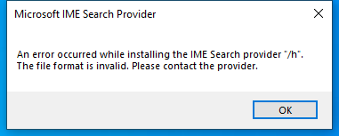

---
title: IMESEARCH.EXE | IME search module
---

# IMESEARCH.EXE 

* File Path: `C:\Windows\SysWOW64\IME\shared\IMESEARCH.EXE`
* Description: IME search module

## Screenshot

## Hashes

Type | Hash
-- | --
MD5 | `93141C19451BA23CA72B66D9F001E909`
SHA1 | `587E14E9110C43CDAD92B5E7CE42C4CDAA0DCA40`
SHA256 | `D0AE970CD194DF10DDE021DA975554B939E9AF85ADFFF46BAE6CF1D63F06C3C9`
SHA384 | `B5E0FC185D276931790BD4743A00B147FE141937D5C55103727AD2F9FE2108DE1E84C171AD37F7F878B375D1229ACD9E`
SHA512 | `84F44F5AA02A269D3260560873C7F13CAB5E34923D7AB2CAA98F183A136853A251644096E24ACE8DD4F3BDB6E1A3F9D04847E02E1D3A4A564D5551F504467549`
SSDEEP | `3072:Mi+9/GBa/KvfFYVQJKIAEaexgkCUWI0kPl:MiU+BaI+gKI1aeikCPI0e`

## Runtime Data

### Window Title:
Microsoft IME Search Provider

### Open Handles:

Path | Type
-- | --
(R-D)   C:\Windows\Fonts\StaticCache.dat | File
(R-D)   C:\Windows\System32\en-US\KernelBase.dll.mui | File
(R-D)   C:\Windows\System32\netmsg.dll | File
(R-D)   C:\Windows\SysWOW64\en-US\msxml6r.dll.mui | File
(R-D)   C:\Windows\SysWOW64\en-US\netmsg.dll.mui | File
(RW-)   C:\Users\Administrator\Documents | File
(RW-)   C:\Windows | File
(RW-)   C:\Windows\WinSxS\x86_microsoft.windows.common-controls_6595b64144ccf1df_6.0.17763.1397_none_26237c0767c2fee2 | File
\BaseNamedObjects\__ComCatalogCache__ | Section
\BaseNamedObjects\NLS_CodePage_1252_3_2_0_0 | Section
\BaseNamedObjects\NLS_CodePage_437_3_2_0_0 | Section
\Sessions\2\Windows\Theme4283305886 | Section
\Windows\Theme1956823608 | Section

### Loaded Modules:

Path |
-- |
C:\Windows\SYSTEM32\ntdll.dll |

## Signature

* Status: Signature verified.
* Serial: `3300000266BD1580EFA75CD6D3000000000266`
* Thumbprint: `A4341B9FD50FB9964283220A36A1EF6F6FAA7840`
* Issuer: CN=Microsoft Windows Production PCA 2011, O=Microsoft Corporation, L=Redmond, S=Washington, C=US
* Subject: CN=Microsoft Windows, O=Microsoft Corporation, L=Redmond, S=Washington, C=US

## File Metadata

* Original Filename: imesearch.exe
* Product Name: Microsoft Windows Operating System
* Company Name: Microsoft Corporation
* File Version: 10.0.17763.1075 (WinBuild.160101.0800)
* Product Version: 10.0.17763.1075
* Language: Language Neutral
* Legal Copyright:  Microsoft Corporation. All rights reserved.

MIT License. Copyright (c) 2020 Strontic.

