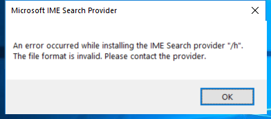

---
title: IMESEARCH.EXE | IME search module
---

# IMESEARCH.EXE 

* File Path: `C:\Windows\system32\IME\SHARED\IMESEARCH.EXE`
* Description: IME search module
* Comments: 

## Screenshot



## Hashes

Type | Hash
-- | --
MD5 | `C61697BB0A671425CF824AE0B6A4C04E`
SHA1 | `B523B78EDCA13A5CA570EFA873BF2EF530D36AE8`
SHA256 | `0289D2AEF081F8B51C08553E6A886BF63B8FE4FBA62D44EBBEF6B77A83F5C9C0`
SHA384 | `E07DF499DE81E1864EE098BDFB2CD460ADAB1FCBF292BAE1950D4E3AFDF3CCCE36F7DDA81185481249CF466BF6AB960E`
SHA512 | `47FD1479D831672C6A288352F02E5D9BC39B51726D46E7A6A6ADA157504111051F1E3E2C4C969E2D84B06392C085F5C44C3D613BEEE90903A8C861B20B0EEA07`
SSDEEP | `3072:jISL9KqHOfbJZCjFlMLcHb1L9+vDWfKBJcI+doI+VLn5gzbtyDlG:PL93YbJZGlML01ULWfKBJcI+doIcNgRQ`

## Runtime Data

### Usage (stdout):
```Batchfile

```

### Usage (stderr):
```Batchfile

```

### Child Processes:


## Signature

* Status: Signature verified.
* Serial: `3300000266BD1580EFA75CD6D3000000000266`
* Thumbprint: `A4341B9FD50FB9964283220A36A1EF6F6FAA7840`
* Issuer: CN=Microsoft Windows Production PCA 2011, O=Microsoft Corporation, L=Redmond, S=Washington, C=US
* Subject: CN=Microsoft Windows, O=Microsoft Corporation, L=Redmond, S=Washington, C=US

## File Metadata

* Original Filename: imesearch.exe
* Product Name: Microsoft Windows Operating System
* Company Name: Microsoft Corporation
* File Version: 10.0.19041.1 (WinBuild.160101.0800)
* Product Version: 10.0.19041.1
* Language: Language Neutral
* Legal Copyright:  Microsoft Corporation. All rights reserved.


MIT License. Copyright (c) 2020 Strontic.


