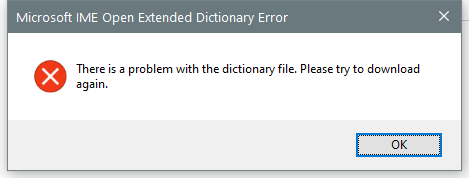

---
title: IMEWDBLD.EXE | Microsoft IME Open Extended Dictionary Module
---

# IMEWDBLD.EXE 

* File Path: `C:\Windows\system32\IME\shared\IMEWDBLD.EXE`
* Description: Microsoft IME Open Extended Dictionary Module

## Screenshot

## Hashes

Type | Hash
-- | --
MD5 | `8B8C8F73B4E96963DD9A6E760C5F77DD`
SHA1 | `71F3B5DA45334B704E5B738F442A5997A9EEC19E`
SHA256 | `51E8741641C33D13908F3260BEE589871D5EFD9210504F7B4CDEEE50BAE17C2C`
SHA384 | `3D57C2A6F93AB54849FC755C705B655C2B2F75D38B7DCEE95B5683751795FDB2C51890E677A7A376C3D90E153A4DB374`
SHA512 | `31C97E1B37727CB5E1208CB468A4DF2BB9C1CBD7B31443B32BA4C0028DD221C386DEBF745639C4094C4C428E0D382145050F77D46A42EB399BC0FBF6CB366504`
SSDEEP | `6144:wDVtT8kSl4FnvSGrwuTUJD3PAfjHPPnsFGUPg7Gs/UEVTppNX+:wBd89iFaGrwuTiAfbaXPg7Gs/r`

## Runtime Data

### Window Title:
Microsoft IME Open Extended Dictionary Error

### Open Handles:

Path | Type
-- | --
(R-D)   C:\Windows\Fonts\StaticCache.dat | File
(R-D)   C:\Windows\System32\en-US\imageres.dll.mui | File
(RW-)   C:\Users\Administrator\Documents | File
(RW-)   C:\Windows\WinSxS\amd64_microsoft.windows.common-controls_6595b64144ccf1df_6.0.17763.1397_none_de7645305346d5dc | File
\BaseNamedObjects\NLS_CodePage_1252_3_2_0_0 | Section
\BaseNamedObjects\NLS_CodePage_437_3_2_0_0 | Section
\Sessions\2\Windows\Theme4283305886 | Section
\Windows\Theme1956823608 | Section

### Loaded Modules:

Path |
-- |
C:\Windows\System32\ADVAPI32.dll |
C:\Windows\System32\bcryptPrimitives.dll |
C:\Windows\SYSTEM32\Cabinet.dll |
C:\Windows\System32\cfgmgr32.dll |
C:\Windows\System32\combase.dll |
C:\Windows\System32\CRYPT32.dll |
C:\Windows\System32\cryptsp.dll |
C:\Windows\System32\GDI32.dll |
C:\Windows\System32\gdi32full.dll |
C:\Windows\system32\IME\shared\IMEWDBLD.EXE |
C:\Windows\System32\kernel.appcore.dll |
C:\Windows\System32\KERNEL32.DLL |
C:\Windows\System32\KERNELBASE.dll |
C:\Windows\System32\MSASN1.dll |
C:\Windows\System32\msvcp_win.dll |
C:\Windows\System32\msvcrt.dll |
C:\Windows\SYSTEM32\ntdll.dll |
C:\Windows\System32\ole32.dll |
C:\Windows\System32\OLEAUT32.dll |
C:\Windows\System32\powrprof.dll |
C:\Windows\System32\profapi.dll |
C:\Windows\System32\RPCRT4.dll |
C:\Windows\System32\sechost.dll |
C:\Windows\System32\shcore.dll |
C:\Windows\System32\SHELL32.dll |
C:\Windows\System32\shlwapi.dll |
C:\Windows\System32\ucrtbase.dll |
C:\Windows\System32\USER32.dll |
C:\Windows\SYSTEM32\UxTheme.dll |
C:\Windows\System32\win32u.dll |
C:\Windows\System32\windows.storage.dll |
C:\Windows\System32\WINTRUST.dll |
C:\Windows\WinSxS\amd64_microsoft.windows.common-controls_6595b64144ccf1df_6.0.17763.1397_none_de7645305346d5dc\COMCTL32.dll |

## Signature

* Status: Signature verified.
* Serial: `330000026551AE1BBD005CBFBD000000000265`
* Thumbprint: `E168609353F30FF2373157B4EB8CD519D07A2BFF`
* Issuer: CN=Microsoft Windows Production PCA 2011, O=Microsoft Corporation, L=Redmond, S=Washington, C=US
* Subject: CN=Microsoft Windows, O=Microsoft Corporation, L=Redmond, S=Washington, C=US

## File Metadata

* Original Filename: imewdbld.exe
* Product Name: Microsoft Windows Operating System
* Company Name: Microsoft Corporation
* File Version: 10.0.17763.1075 (WinBuild.160101.0800)
* Product Version: 10.0.17763.1075
* Language: Language Neutral
* Legal Copyright:  Microsoft Corporation. All rights reserved.

## File Similarity (ssdeep match)

File | Score
-- | --
[C:\WINDOWS\system32\IME\SHARED\IMEWDBLD.EXE](IMEWDBLD.EXE-CB30AD795C9B30E71EB1E596D18B7A21.md) | 43
[C:\Windows\system32\IME\SHARED\IMEWDBLD.EXE](IMEWDBLD.EXE-FBEE6DD18640B1575FF98D1EB3B51724.md) | 38
[C:\Windows\SysWOW64\IME\shared\IMEWDBLD.EXE](IMEWDBLD.EXE-0984D217E10D11B2DBB8CCD47CDF36BD.md) | 36
[C:\Windows\SysWOW64\IME\SHARED\IMEWDBLD.EXE](IMEWDBLD.EXE-40FBB367D0F83472C170359D6E3446A0.md) | 32
[C:\windows\SysWOW64\IME\SHARED\IMEWDBLD.EXE](IMEWDBLD.EXE-8EDFF2D1145341D7B23D012B29910539.md) | 32
[C:\Windows\SysWOW64\IME\SHARED\IMEWDBLD.EXE](IMEWDBLD.EXE-B840116C2D5805095F46CFD8ACBD0EB8.md) | 32
[C:\WINDOWS\SysWOW64\IME\SHARED\IMEWDBLD.EXE](IMEWDBLD.EXE-F042BFE4E2BE1EF592D9CFA14F8E6BD1.md) | 33

MIT License. Copyright (c) 2020 Strontic.

