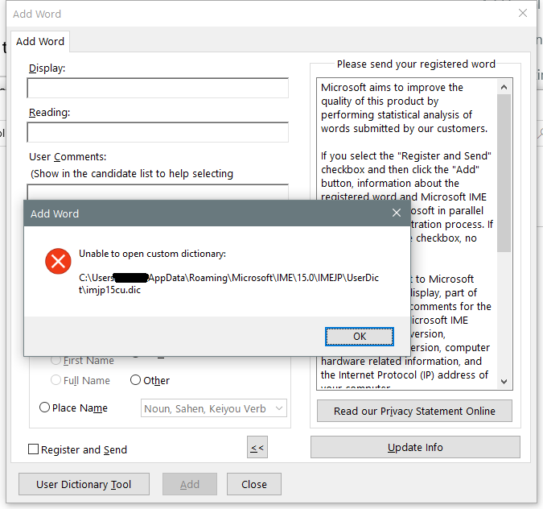

---
title: IMJPDCT.EXE | Microsoft IME 2012
---

# IMJPDCT.EXE 

* File Path: `C:\windows\system32\IME\IMEJP\IMJPDCT.EXE`
* Description: Microsoft IME 2012

## Screenshot

## Hashes

Type | Hash
-- | --
MD5 | `20F49251DE65FED54EE5FDA6091B2161`
SHA1 | `052005F22A4B4E7B02747DDA2604E529564A2F87`
SHA256 | `96411F399F78C7FAF64BDAB817F0A5CE2E8C45858C11970405A0DE645465752D`
SHA384 | `42AF74576989103AC8C1583F9779CED5B1507A394778DADF5C535040FCC23083C3113221D6C04B9E33AD0838B8792ACD`
SHA512 | `FFD4711978BADA436A1ECA598C5F3A23A1881D90DF5F377F17905CB59D275704B5690130AC44638CFFD1E4845AE2CC90C822B7EA7F33370F1CC282184B9D5E29`
SSDEEP | `12288:Qeq+WbflW3Y7A9dhbREBLBaW2nTxhPmXdAp8q52:QlVCQ2hPmXdAp8q`

### Loaded Modules:

Path |
-- |
C:\program files (x86)\ImgBurn\ImgBurnPreview.exe |
C:\Windows\SYSTEM32\ntdll.dll |
C:\Windows\System32\wow64.dll |
C:\Windows\System32\wow64cpu.dll |
C:\Windows\System32\wow64win.dll |

## Signature

* Status: The file C:\windows\system32\IME\IMEJP\IMJPDCT.EXE is not digitally signed. You cannot run this script on the current system. For more information about running scripts and setting execution policy, see about_Execution_Policies at http://go.microsoft.com/fwlink/?LinkID=135170
* Serial: ``
* Thumbprint: ``
* Issuer: 
* Subject: 

## File Metadata

* Original Filename: imjpdct.exe
* Product Name: Microsoft IME 2012
* Company Name: Microsoft Corporation
* File Version: 15.0.9600.18514
* Product Version: 15.0.9600.18514
* Language: Language Neutral
* Legal Copyright:  Microsoft Corporation. All rights reserved.

## File Similarity (ssdeep match)

File | Score
-- | --
[C:\windows\SysWOW64\IME\IMEJP\IMJPDCT.EXE](IMJPDCT.EXE-35E8439FC4EC658C513DBC7C46DD7647.md) | 27

MIT License. Copyright (c) 2020 Strontic.

