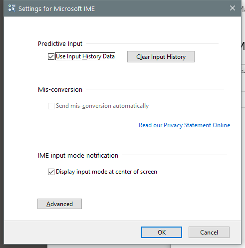

---
title: IMJPSET.EXE | Microsoft IME 2012
---

# IMJPSET.EXE 

* File Path: `C:\windows\SysWOW64\IME\IMEJP\IMJPSET.EXE`
* Description: Microsoft IME 2012

## Screenshot

## Hashes

Type | Hash
-- | --
MD5 | `9C6D673CBAC43B464AFB3F7E7BAD25ED`
SHA1 | `FE225CC2DB3459C1054B7C73C3EA8548C8D17FAA`
SHA256 | `6659CA242FD992C2C6994D67930F121A8EC4B58E7027E478129BDCD632D58EAE`
SHA384 | `91A6F5398CA08EFC5E37466D568889240F0AC507593B27ABE6F101333841B0DEA27FEC5547F1A31B6E582605C9470273`
SHA512 | `C847FDD36C998A9E6DC96D97CF6C3E6DEF9EA596A232A9BDD20B304564933A90D0AF634B1C2C43B3C27654F91A210D68370B1DAED4CC9297C1CAC41896BB019A`
SSDEEP | `1536:AYLP1dAotzlhNqEawwtHcGXqu+40YC9Sg6TWDga7t1UE0cYH67nIWDK2NLPcwq7:jLP5thD/7wtHJKzzYH67IkK2NLPcwq`

## Signature

* Status: The file C:\windows\SysWOW64\IME\IMEJP\IMJPSET.EXE is not digitally signed. You cannot run this script on the current system. For more information about running scripts and setting execution policy, see about_Execution_Policies at http://go.microsoft.com/fwlink/?LinkID=135170
* Serial: ``
* Thumbprint: ``
* Issuer: 
* Subject: 

## File Metadata

* Original Filename: IMJPSET.exe
* Product Name: Microsoft IME 2012
* Company Name: Microsoft Corporation
* File Version: 15.0.9600.18514
* Product Version: 15.0.9600.18514
* Language: Language Neutral
* Legal Copyright:  Microsoft Corporation. All rights reserved.

## File Similarity (ssdeep match)

File | Score
-- | --
[C:\Windows\system32\IME\IMEJP\IMJPSET.EXE](IMJPSET.EXE-0DE3C3E47A5EF0B9170437D0D02422E3.md) | 35
[C:\windows\system32\IME\IMEJP\IMJPSET.EXE](IMJPSET.EXE-3C36873D17795ECDC0BBFFDDFCA4BC38.md) | 55
[C:\Windows\system32\IME\IMEJP\IMJPSET.EXE](IMJPSET.EXE-4C7AE716A57F5DB82C8AA8EA253734DB.md) | 40
[C:\Windows\system32\IME\IMEJP\IMJPSET.EXE](IMJPSET.EXE-6FEC8EEB04AE0BE04ADD090B26EC27C1.md) | 41
[C:\WINDOWS\system32\IME\IMEJP\IMJPSET.EXE](IMJPSET.EXE-71340CEA2C0FC1089AF616AAE507649C.md) | 41
[C:\Windows\system32\IME\IMEJP\IMJPUEX.EXE](IMJPUEX.EXE-069FC22EEF43E9EDC2818E30FBF21BDA.md) | 49
[C:\windows\system32\IME\IMEJP\IMJPUEX.EXE](IMJPUEX.EXE-51483AD020C493EB5790D51600D4706B.md) | 46
[C:\Windows\system32\IME\IMEJP\IMJPUEX.EXE](IMJPUEX.EXE-6B59D6B19D912836B63BDF82E6225E2E.md) | 50
[C:\Windows\system32\IME\IMEJP\IMJPUEX.EXE](IMJPUEX.EXE-8B2B2098EF493A0A308983B6608E6225.md) | 46
[C:\WINDOWS\system32\IME\IMEJP\IMJPUEX.EXE](IMJPUEX.EXE-8C01DDD9E78B621915141C3866F11FCA.md) | 54
[C:\WINDOWS\SysWOW64\IME\IMEJP\IMJPSET.EXE](IMJPSET.EXE-0243C95369EE36091113791CB7D2A33B.md) | 43
[C:\Windows\SysWOW64\IME\IMEJP\IMJPSET.EXE](IMJPSET.EXE-0AD847DD732C12944C3A7B7C7E888303.md) | 46
[C:\Windows\SysWOW64\IME\IMEJP\IMJPSET.EXE](IMJPSET.EXE-A7EE6301AE64907FEF06B2BCA4EA41C1.md) | 43
[C:\Windows\SysWOW64\IME\IMEJP\IMJPSET.EXE](IMJPSET.EXE-B3013D8C001264B02C08156A08F989C5.md) | 43
[C:\windows\SysWOW64\IME\IMEJP\IMJPUEX.EXE](IMJPUEX.EXE-31864ABD4AB1B2E8A42498CDC1EA6974.md) | 40
[C:\Windows\SysWOW64\IME\IMEJP\IMJPUEX.EXE](IMJPUEX.EXE-48288F9B61EB81FE9DEE7C75D949BC54.md) | 47
[C:\Windows\SysWOW64\IME\IMEJP\IMJPUEX.EXE](IMJPUEX.EXE-4B3A94B9B826591C977679B493D5FE2B.md) | 41
[C:\WINDOWS\SysWOW64\IME\IMEJP\IMJPUEX.EXE](IMJPUEX.EXE-9E320A6AF5B77D63CFC7DF365CBA40E2.md) | 43
[C:\Windows\SysWOW64\IME\IMEJP\IMJPUEX.EXE](IMJPUEX.EXE-F25AFE5F7458838756F205E18A800A3B.md) | 36

MIT License. Copyright (c) 2020 Strontic.

