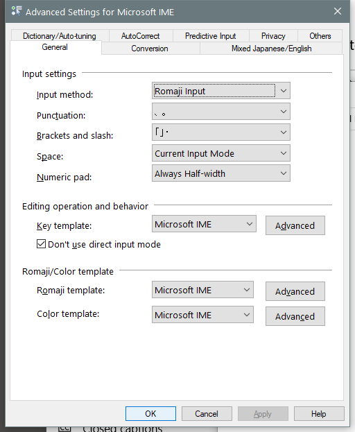

---
title: IMJPUEX.EXE | Microsoft IME
excerpt: What is IMJPUEX.EXE?
---

# IMJPUEX.EXE 

* File Path: `C:\Windows\SysWOW64\IME\IMEJP\IMJPUEX.EXE`
* Description: Microsoft IME

## Screenshot

## Hashes

Type | Hash
-- | --
MD5 | `F25AFE5F7458838756F205E18A800A3B`
SHA1 | `3AFCA2D8818EB987209285C0FEB2BFB989B1B0E2`
SHA256 | `ADD9B3F88E55F55403022C946B1C4A8D7EEF597C524E766BAA751689DB4890C0`
SHA384 | `2C0600491652B014B8BE3539C6E2AFE5C540A91A435FB26DB2F0BD5DF35D5B8752CD093B6ED86DF5F853544D8CEEB66E`
SHA512 | `4AD5104D4A68A4CFDD9361273E3737CD28A8B3C5F9E77D19001ACBCF0B9243F27B08C5ED2CAC89DB1EFD966D8BAC54FEC739744E1FF04FD6F4D1DD27F142A8A9`
SSDEEP | `1536:o+DLziEvQS6oKL6x8oe4noCneHY3GBG3cYH67nIWDK2NLPcrIei:o+vziEoS6ovx/e4okWY3kGMYH67IkK2T`
IMP | `8EDC9357F22ADF7DB8B30C9166C360A7`
PESHA1 | `850250E3028355654D7D4224213A4B364177CAAB`
PE256 | `7D4C57162128948F3A1FFC3A4EF29D6F40BDED64076979C48CF6A7552CBD2AE9`

## Runtime Data

### Window Title:
Advanced Settings for Microsoft IME

### Open Handles:

Path | Type
-- | --
(R-D)   C:\Windows\Fonts\StaticCache.dat | File
(R-D)   C:\Windows\System32\en-US\MFC42u.dll.mui | File
(R-D)   C:\Windows\WinSxS\x86_microsoft.windows.c..-controls.resources_6595b64144ccf1df_6.0.17763.1518_en-us_3c26ab8c9470805a\comctl32.dll.mui | File
(RW-)   C:\Users\user | File
(RW-)   C:\Windows | File
(RW-)   C:\Windows\WinSxS\x86_microsoft.windows.c..-controls.resources_6595b64144ccf1df_6.0.17763.1518_en-us_3c26ab8c9470805a | File
(RW-)   C:\Windows\WinSxS\x86_microsoft.windows.common-controls_6595b64144ccf1df_6.0.17763.1518_none_261b62a767ca4e6d | File
\BaseNamedObjects\C:\*ProgramData\*Microsoft\*Windows\*Caches\*{6AF0698E-D558-4F6E-9B3C-3716689AF493}.2.ver0x0000000000000004.db | Section
\BaseNamedObjects\C:\*ProgramData\*Microsoft\*Windows\*Caches\*{DDF571F2-BE98-426D-8288-1A9A39C3FDA2}.2.ver0x0000000000000004.db | Section
\BaseNamedObjects\C:\*ProgramData\*Microsoft\*Windows\*Caches\*cversions.2.ro | Section
\BaseNamedObjects\NLS_CodePage_1252_3_2_0_0 | Section
\BaseNamedObjects\NLS_CodePage_437_3_2_0_0 | Section
\Sessions\2\BaseNamedObjects\_IMJP_15_UD_FileMapping_{b4f0aa5b-77d3-486f-b999-53049e87159e}_M_S-1-5-21-4075667164-670084373-454571106-500 | Section
\Sessions\2\Windows\Theme2131664586 | Section
\Windows\Theme966197582 | Section

### Loaded Modules:

Path |
-- |
C:\Windows\SYSTEM32\ntdll.dll |
C:\Windows\System32\wow64.dll |
C:\Windows\System32\wow64cpu.dll |
C:\Windows\System32\wow64win.dll |
C:\Windows\SysWOW64\IME\IMEJP\IMJPUEX.EXE |

## Signature

* Status: Signature verified.
* Serial: `3300000266BD1580EFA75CD6D3000000000266`
* Thumbprint: `A4341B9FD50FB9964283220A36A1EF6F6FAA7840`
* Issuer: CN=Microsoft Windows Production PCA 2011, O=Microsoft Corporation, L=Redmond, S=Washington, C=US
* Subject: CN=Microsoft Windows, O=Microsoft Corporation, L=Redmond, S=Washington, C=US

## File Metadata

* Original Filename: imjpuex.exe
* Product Name: Microsoft Windows Operating System
* Company Name: Microsoft Corporation
* File Version: 10.0.17763.1075 (WinBuild.160101.0800)
* Product Version: 10.0.17763.1075
* Language: Language Neutral
* Legal Copyright:  Microsoft Corporation. All rights reserved.
* Machine Type: 32-bit

## File Scan

* VirusTotal Detections: 0/73
* VirusTotal Link: https://www.virustotal.com/gui/file/add9b3f88e55f55403022c946b1c4a8d7eef597c524e766baa751689db4890c0/detection/

## File Similarity (ssdeep match)

File | Score
-- | --
[C:\Windows\system32\IME\IMEJP\IMJPSET.EXE](IMJPSET.EXE-0DE3C3E47A5EF0B9170437D0D02422E3.md) | 30
[C:\WINDOWS\system32\IME\IMEJP\IMJPSET.EXE](IMJPSET.EXE-10BAD1F24D4F62F11B3BCD190CCF72CB.md) | 27
[C:\windows\system32\IME\IMEJP\IMJPSET.EXE](IMJPSET.EXE-3C36873D17795ECDC0BBFFDDFCA4BC38.md) | 40
[C:\Windows\system32\IME\IMEJP\IMJPSET.EXE](IMJPSET.EXE-4C7AE716A57F5DB82C8AA8EA253734DB.md) | 30
[C:\Windows\system32\IME\IMEJP\IMJPSET.EXE](IMJPSET.EXE-6FEC8EEB04AE0BE04ADD090B26EC27C1.md) | 33
[C:\WINDOWS\system32\IME\IMEJP\IMJPSET.EXE](IMJPSET.EXE-71340CEA2C0FC1089AF616AAE507649C.md) | 25
[C:\Windows\system32\IME\IMEJP\IMJPUEX.EXE](IMJPUEX.EXE-069FC22EEF43E9EDC2818E30FBF21BDA.md) | 46
[C:\windows\system32\IME\IMEJP\IMJPUEX.EXE](IMJPUEX.EXE-51483AD020C493EB5790D51600D4706B.md) | 46
[C:\Windows\system32\IME\IMEJP\IMJPUEX.EXE](IMJPUEX.EXE-6B59D6B19D912836B63BDF82E6225E2E.md) | 46
[C:\Windows\system32\IME\IMEJP\IMJPUEX.EXE](IMJPUEX.EXE-8B2B2098EF493A0A308983B6608E6225.md) | 36
[C:\WINDOWS\system32\IME\IMEJP\IMJPUEX.EXE](IMJPUEX.EXE-8C01DDD9E78B621915141C3866F11FCA.md) | 46
[C:\WINDOWS\system32\IME\IMEJP\IMJPUEX.EXE](IMJPUEX.EXE-B9020197196B7A726C80EEFB6A64B7A6.md) | 32
[C:\WINDOWS\SysWOW64\IME\IMEJP\IMJPSET.EXE](IMJPSET.EXE-0243C95369EE36091113791CB7D2A33B.md) | 32
[C:\Windows\SysWOW64\IME\IMEJP\IMJPSET.EXE](IMJPSET.EXE-0AD847DD732C12944C3A7B7C7E888303.md) | 32
[C:\WINDOWS\SysWOW64\IME\IMEJP\IMJPSET.EXE](IMJPSET.EXE-35744A01C5D5ACE307AF41ADFD23CBD7.md) | 33
[C:\windows\SysWOW64\IME\IMEJP\IMJPSET.EXE](IMJPSET.EXE-9C6D673CBAC43B464AFB3F7E7BAD25ED.md) | 36
[C:\Windows\SysWOW64\IME\IMEJP\IMJPSET.EXE](IMJPSET.EXE-A7EE6301AE64907FEF06B2BCA4EA41C1.md) | 32
[C:\Windows\SysWOW64\IME\IMEJP\IMJPSET.EXE](IMJPSET.EXE-B3013D8C001264B02C08156A08F989C5.md) | 32
[C:\windows\SysWOW64\IME\IMEJP\IMJPUEX.EXE](IMJPUEX.EXE-31864ABD4AB1B2E8A42498CDC1EA6974.md) | 47
[C:\Windows\SysWOW64\IME\IMEJP\IMJPUEX.EXE](IMJPUEX.EXE-48288F9B61EB81FE9DEE7C75D949BC54.md) | 49
[C:\Windows\SysWOW64\IME\IMEJP\IMJPUEX.EXE](IMJPUEX.EXE-4B3A94B9B826591C977679B493D5FE2B.md) | 44
[C:\WINDOWS\SysWOW64\IME\IMEJP\IMJPUEX.EXE](IMJPUEX.EXE-9E320A6AF5B77D63CFC7DF365CBA40E2.md) | 43
[C:\WINDOWS\SysWOW64\IME\IMEJP\IMJPUEX.EXE](IMJPUEX.EXE-CE4AB827586D17F1A29C0F1068CCEC90.md) | 33

MIT License. Copyright (c) 2020-2021 Strontic.

