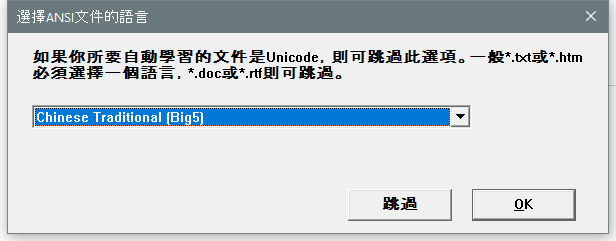

---
title: IMTCLNWZ.EXE | Microsoft IME 2012
---

# IMTCLNWZ.EXE 

* File Path: `C:\windows\system32\IME\IMETC\IMTCLNWZ.EXE`
* Description: Microsoft IME 2012
* Comments: 

## Screenshot



## Hashes

Type | Hash
-- | --
MD5 | `C89E5078CD86C1A5409D129301AEEC69`
SHA1 | `62B3EA99C508B46D174007D185F1488F285C9AF1`
SHA256 | `71B67DF74FF6ABC2E5FB4E37F7EB6905906E43A2CA2D5E70E48979252721601B`
SHA384 | `F5C0F3F0B4D64DABBF1344A30C1350B3FE97EA5E06E1D4155DC4276BF0AEBA3200F9822DD2C267B3EA2D2FDB120B8E67`
SHA512 | `0298653A443938423CD1CEF80ECCFFB1A4D45ED0BD7D065FA8017A466AAA6A5A93EEAACBA379015F0944423E770F7606D86D8015E23270C8E1CB164F737BA612`
SSDEEP | `1536:AYI9BrzMexKhdbZUW1+H+ZCoIOHnxjNqcG5yObq:WXrzpAl70eY3a5Nqc`

## Runtime Data

### Usage (stdout):
```Batchfile

```

### Usage (stderr):
```Batchfile

```

### Child Processes:


## Signature

* Status: The file C:\windows\system32\IME\IMETC\IMTCLNWZ.EXE is not digitally signed. You cannot run this script on the current system. For more information about running scripts and setting execution policy, see about_Execution_Policies at http://go.microsoft.com/fwlink/?LinkID=135170
* Serial: ``
* Thumbprint: ``
* Issuer: 
* Subject: 

## File Metadata

* Original Filename: IMTCLNWZ.exe
* Product Name: Microsoft IME 2012
* Company Name: Microsoft Corporation
* File Version: 15.0.9600.17415
* Product Version: 15.0.9600.17415
* Language: Language Neutral
* Legal Copyright:  2012 Microsoft Corporation.  All rights reserved.

## File Similarity (ssdeep match)

File | Score
-- | --
[C:\Windows\system32\IME\IMETC\IMTCLNWZ.EXE](IMTCLNWZ.EXE-276DC3BD19C1340A5CD15EF59493DBD4.md) | 40
[C:\Windows\system32\IME\IMETC\IMTCLNWZ.EXE](IMTCLNWZ.EXE-4900C7A4A9DFEDC07BC5B01D62530F92.md) | 38
[C:\WINDOWS\SysWOW64\IME\IMETC\IMTCLNWZ.EXE](IMTCLNWZ.EXE-29F4933D7C3B572A653DDC628FBDA485.md) | 35
[C:\Windows\SysWOW64\IME\IMETC\IMTCLNWZ.EXE](IMTCLNWZ.EXE-433BDECA0C6C645DB6DEAD1FD50735E8.md) | 36
[C:\windows\SysWOW64\IME\IMETC\IMTCLNWZ.EXE](IMTCLNWZ.EXE-B9596044CC56729A998E26618703AA49.md) | 46
[C:\Windows\SysWOW64\IME\IMETC\IMTCLNWZ.EXE](IMTCLNWZ.EXE-FFC5AB5333DEA60739B3AAB472A106E5.md) | 29


MIT License. Copyright (c) 2020 Strontic.


