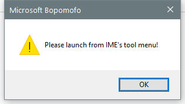

---
title: IMTCPROP.exe | IMTCPROP.exe
---

# IMTCPROP.exe 

* File Path: `C:\Windows\system32\IME\IMETC\IMTCPROP.exe`
* Description: IMTCPROP.exe
* Comments: 

## Screenshot



## Hashes

Type | Hash
-- | --
MD5 | `7319F199B67069654A4E65048AE956F5`
SHA1 | `59FDE0E4F6D580204DD6E946A17AA4418021C863`
SHA256 | `2A8EA49ACD7020A3F641521CDCD28D3EFA9585AED9DD92989F695A6489AD4657`
SHA384 | `078C107CA59906905833A66FD71419A5218DA35FF6A5CB6B1360E43CB3CCF59588FB294F0419B34FB6899D7234D7494C`
SHA512 | `6C9859438A13266BC76288C14E55E264D708F9FB216C8E8317EB418D8F3C1D1CAC8A522F42B651232C6169EE95051D6382DACBB713E64EFA08D3234A8D88732E`
SSDEEP | `3072:xKtDzC2eXhRbJ08TgrCk70im5gpH+faSfeLOQDPiC21P7I/Xg+mClKRiTPqcfYM5:xKtDgXnbFEGktu8v5rWjINmKKRiT7fJ`

## Runtime Data

### Usage (stdout):
```Batchfile

```

### Usage (stderr):
```Batchfile

```

### Child Processes:


## Signature

* Status: Signature verified.
* Serial: `3300000266BD1580EFA75CD6D3000000000266`
* Thumbprint: `A4341B9FD50FB9964283220A36A1EF6F6FAA7840`
* Issuer: CN=Microsoft Windows Production PCA 2011, O=Microsoft Corporation, L=Redmond, S=Washington, C=US
* Subject: CN=Microsoft Windows, O=Microsoft Corporation, L=Redmond, S=Washington, C=US

## File Metadata

* Original Filename: IMTCPROP.exe
* Product Name: Microsoft Windows Operating System
* Company Name: Microsoft Corporation
* File Version: 10.0.14393.2608 (rs1_release.181024-1742)
* Product Version: 10.0.14393.2608
* Language: English (United States)
* Legal Copyright:  Microsoft Corporation. All rights reserved.

## File Similarity (ssdeep match)

File | Score
-- | --
[C:\Windows\system32\IME\IMETC\IMTCPROP.exe](IMTCPROP.exe-1C555A6D303925921D4C623B107E848F.md) | 46
[C:\windows\system32\IME\IMETC\IMTCPROP.exe](IMTCPROP.exe-391D5A0F76FD34978E5F573A4D645468.md) | 50
[C:\Windows\system32\IME\IMETC\IMTCPROP.exe](IMTCPROP.exe-CB750586C353E12636F45780B5D5A0C7.md) | 50
[C:\WINDOWS\system32\IME\IMETC\IMTCPROP.exe](IMTCPROP.exe-EDD8488E449D5D1997796ABBA1EBE001.md) | 47
[C:\Windows\SysWOW64\IME\IMETC\IMTCPROP.exe](IMTCPROP.exe-03A7527713DFDC68221A62DD583341E7.md) | 49
[C:\Windows\SysWOW64\IME\IMETC\IMTCPROP.exe](IMTCPROP.exe-34622F025E78CD8102AF2279C627AE59.md) | 47
[C:\Windows\SysWOW64\IME\IMETC\IMTCPROP.exe](IMTCPROP.exe-428B2502806D71368D48C46EB89E7291.md) | 47
[C:\windows\SysWOW64\IME\IMETC\IMTCPROP.exe](IMTCPROP.exe-69F01870E972302EF48B7C47CE9610B9.md) | 43
[C:\WINDOWS\SysWOW64\IME\IMETC\IMTCPROP.exe](IMTCPROP.exe-BF4E435A6D47A79D5F347234D21D0FD5.md) | 54


MIT License. Copyright (c) 2020 Strontic.


