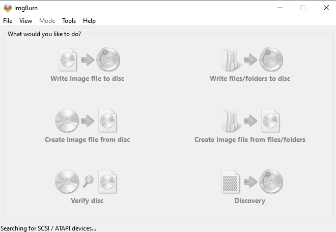

---
title: ImgBurn.exe | ImgBurn - The Ultimate Image Burner!
excerpt: What is ImgBurn.exe?
---

# ImgBurn.exe 

* File Path: `C:\Program Files (x86)\ImgBurn\ImgBurn.exe`
* Description: ImgBurn - The Ultimate Image Burner!

## Screenshot

## Hashes

Type | Hash
-- | --
MD5 | `4776C25E4FFDA40783DF8D31217ED085`
SHA1 | `8DFEB7DA315EE2F5CCC59B1CBFD9E60B74F17FC3`
SHA256 | `02C74678128A9DFEF58EAB5ABE269382C6B4862440C26C22CDE7B83868F478F1`
SHA384 | `479DA9D0B011BDCA1633A2B19E43ECD3BE7E5983DEE69A3301DE791D3983017C527BE0D486EEF80A8078D39EE34CD5F6`
SHA512 | `8EF9677F52A5FCFB0DA7C34DEFC03A2C449962DABE468C57A3C4BF9CD7A21997E348252ACE05DA5A60E809B2305FA320C95F79376CC75FEAE83B698E60744BAC`
SSDEEP | `49152:mjFpUHdWtSyTHF9FilJ/i1Lh8sqBrpGEXtx3VIL+zqXlnsvzXi08GzFt:BHdFojiuLusqBdGutxVuXOU`
IMP | `n/a`
PESHA1 | `F0AE31AD252E2C1F1F34D1AF999D67726B0407CD`
PE256 | `BAFD62EE8DEE059CD8FFF130CC0829FA0EC4A52ADB26D3869389D813E9B0D5B2`

## Runtime Data

### Open Handles:

Path | Type
-- | --
(R-D)   C:\Windows\Fonts\StaticCache.dat | File
(R-D)   C:\Windows\System32\en-US\windows.storage.dll.mui | File
(R-D)   C:\Windows\System32\en-US\winnlsres.dll.mui | File
(R-D)   C:\Windows\SysWOW64\en-US\user32.dll.mui | File
(R-D)   C:\Windows\WinSxS\x86_microsoft.windows.c..-controls.resources_6595b64144ccf1df_6.0.19041.1_en-us_130e63d987a738df\comctl32.dll.mui | File
(RW-)   C:\Windows | File
(RW-)   C:\Windows\WinSxS\x86_microsoft.windows.c..-controls.resources_6595b64144ccf1df_6.0.19041.1_en-us_130e63d987a738df | File
(RW-)   C:\Windows\WinSxS\x86_microsoft.windows.common-controls_6595b64144ccf1df_6.0.19041.488_none_11b1e5df2ffd8627 | File
(RW-)   C:\xCyclopedia | File
\BaseNamedObjects\__ComCatalogCache__ | Section
\BaseNamedObjects\NLS_CodePage_1252_3_2_0_0 | Section
\BaseNamedObjects\NLS_CodePage_437_3_2_0_0 | Section
\BaseNamedObjects\windows_shell_global_counters | Section
\Sessions\1\BaseNamedObjects\1ac0HWNDInterface:14904c4 | Section
\Sessions\1\BaseNamedObjects\1ac0HWNDInterface:17062a | Section
\Sessions\1\BaseNamedObjects\1ac0HWNDInterface:48033e | Section
\Sessions\1\BaseNamedObjects\1ac0HWNDInterface:510362 | Section
\Sessions\1\BaseNamedObjects\1ac0HWNDInterface:5b074a | Section
\Sessions\1\BaseNamedObjects\1ac0HWNDInterface:bd039c | Section
\Sessions\1\BaseNamedObjects\1ac0HWNDInterface:cf0406 | Section
\Sessions\1\BaseNamedObjects\1DefaultTIPSharedMemory | Section
\Sessions\1\BaseNamedObjects\madExceptSettingsBuf2$1ac0 | Section
\Sessions\1\BaseNamedObjects\madExceptThreadNameBuf$1ac0 | Section
\Sessions\1\BaseNamedObjects\windows_shell_global_counters | Section
\Sessions\1\Windows\Theme2547664911 | Section
\Windows\Theme3854699184 | Section

### Loaded Modules:

Path |
-- |
C:\Program Files (x86)\ImgBurn\ImgBurn.exe |
C:\Windows\SYSTEM32\ntdll.dll |
C:\Windows\System32\wow64.dll |
C:\Windows\System32\wow64cpu.dll |
C:\Windows\System32\wow64win.dll |

## Signature

* Status: The file C:\Program Files (x86)\ImgBurn\ImgBurn.exe is not digitally signed. You cannot run this script on the current system. For more information about running scripts and setting execution policy, see about_Execution_Policies at https:/go.microsoft.com/fwlink/?LinkID=135170
* Serial: ``
* Thumbprint: ``
* Issuer: 
* Subject: 

## File Metadata

* Original Filename: ImgBurn.exe
* Product Name: ImgBurn
* Company Name: LIGHTNING UK!
* File Version: 2.5.8.0
* Product Version: 2.5.8.0
* Language: English (United Kingdom)
* Legal Copyright: Copyright 2005 - 2013
* Machine Type: 32-bit

## File Scan

* VirusTotal Detections: 0/68
* VirusTotal Link: https://www.virustotal.com/gui/file/02c74678128a9dfef58eab5abe269382c6b4862440c26c22cde7b83868f478f1/detection/

MIT License. Copyright (c) 2020 Strontic.

