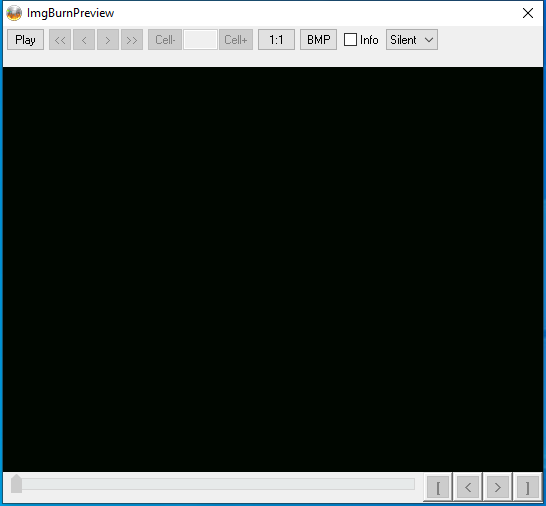

---
title: ImgBurnPreview.exe | ImgBurnPreview
excerpt: What is ImgBurnPreview.exe?
---

# ImgBurnPreview.exe 

* File Path: `C:\Program Files (x86)\ImgBurn\ImgBurnPreview.exe`
* Description: ImgBurnPreview
* Comments: By jeanl, from jsoto's modification of DVD2AVI

## Screenshot

## Hashes

Type | Hash
-- | --
MD5 | `AD46F2B6D9BBD7C271E6B67DF3A00695`
SHA1 | `A929F7C87F659253C25CBF786A81180A4DCA0E3D`
SHA256 | `363F61889ADAF3EE4BB95BDA5F6D7CB1D7C906B61C310C8E98AD02717C5203F9`
SHA384 | `0575F93187293F87ADD4749A00795760BA7C35324B937914A9E9BC5A3340D65CE0AD9B5B7A7FD1020524810067BDCB0E`
SHA512 | `AF72E7D61CBCEF34258EC819041DBC7747862070882C8390DF939A6483FBCFA0D1635BE16CB5720DC74F551F8EC426DA1C5157FE65664B592C70FC893DE59AB6`
SSDEEP | `3072:Em1BzKL2lZ33qxjrzVcol6gUjywWHlGvakyvVuk2AQ4w/vvoutc:LLzL33qxjWoG19xCuzAQn/XoS`
PESHA1 | `A4B8C11287668C9908A8C66B20A3C262FC0E2770`
PE256 | `8CF5D0721559C439609760F008492ACE792502E08B269AAC9FAFF879E3985775`

## Runtime Data

### Window Title:
ImgBurnPreview

### Open Handles:

Path | Type
-- | --
(R-D)   C:\Windows\Fonts\StaticCache.dat | File
(R-D)   C:\Windows\SysWOW64\en-US\msvfw32.dll.mui | File
(R-D)   C:\Windows\SysWOW64\en-US\user32.dll.mui | File
(RW-)   C:\Windows | File
(RW-)   C:\Windows\WinSxS\x86_microsoft.windows.common-controls_6595b64144ccf1df_6.0.19041.488_none_11b1e5df2ffd8627 | File
(RW-)   C:\xCyclopedia | File
\BaseNamedObjects\NLS_CodePage_1252_3_2_0_0 | Section
\BaseNamedObjects\NLS_CodePage_437_3_2_0_0 | Section
\Sessions\1\Windows\Theme2547664911 | Section
\Windows\Theme3854699184 | Section

### Loaded Modules:

Path |
-- |
C:\Program Files (x86)\ImgBurn\ImgBurnPreview.exe |
C:\Windows\SYSTEM32\ntdll.dll |
C:\Windows\System32\wow64.dll |
C:\Windows\System32\wow64cpu.dll |
C:\Windows\System32\wow64win.dll |

## Signature

* Status: The file C:\Program Files (x86)\ImgBurn\ImgBurnPreview.exe is not digitally signed. You cannot run this script on the current system. For more information about running scripts and setting execution policy, see about_Execution_Policies at https:/go.microsoft.com/fwlink/?LinkID=135170
* Serial: ``
* Thumbprint: ``
* Issuer: 
* Subject: 

## File Metadata

* Original Filename: ImgBurnPreview.exe
* Product Name: ImgBurnPreview Application
* Company Name: LIGHTNING UK!
* File Version: 1.1.6.0
* Product Version: 1.1.6.0
* Language: English (United States)
* Legal Copyright: Copyright 2008
* Machine Type: 32-bit

## File Scan

* VirusTotal Detections: 1/68
* VirusTotal Link: https://www.virustotal.com/gui/file/363f61889adaf3ee4bb95bda5f6d7cb1d7c906b61c310c8e98ad02717c5203f9/detection/

MIT License. Copyright (c) 2020-2021 Strontic.

