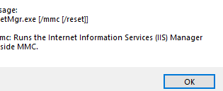
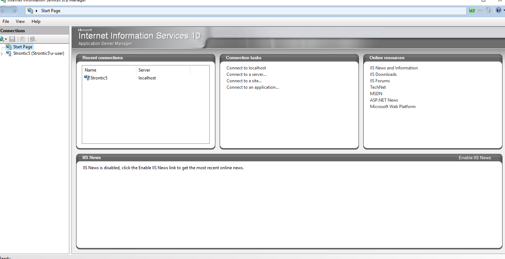

---
title: InetMgr.exe | IIS Manager
---

# InetMgr.exe 

* File Path: `C:\Windows\system32\inetsrv\InetMgr.exe`
* Description: IIS Manager

## Screenshot

## Hashes

Type | Hash
-- | --
MD5 | `A9464BD6A64A088F5664550D4FCD6CAD`
SHA1 | `CD940A6F910F302C21F0CF6B8BA6B41B3C3B619E`
SHA256 | `5458371E9680FE89A0D1964AA50D10CC8F9AA86FDE82D4AC69B2AC6CFF487554`
SHA384 | `80D69877535B9B2D7997B4AAA193FC999E0BE6DE80CEAEEDB34B91E38676C82ABF7A8356C7D37F996F1BB6423F2467CC`
SHA512 | `5FDA3ED88FC766B7AD5F9450E4756286D6BF5141D16773829AAA745C8EE1C274A4E2A4336CD62E1CEE0FA09AB7F8B0490B51AE5AA250F18ED378090887650DC9`
SSDEEP | `3072:8bj2Cf40w3oh7PR3i3RLchg5O++FL034X1:zCgtoJFihLt3A+`

## Runtime Data

### Window Title:
Internet Information Services (IIS) Manager

### Open Handles:

Path | Type
-- | --
(R-D)   C:\Windows\Fonts\StaticCache.dat | File
(R-D)   C:\Windows\System32\en-US\imageres.dll.mui | File
(R-D)   C:\Windows\System32\inetsrv\en-US\Inetmgr.exe.mui | File
(RW-)   C:\Users\Administrator\Documents | File
(RW-)   C:\Windows\WinSxS\amd64_microsoft.windows.common-controls_6595b64144ccf1df_6.0.17763.1397_none_de7645305346d5dc | File
\BaseNamedObjects\NLS_CodePage_1252_3_2_0_0 | Section
\BaseNamedObjects\NLS_CodePage_437_3_2_0_0 | Section
\Sessions\2\Windows\Theme4283305886 | Section
\Windows\Theme1956823608 | Section

### Loaded Modules:

Path |
-- |
C:\Windows\System32\advapi32.dll |
C:\Windows\System32\bcryptPrimitives.dll |
C:\Windows\System32\cfgmgr32.dll |
C:\Windows\System32\combase.dll |
C:\Windows\System32\cryptsp.dll |
C:\Windows\System32\GDI32.dll |
C:\Windows\System32\gdi32full.dll |
C:\Windows\System32\IMM32.DLL |
C:\Windows\system32\inetsrv\InetMgr.exe |
C:\Windows\System32\kernel.appcore.dll |
C:\Windows\System32\KERNEL32.DLL |
C:\Windows\System32\KERNELBASE.dll |
C:\Windows\SYSTEM32\mscoree.dll |
C:\Windows\System32\msvcp_win.dll |
C:\Windows\System32\msvcrt.dll |
C:\Windows\SYSTEM32\ntdll.dll |
C:\Windows\System32\ole32.dll |
C:\Windows\System32\powrprof.dll |
C:\Windows\System32\profapi.dll |
C:\Windows\System32\RPCRT4.dll |
C:\Windows\System32\sechost.dll |
C:\Windows\System32\shcore.dll |
C:\Windows\System32\SHELL32.dll |
C:\Windows\System32\SHLWAPI.dll |
C:\Windows\System32\ucrtbase.dll |
C:\Windows\System32\USER32.dll |
C:\Windows\System32\win32u.dll |
C:\Windows\System32\windows.storage.dll |

## Signature

* Status: Signature verified.
* Serial: `33000001C422B2F79B793DACB20000000001C4`
* Thumbprint: `AE9C1AE54763822EEC42474983D8B635116C8452`
* Issuer: CN=Microsoft Windows Production PCA 2011, O=Microsoft Corporation, L=Redmond, S=Washington, C=US
* Subject: CN=Microsoft Windows, O=Microsoft Corporation, L=Redmond, S=Washington, C=US

## File Metadata

* Original Filename: InetMgr.exe.mui
* Product Name: Internet Information Services
* Company Name: Microsoft Corporation
* File Version: 10.0.17763.1 (WinBuild.160101.0800)
* Product Version: 10.0.17763.1
* Language: Language Neutral
* Legal Copyright:  Microsoft Corporation. All rights reserved.

## File Similarity (ssdeep match)

File | Score
-- | --
[C:\windows\system32\inetsrv\InetMgr.exe](InetMgr.exe-D9BF7B9A71D28754716899BCB99047AE.md) | 83

MIT License. Copyright (c) 2020 Strontic.

