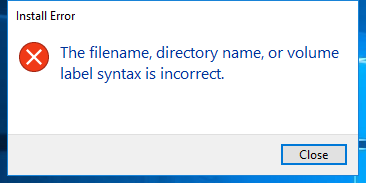
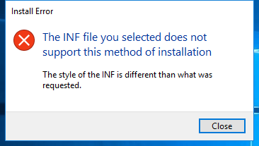
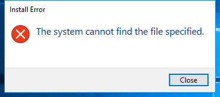

---
title: InfDefaultInstall.exe | INF Default Install
excerpt: What is InfDefaultInstall.exe?
---

# InfDefaultInstall.exe 

* File Path: `C:\WINDOWS\system32\InfDefaultInstall.exe`
* Description: INF Default Install

## Screenshot

## Hashes

Type | Hash
-- | --
MD5 | `8A91DEC7CD83D38314AD072EE568D1CB`
SHA1 | `C27F2C4AFA18075B8BCD6875260F4ECD680D0268`
SHA256 | `D10352EC62DB01410E49D0E38B5575AD81D1FAB383222EAA7C30C3F05C632DA0`
SHA384 | `672F6DDE897A0501E652E4FA90CB198DAB8D7E38F29E0B1C7B59BEBFAB8F0D947BB5668A3B224E8759A6B6A89C9B6E7A`
SHA512 | `673EDAB0C947B50AD8BEF06E62F6249BFF96A005A8F3733E63D0FA803AD9D5F3A7C75AF130739A06A6D22F689656B0745ED0602A61B5055A834125CEE7571598`
SSDEEP | `192:WLhyJxRI+58Hne2bnNOke5dNrxD9Nrzx6vICFzs9aW/GW:4hYqHe2jNe5H1r/xSzcaW/GW`

## Signature

* Status: Signature verified.
* Serial: `330000023241FB59996DCC4DFF000000000232`
* Thumbprint: `FF82BC38E1DA5E596DF374C53E3617F7EDA36B06`
* Issuer: CN=Microsoft Windows Production PCA 2011, O=Microsoft Corporation, L=Redmond, S=Washington, C=US
* Subject: CN=Microsoft Windows, O=Microsoft Corporation, L=Redmond, S=Washington, C=US

## File Metadata

* Original Filename: InfDefaultInstall.EXE.MUI
* Product Name: Microsoft Windows Operating System
* Company Name: Microsoft Corporation
* File Version: 5.2.3668.0
* Product Version: 5.2.3668.0
* Language: English (United States)
* Legal Copyright:  Microsoft Corporation. All rights reserved.

## File Similarity (ssdeep match)

File | Score
-- | --
[C:\Windows\system32\InfDefaultInstall.exe](InfDefaultInstall.exe-6E4ACBE95965D394FE042E1C0B5D7206.md) | 49
[C:\Windows\system32\InfDefaultInstall.exe](InfDefaultInstall.exe-A18B52BBC5C39DAD58703CF92ACAA37C.md) | 33
[C:\Windows\system32\InfDefaultInstall.exe](InfDefaultInstall.exe-EE18876C1E5DE583DE7547075975120E.md) | 27

## Possible Misuse

*The following table contains possible examples of `InfDefaultInstall.exe` being misused. While `InfDefaultInstall.exe` is **not** inherently malicious, its legitimate functionality can be abused for malicious purposes.*

Source | Source File | Example | License
-- | -- | -- | --
[LOLBAS](https://github.com/LOLBAS-Project/LOLBAS) | [Infdefaultinstall.yml](https://github.com/LOLBAS-Project/LOLBAS/blob/master/yml/OSBinaries/Infdefaultinstall.yml) | `Name: Infdefaultinstall.exe` | 
[LOLBAS](https://github.com/LOLBAS-Project/LOLBAS) | [Infdefaultinstall.yml](https://github.com/LOLBAS-Project/LOLBAS/blob/master/yml/OSBinaries/Infdefaultinstall.yml) | `- Command: InfDefaultInstall.exe Infdefaultinstall.inf` | 
[LOLBAS](https://github.com/LOLBAS-Project/LOLBAS) | [Infdefaultinstall.yml](https://github.com/LOLBAS-Project/LOLBAS/blob/master/yml/OSBinaries/Infdefaultinstall.yml) | `- Path: C:\Windows\System32\Infdefaultinstall.exe` | 
[LOLBAS](https://github.com/LOLBAS-Project/LOLBAS) | [Infdefaultinstall.yml](https://github.com/LOLBAS-Project/LOLBAS/blob/master/yml/OSBinaries/Infdefaultinstall.yml) | `- Path: C:\Windows\SysWOW64\Infdefaultinstall.exe` | 
[atomic-red-team](https://github.com/redcanaryco/atomic-red-team) | [index.md](https://github.com/redcanaryco/atomic-red-team/blob/master/atomics/Indexes/Indexes-Markdown/index.md) | - Atomic Test #4: InfDefaultInstall.exe .inf Execution [windows] | [MIT License. © 2018 Red Canary](https://github.com/redcanaryco/atomic-red-team/blob/master/LICENSE.txt)
[atomic-red-team](https://github.com/redcanaryco/atomic-red-team) | [windows-index.md](https://github.com/redcanaryco/atomic-red-team/blob/master/atomics/Indexes/Indexes-Markdown/windows-index.md) | - Atomic Test #4: InfDefaultInstall.exe .inf Execution [windows] | [MIT License. © 2018 Red Canary](https://github.com/redcanaryco/atomic-red-team/blob/master/LICENSE.txt)
[atomic-red-team](https://github.com/redcanaryco/atomic-red-team) | [T1218.md](https://github.com/redcanaryco/atomic-red-team/blob/master/atomics/T1218/T1218.md) | - [Atomic Test #4 - InfDefaultInstall.exe .inf Execution](#atomic-test-4---infdefaultinstallexe-inf-execution) | [MIT License. © 2018 Red Canary](https://github.com/redcanaryco/atomic-red-team/blob/master/LICENSE.txt)
[atomic-red-team](https://github.com/redcanaryco/atomic-red-team) | [T1218.md](https://github.com/redcanaryco/atomic-red-team/blob/master/atomics/T1218/T1218.md) | ## Atomic Test #4 - InfDefaultInstall.exe .inf Execution | [MIT License. © 2018 Red Canary](https://github.com/redcanaryco/atomic-red-team/blob/master/LICENSE.txt)
[atomic-red-team](https://github.com/redcanaryco/atomic-red-team) | [T1218.md](https://github.com/redcanaryco/atomic-red-team/blob/master/atomics/T1218/T1218.md) | Test execution of a .inf using InfDefaultInstall.exe | [MIT License. © 2018 Red Canary](https://github.com/redcanaryco/atomic-red-team/blob/master/LICENSE.txt)
[atomic-red-team](https://github.com/redcanaryco/atomic-red-team) | [T1218.md](https://github.com/redcanaryco/atomic-red-team/blob/master/atomics/T1218/T1218.md) | Reference: https://github.com/LOLBAS-Project/LOLBAS/blob/master/yml/OSBinaries/Infdefaultinstall.yml | [MIT License. © 2018 Red Canary](https://github.com/redcanaryco/atomic-red-team/blob/master/LICENSE.txt)
[atomic-red-team](https://github.com/redcanaryco/atomic-red-team) | [T1218.md](https://github.com/redcanaryco/atomic-red-team/blob/master/atomics/T1218/T1218.md) | \| inf_to_execute \| Local location of inf file \| string \| PathToAtomicsFolder&#92;T1218&#92;src&#92;Infdefaultinstall.inf\| | [MIT License. © 2018 Red Canary](https://github.com/redcanaryco/atomic-red-team/blob/master/LICENSE.txt)
[atomic-red-team](https://github.com/redcanaryco/atomic-red-team) | [T1218.md](https://github.com/redcanaryco/atomic-red-team/blob/master/atomics/T1218/T1218.md) | InfDefaultInstall.exe #{inf_to_execute} | [MIT License. © 2018 Red Canary](https://github.com/redcanaryco/atomic-red-team/blob/master/LICENSE.txt)
[atomic-red-team](https://github.com/redcanaryco/atomic-red-team) | [T1218.md](https://github.com/redcanaryco/atomic-red-team/blob/master/atomics/T1218/T1218.md) | Invoke-WebRequest "https://github.com/redcanaryco/atomic-red-team/raw/master/atomics/T1218/src/Infdefaultinstall.inf" -OutFile "#{inf_to_execute}" | [MIT License. © 2018 Red Canary](https://github.com/redcanaryco/atomic-red-team/blob/master/LICENSE.txt)

MIT License. Copyright (c) 2020 Strontic.

