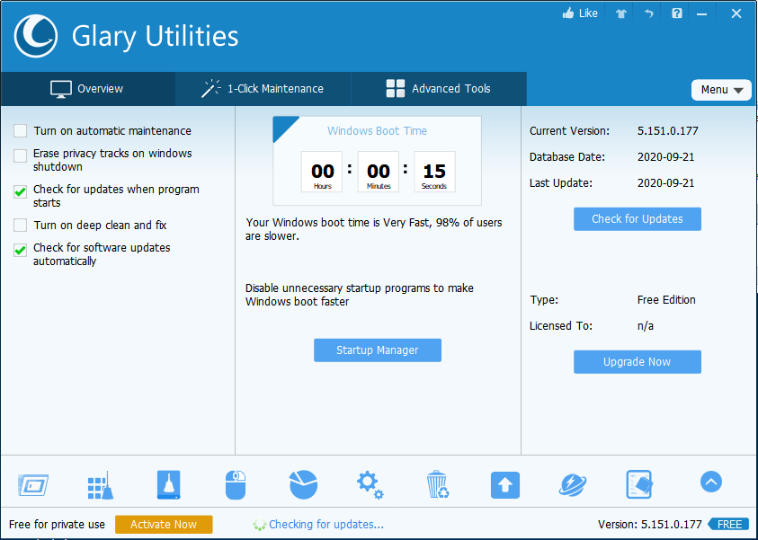

---
title: Integrator.exe | Glary Utilities 5
excerpt: What is Integrator.exe?
---

# Integrator.exe 

* File Path: `C:\Program Files (x86)\Glary Utilities 5\Integrator.exe`
* Description: Glary Utilities 5

## Screenshot

## Hashes

Type | Hash
-- | --
MD5 | `479C0EFFA117B08844D93319A4849E39`
SHA1 | `CACDE08275EE6D2A4144A5194014ADDDD4D5AE76`
SHA256 | `68AB46406B1CE1147344EEEF64EBA5EE767DD6F5271D3306BA5897B052BA4A2C`
SHA384 | `557CDB2DD762520034D5F01744344062681832D48475D3FA37F06AC620537DC1BD7D5887E543789E508E8586AE3C0176`
SHA512 | `2EFD2AB69664CE1BA84D752B9EE2C812C5E59F3782176B4F8F0522A584F055042B9ACE2FDB00F430A85321E90F38AE71B0F3B9560B3CC10FA22328F00778FF0B`
SSDEEP | `24576:vxEPkbOUmcBPkGVP1RjETfSwtTx0WyZwnnvqJx:vxEPkbIGVzGSwtTx0VGnvq3`
IMP | `F0794008BAFFA4EB5FD3F1ADE7507E85`
PESHA1 | `8142D81CE4D9D47EA28FE9AF40BE69E688C1A9A7`
PE256 | `E996600E91383EFA31DD6EB6D30A6F9AF65789822F1B84F4558BB9D9AF696A5E`

## Runtime Data

### Child Processes:
upgrade.exe

### Window Title:
Glary Utilities

### Open Handles:

Path | Type
-- | --
(R-D)   C:\Windows\Fonts\StaticCache.dat | File
(R-D)   C:\Windows\System32\en-US\crypt32.dll.mui | File
(R-D)   C:\Windows\System32\en-US\KernelBase.dll.mui | File
(R-D)   C:\Windows\System32\en-US\mswsock.dll.mui | File
(R-D)   C:\Windows\System32\en-US\propsys.dll.mui | File
(R-D)   C:\Windows\SysWOW64\en-US\user32.dll.mui | File
(RW-)   C:\Program Files (x86)\Glary Utilities 5 | File
(RW-)   C:\Windows | File
(RW-)   C:\Windows\WinSxS\x86_microsoft.vc90.crt_1fc8b3b9a1e18e3b_9.0.30729.9625_none_508ef7e4bcbbe589 | File
(RW-)   C:\Windows\WinSxS\x86_microsoft.windows.common-controls_6595b64144ccf1df_6.0.19041.488_none_11b1e5df2ffd8627 | File
(RW-)   C:\Windows\WinSxS\x86_microsoft.windows.gdiplus_6595b64144ccf1df_1.1.19041.508_none_429cdbca8a8ffa94 | File
(RW-)   C:\xCyclopedia | File
\BaseNamedObjects\__ComCatalogCache__ | Section
\BaseNamedObjects\C:\*ProgramData\*Microsoft\*Windows\*Caches\*{6AF0698E-D558-4F6E-9B3C-3716689AF493}.2.ver0x0000000000000003.db | Section
\BaseNamedObjects\C:\*ProgramData\*Microsoft\*Windows\*Caches\*{DDF571F2-BE98-426D-8288-1A9A39C3FDA2}.2.ver0x0000000000000002.db | Section
\BaseNamedObjects\C:\*ProgramData\*Microsoft\*Windows\*Caches\*cversions.2 | Section
\BaseNamedObjects\F932B6C7-3A20-46A0-B8A0-8894AA421973 | Section
\BaseNamedObjects\NLS_CodePage_1252_3_2_0_0 | Section
\BaseNamedObjects\NLS_CodePage_437_3_2_0_0 | Section
\BaseNamedObjects\windows_shell_global_counters | Section
\Sessions\1\BaseNamedObjects\UrlZonesSM_user | Section
\Sessions\1\BaseNamedObjects\windows_shell_global_counters | Section
\Sessions\1\BaseNamedObjects\windows_webcache_counters_{9B6AB5B3-91BC-4097-835C-EA2DEC95E9CC}_S-1-5-21-2047949552-857980807-821054962-504 | Section
\Sessions\1\Windows\Theme2547664911 | Section
\Windows\Theme3854699184 | Section

### Loaded Modules:

Path |
-- |
C:\Program Files (x86)\Glary Utilities 5\Integrator.exe |
C:\Windows\SYSTEM32\ntdll.dll |
C:\Windows\System32\wow64.dll |
C:\Windows\System32\wow64cpu.dll |
C:\Windows\System32\wow64win.dll |

## Signature

* Status: Signature verified.
* Serial: `0F05AE21CDC17B9F3CF09D7BFC659BA3`
* Thumbprint: `362EBB303E088105BDCC07D94E6B7875D30C0D06`
* Issuer: CN=DigiCert Assured ID Code Signing CA-1, OU=www.digicert.com, O=DigiCert Inc, C=US
* Subject: CN=Glarysoft LTD, O=Glarysoft LTD, S=Beijing, C=CN

## File Metadata

* Original Filename: Integrator.exe
* Product Name: Glary Utilities
* Company Name: Glarysoft Ltd
* File Version: 5, 151, 0, 177
* Product Version: 5, 0, 0, 0
* Language: English
* Legal Copyright: Copyright (c) 2003-2020 Glarysoft Ltd
* Machine Type: 32-bit

## File Scan

* VirusTotal Detections: 0/70
* VirusTotal Link: https://www.virustotal.com/gui/file/68ab46406b1ce1147344eeef64eba5ee767dd6f5271d3306ba5897b052ba4a2c/detection/

## File Similarity (ssdeep match)

File | Score
-- | --
[C:\Program Files (x86)\Glary Utilities 5\Integrator.exe](Integrator.exe-7D8607322AF951E838D38FB397F49A79.md) | 85
[C:\program files (x86)\Glary Utilities 5\Integrator.exe](Integrator.exe-BD5EFF31291F2089276BC716FE9C958B.md) | 91

MIT License. Copyright (c) 2020-2021 Strontic.

