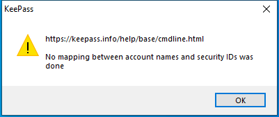

---
title: KeePass.exe | KeePass
excerpt: What is KeePass.exe?
---

# KeePass.exe 

* File Path: `C:\Program Files (x86)\KeePass Password Safe 2\KeePass.exe`
* Description: KeePass
* Comments: KeePass Password Safe

## Screenshot

## Hashes

Type | Hash
-- | --
MD5 | `961DFBEE4C1C386665D4BB29F0A49441`
SHA1 | `B011C8DCBE990C5A835BDDCC01DE793090B35480`
SHA256 | `88E405FB55ACE99ABA86F1498448EB4AC815EF957AC947FD8A23F264782A5E33`
SHA384 | `B56A06BA7BF68E73DC3811D64DD9B2E7B76C24FB87560396FD996136409B5812EC8C84106830FA2E56A98867353349A9`
SHA512 | `55D92B1570B2EECF3BE9E39373CEB6C3B24AE7D6E28D215BFFAFDEFFEA0DF27EC5D1D1A0995CDD8A110D152C32957A62E384CCFFA7AB05D62D5D166B3E763283`
SSDEEP | `49152:xrcbPl1xttuelS6RsOklw94Vh3GNhbNfvioK:xr8PV/uelS6uzF`
IMP | `F34D5F2D4577ED6D9CEEC516C1F5A744`
PESHA1 | `F301560F9D35D112E2FAFBCF10BE0A29584C862B`
PE256 | `CD30A745644C598C4FBB42CB6F32F05ABDD1C47B56B073B29C92352E896CB1C4`

## Runtime Data

### Open Handles:

Path | Type
-- | --
(R-D)   C:\Program Files (x86)\KeePass Password Safe 2\KeePass.exe | File
(R-D)   C:\Program Files (x86)\KeePass Password Safe 2\KeePass.XmlSerializers.dll | File
(R-D)   C:\Windows\Fonts\StaticCache.dat | File
(R-D)   C:\Windows\System32\en-US\user32.dll.mui | File
(R-D)   C:\Windows\System32\en-US\winnlsres.dll.mui | File
(RW-)   C:\Windows\WinSxS\amd64_microsoft.windows.common-controls_6595b64144ccf1df_6.0.19041.488_none_ca04af081b815d21 | File
(RW-)   C:\Windows\WinSxS\amd64_microsoft.windows.gdiplus_6595b64144ccf1df_1.1.19041.508_none_faefa4f37613d18e | File
(RW-)   C:\xCyclopedia | File
(RWD)   C:\Windows\Fonts\micross.ttf | File
\...\Cor_SxSPublic_IPCBlock | Section
\BaseNamedObjects\__ComCatalogCache__ | Section
\BaseNamedObjects\Cor_Private_IPCBlock_v4_612 | Section
\BaseNamedObjects\NLS_CodePage_1252_3_2_0_0 | Section
\BaseNamedObjects\NLS_CodePage_437_3_2_0_0 | Section
\Sessions\1\BaseNamedObjects\1DefaultTIPSharedMemory | Section
\Sessions\1\BaseNamedObjects\264HWNDInterface:50066a | Section
\Sessions\1\BaseNamedObjects\264HWNDInterface:980756 | Section
\Sessions\1\BaseNamedObjects\windows_shell_global_counters | Section
\Sessions\1\Windows\Theme2547664911 | Section
\Windows\Theme3854699184 | Section

### Loaded Modules:

Path |
-- |
C:\Program Files (x86)\KeePass Password Safe 2\KeePass.exe |
C:\Windows\Microsoft.NET\Framework64\v4.0.30319\clr.dll |
C:\Windows\Microsoft.NET\Framework64\v4.0.30319\mscoreei.dll |
C:\Windows\System32\ADVAPI32.dll |
C:\Windows\System32\GDI32.dll |
C:\Windows\SYSTEM32\kernel.appcore.dll |
C:\Windows\System32\KERNEL32.dll |
C:\Windows\System32\KERNELBASE.dll |
C:\Windows\SYSTEM32\MSCOREE.DLL |
C:\Windows\System32\msvcrt.dll |
C:\Windows\SYSTEM32\ntdll.dll |
C:\Windows\System32\RPCRT4.dll |
C:\Windows\System32\sechost.dll |
C:\Windows\System32\SHLWAPI.dll |
C:\Windows\System32\USER32.dll |
C:\Windows\SYSTEM32\VERSION.dll |
C:\Windows\System32\win32u.dll |

## Signature

* Status: Signature verified.
* Serial: `57E66F7FA80DDA7E5D403D6863548CC6`
* Thumbprint: `3B82AC8D746DF6E395B76EC1BDC27CE25793D73B`
* Issuer: CN=Certum Code Signing CA SHA2, OU=Certum Certification Authority, O=Unizeto Technologies S.A., C=PL
* Subject: E=cert@dominik-reichl.de, CN="Open Source Developer, Dominik Reichl", O=Open Source Developer, L=Metzingen, C=DE

## File Metadata

* Original Filename: KeePass.exe
* Product Name: KeePass
* Company Name: Dominik Reichl
* File Version: 2.46.0.0
* Product Version: 2.46.0.0
* Language: Language Neutral
* Legal Copyright: Copyright  2003-2020 Dominik Reichl
* Machine Type: 32-bit

## File Scan

* VirusTotal Detections: 0/71
* VirusTotal Link: https://www.virustotal.com/gui/file/88e405fb55ace99aba86f1498448eb4ac815ef957ac947fd8a23f264782a5e33/detection/

## File Similarity (ssdeep match)

File | Score
-- | --
[C:\program files (x86)\KeePass Password Safe 2\KeePass.exe](KeePass.exe-5EA874CE90310328654D49B0A01E5919.md) | 54

## Possible Misuse

*The following table contains possible examples of `KeePass.exe` being misused. While `KeePass.exe` is **not** inherently malicious, its legitimate functionality can be abused for malicious purposes.*

Source | Source File | Example | License
-- | -- | -- | --
[sigma](https://github.com/Neo23x0/sigma) | [win_apt_wocao.yml](https://github.com/Neo23x0/sigma/blob/master/rules/windows/process_creation/win_apt_wocao.yml) | `- 'type *keepass\KeePass.config.xml'` | [DRL 1.0](https://github.com/Neo23x0/sigma/blob/master/LICENSE.Detection.Rules.md)
[signature-base](https://github.com/Neo23x0/signature-base) | [gen_fireeye_redteam_tools.yar](https://github.com/Neo23x0/signature-base/blob/master/yara/gen_fireeye_redteam_tools.yar) | $b3 = "ERROR: Keepass configuration file not found." ascii wide | [CC BY-NC 4.0](https://github.com/Neo23x0/signature-base/blob/master/LICENSE)
[signature-base](https://github.com/Neo23x0/signature-base) | [gen_fireeye_redteam_tools.yar](https://github.com/Neo23x0/signature-base/blob/master/yara/gen_fireeye_redteam_tools.yar) | $b4 = "ERROR: Keepass configuration file was not found." ascii wide | [CC BY-NC 4.0](https://github.com/Neo23x0/signature-base/blob/master/LICENSE)
[signature-base](https://github.com/Neo23x0/signature-base) | [thor-hacktools.yar](https://github.com/Neo23x0/signature-base/blob/master/yara/thor-hacktools.yar) | description = "Detects component of KeeTheft - KeePass dump tool - file KeeThief.ps1" | [CC BY-NC 4.0](https://github.com/Neo23x0/signature-base/blob/master/LICENSE)
[signature-base](https://github.com/Neo23x0/signature-base) | [thor-hacktools.yar](https://github.com/Neo23x0/signature-base/blob/master/yara/thor-hacktools.yar) | description = "Detects component of KeeTheft - KeePass dump tool - file KeeTheft.exe" | [CC BY-NC 4.0](https://github.com/Neo23x0/signature-base/blob/master/LICENSE)
[signature-base](https://github.com/Neo23x0/signature-base) | [thor-hacktools.yar](https://github.com/Neo23x0/signature-base/blob/master/yara/thor-hacktools.yar) | $x6 = "*** Interesting... there are multiple .NET runtimes loaded in KeePass" fullword wide | [CC BY-NC 4.0](https://github.com/Neo23x0/signature-base/blob/master/LICENSE)
[signature-base](https://github.com/Neo23x0/signature-base) | [thor-hacktools.yar](https://github.com/Neo23x0/signature-base/blob/master/yara/thor-hacktools.yar) | description = "Detects component of KeeTheft - KeePass dump tool - file Out-Shellcode.ps1" | [CC BY-NC 4.0](https://github.com/Neo23x0/signature-base/blob/master/LICENSE)

MIT License. Copyright (c) 2020 Strontic.

