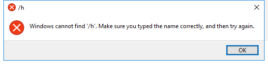

---
title: LaunchWinApp.exe | Launch Windows App
excerpt: What is LaunchWinApp.exe?
---

# LaunchWinApp.exe 

* File Path: `C:\Windows\SysWOW64\LaunchWinApp.exe`
* Description: Launch Windows App

## Screenshot

## Hashes

Type | Hash
-- | --
MD5 | `98EBBD66B13C7E5AB7470A1FAED28654`
SHA1 | `E85FF6BFF537602F64ABB4F7F7E4E9CF21B1C461`
SHA256 | `6A40C7EA3927A74805EA2CE4B99EB2B14111F52D9B1737141B3CF6F808F4AD59`
SHA384 | `08B64DD6163999B50A4C53C694F50FA8ADDD638E49D2B8F8F3FE64FADC456767A7E5D4336052692C79277BC5259239F4`
SHA512 | `5942B33CAD25077B67F84D54CD7E8C8307D55E9F5F361131DBB40024E6EF46D2883DD5F52B49AC59F243502F7E5EA9C1DD77C9872C8BB90BDECA0AE4B2E024EC`
SSDEEP | `768:4feQl8I/Q3CGqm6hzHXm6shqHhVL72VAtVJGzwB:YeQaInGqb4qHhV31JGzw`

## Signature

* Status: Signature verified.
* Serial: `3300000266BD1580EFA75CD6D3000000000266`
* Thumbprint: `A4341B9FD50FB9964283220A36A1EF6F6FAA7840`
* Issuer: CN=Microsoft Windows Production PCA 2011, O=Microsoft Corporation, L=Redmond, S=Washington, C=US
* Subject: CN=Microsoft Windows, O=Microsoft Corporation, L=Redmond, S=Washington, C=US

## File Metadata

* Original Filename: LaunchWinApp.exe
* Product Name: Microsoft Windows Operating System
* Company Name: Microsoft Corporation
* File Version: 10.0.14393.3686 (rs1_release.200504-1524)
* Product Version: 10.0.14393.3686
* Language: English (United States)
* Legal Copyright:  Microsoft Corporation. All rights reserved.

MIT License. Copyright (c) 2020-2021 Strontic.

