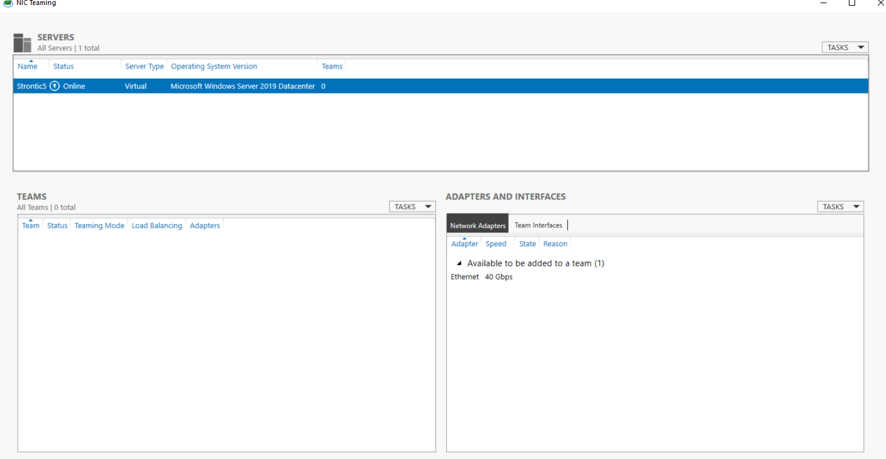

---
title: LbfoAdmin.exe | NIC Teaming
excerpt: What is LbfoAdmin.exe?
---

# LbfoAdmin.exe 

* File Path: `C:\Windows\system32\LbfoAdmin.exe`
* Description: NIC Teaming

## Screenshot

## Hashes

Type | Hash
-- | --
MD5 | `911DC9868BBFEA5E95DC88BE10BC9C11`
SHA1 | `6C451C32E74F99C8823DB0EB82799958C2458334`
SHA256 | `457C99EF5D87D7EFC4B853CCC0D07FF16F9E411EFB59A8B0FDE4E85FED704B39`
SHA384 | `D20D1B5F517F9D6E27B6A31D003A1F349C5BC5D33FF51B0CC0189B152F30FFFDC734B7AAB7F15E26305E0054586FFFCF`
SHA512 | `8911F561602D6517CC58EE390665794810205B73F8E25D872D1980D70FD22167258BFCF25116E0CCE8A2A3B58EE89D0D7F1DCDBAE41E6382693B1AD0AED54229`
SSDEEP | `1536:BtVcjj4PBuhUYXH1VydQShStyJPnqbye86opC3M/EgmnryqPbvAWc14zUWJGCTBH:lxP8hUYXH1+mty9quegO7jS4VzTN`
IMP | `F34D5F2D4577ED6D9CEEC516C1F5A744`
PESHA1 | `4825BF02792DA52E65100B9414806B6951CBF8AA`
PE256 | `B83976D52CA198B307119327803D342AC3B520961DAA19C20D4B97F2AEDFBFF3`

## Runtime Data

### Window Title:
NIC Teaming

### Open Handles:

Path | Type
-- | --
(R--)   C:\Windows\System32\spool\drivers\color\sRGB Color Space Profile.icm | File
(R-D)   C:\Windows\System32\en-US\KernelBase.dll.mui | File
(R-D)   C:\Windows\System32\en-US\LbfoAdmin.exe.mui | File
(R-D)   C:\Windows\System32\en-US\msctfui.dll.mui | File
(R-D)   C:\Windows\System32\LbfoAdminLib.dll | File
(RW-)   C:\Users\user | File
(RW-)   C:\Windows\WinSxS\amd64_microsoft.windows.common-controls_6595b64144ccf1df_6.0.17763.1518_none_de6e2bd0534e2567 | File
(RWD)   C:\Windows\Fonts\segoeui.ttf | File
\...\Cor_SxSPublic_IPCBlock | Section
\BaseNamedObjects\__ComCatalogCache__ | Section
\BaseNamedObjects\C:\*ProgramData\*Microsoft\*Windows\*Caches\*{6AF0698E-D558-4F6E-9B3C-3716689AF493}.2.ver0x0000000000000004.db | Section
\BaseNamedObjects\C:\*ProgramData\*Microsoft\*Windows\*Caches\*{DDF571F2-BE98-426D-8288-1A9A39C3FDA2}.2.ver0x0000000000000004.db | Section
\BaseNamedObjects\C:\*ProgramData\*Microsoft\*Windows\*Caches\*cversions.2.ro | Section
\BaseNamedObjects\Cor_Private_IPCBlock_v4_1528 | Section
\BaseNamedObjects\NLS_CodePage_1252_3_2_0_0 | Section
\BaseNamedObjects\NLS_CodePage_437_3_2_0_0 | Section
\RPC Control\DSEC5F8 | Section
\Sessions\2\BaseNamedObjects\5f8HWNDInterface:5a02de | Section
\Sessions\2\BaseNamedObjects\701647d8-b9fe-44e8-853f-bc4f86189ce0 | Section
\Sessions\2\BaseNamedObjects\UrlZonesSM_Administrator | Section
\Sessions\2\BaseNamedObjects\windows_shell_global_counters | Section
\Sessions\2\Windows\Theme2131664586 | Section
\Windows\Theme966197582 | Section

### Loaded Modules:

Path |
-- |
C:\Windows\assembly\NativeImages_v4.0.30319_64\mscorlib\5543cca0df435801e2303ff46a482ed5\mscorlib.ni.dll |
C:\Windows\assembly\NativeImages_v4.0.30319_64\Presentatio5ae0f00f#\d1101640429a2c3d8c6c257103ad22c1\PresentationFramework.ni.dll |
C:\Windows\assembly\NativeImages_v4.0.30319_64\PresentationCore\8fad18d47be73b98845c53d0e6d3b964\PresentationCore.ni.dll |
C:\Windows\assembly\NativeImages_v4.0.30319_64\System.Core\f29b1120627489754c4b8dd317bbe950\System.Core.ni.dll |
C:\Windows\assembly\NativeImages_v4.0.30319_64\System.Xaml\12c01954752c224882de75b4418c8382\System.Xaml.ni.dll |
C:\Windows\assembly\NativeImages_v4.0.30319_64\System\6885802f40fd803e49150d8a2b43a09b\System.ni.dll |
C:\Windows\assembly\NativeImages_v4.0.30319_64\WindowsBase\7766b716f453669f6453022ce957c6ad\WindowsBase.ni.dll |
C:\Windows\Microsoft.NET\Framework64\v4.0.30319\clr.dll |
C:\Windows\Microsoft.NET\Framework64\v4.0.30319\clrjit.dll |
C:\Windows\Microsoft.NET\Framework64\v4.0.30319\mscoreei.dll |
C:\Windows\Microsoft.NET\Framework64\v4.0.30319\WPF\PresentationNative_v0400.dll |
C:\Windows\Microsoft.NET\Framework64\v4.0.30319\WPF\wpfgfx_v0400.dll |
C:\Windows\System32\ADVAPI32.dll |
C:\Windows\System32\bcrypt.dll |
C:\Windows\System32\bcryptPrimitives.dll |
C:\Windows\System32\combase.dll |
C:\Windows\system32\CRYPTBASE.dll |
C:\Windows\System32\CRYPTSP.dll |
C:\Windows\SYSTEM32\dwrite.dll |
C:\Windows\System32\GDI32.dll |
C:\Windows\System32\gdi32full.dll |
C:\Windows\System32\IMM32.DLL |
C:\Windows\System32\kernel.appcore.dll |
C:\Windows\System32\KERNEL32.dll |
C:\Windows\System32\KERNELBASE.dll |
C:\Windows\system32\LbfoAdmin.exe |
C:\Windows\SYSTEM32\MSCOREE.DLL |
C:\Windows\System32\msvcp_win.dll |
C:\Windows\system32\MSVCP120_CLR0400.dll |
C:\Windows\SYSTEM32\MSVCR120_CLR0400.dll |
C:\Windows\System32\msvcrt.dll |
C:\Windows\SYSTEM32\ntdll.dll |
C:\Windows\System32\ole32.dll |
C:\Windows\System32\OLEAUT32.dll |
C:\Windows\System32\RPCRT4.dll |
C:\Windows\system32\rsaenh.dll |
C:\Windows\System32\sechost.dll |
C:\Windows\System32\SHLWAPI.dll |
C:\Windows\System32\ucrtbase.dll |
C:\Windows\System32\USER32.dll |
C:\Windows\system32\uxtheme.dll |
C:\Windows\system32\VERSION.dll |
C:\Windows\System32\win32u.dll |

## Signature

* Status: Signature verified.
* Serial: `33000001C422B2F79B793DACB20000000001C4`
* Thumbprint: `AE9C1AE54763822EEC42474983D8B635116C8452`
* Issuer: CN=Microsoft Windows Production PCA 2011, O=Microsoft Corporation, L=Redmond, S=Washington, C=US
* Subject: CN=Microsoft Windows, O=Microsoft Corporation, L=Redmond, S=Washington, C=US

## File Metadata

* Original Filename: LBFOADMIN.EXE.MUI
* Product Name: Microsoft Windows Operating System
* Company Name: Microsoft Corporation
* File Version: 10.0.17763.1 (WinBuild.160101.0800)
* Product Version: 10.0.17763.1
* Language: English (United States)
* Legal Copyright:  Microsoft Corporation. All rights reserved.
* Machine Type: 32-bit

## File Scan

* VirusTotal Detections: 0/66
* VirusTotal Link: https://www.virustotal.com/gui/file/457c99ef5d87d7efc4b853ccc0d07ff16f9e411efb59a8b0fde4e85fed704b39/detection/

## File Similarity (ssdeep match)

File | Score
-- | --
[C:\windows\system32\LbfoAdmin.exe](LbfoAdmin.exe-864ACD5218AE9D270B2DC7AACBE26BA7.md) | 86
[C:\Windows\system32\LbfoAdmin.exe](LbfoAdmin.exe-86D331A0F698EEA7CEF552C1EF7F4E82.md) | 97

MIT License. Copyright (c) 2020-2021 Strontic.

