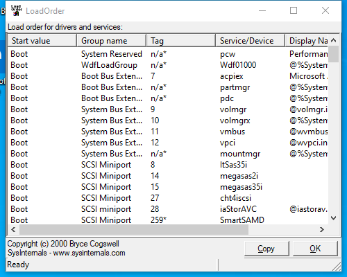

---
title: LoadOrd64.exe | Startup order viewer
excerpt: What is LoadOrd64.exe?
---

# LoadOrd64.exe 

* File Path: `C:\SysinternalsSuite\LoadOrd64.exe`
* Description: Startup order viewer

## Screenshot

## Hashes

Type | Hash
-- | --
MD5 | `409ED17853D3A1B7413926FF8471957C`
SHA1 | `0558F8975CEBE341BBFA5D95356406307C446892`
SHA256 | `E8EC243BE1CA6C20D7EC12B164526E060FC2E8A7F2F4B27F0784CB5970377708`
SHA384 | `47E8BDEF64D058E77FE5F4CC847CA8B645CF1BBAB64A3704A91536333DBFE3678865C2897C4D673C36A58CBD75000291`
SHA512 | `075BD79EF51213C4C2744AE9B55683B91E7741049CDDCB0C8A2886452EF50C4AF4B1D2C09F5C0CF1B4C8263DE93BD89C5BAF5AA23B88F170785CABF3B108466F`
SSDEEP | `3072:Au+qdlgrbYmLlqJATTmBb26WJGOTcrp5UF/YfUuXI3rgWqYENfa:AVoZYlqKTU26drE/m9XIwfa`
IMP | `029784929DBB3CA04D47E51C910CAB3E`
PESHA1 | `B6A32D3C74D303C20D15CBEC1F30EC6CA0A6D4DF`
PE256 | `5DEFA17FDBF7805D87A7B1BB908B0619BB8CCE5CA335F399F75446B7D404B539`

## Runtime Data

### Window Title:
LoadOrder

### Open Handles:

Path | Type
-- | --
(R-D)   C:\Windows\Fonts\StaticCache.dat | File
(RW-)   C:\Windows\WinSxS\amd64_microsoft.windows.common-controls_6595b64144ccf1df_5.82.19041.488_none_4238de57f6b64d28 | File
(RW-)   C:\Windows\WinSxS\amd64_microsoft.windows.common-controls_6595b64144ccf1df_6.0.19041.488_none_ca04af081b815d21 | File
(RW-)   C:\xCyclopedia | File
\BaseNamedObjects\NLS_CodePage_1252_3_2_0_0 | Section
\BaseNamedObjects\NLS_CodePage_437_3_2_0_0 | Section
\Sessions\1\Windows\Theme2036293991 | Section
\Windows\Theme1324212991 | Section

### Loaded Modules:

Path |
-- |
C:\SysinternalsSuite\LoadOrd64.exe |
C:\Windows\System32\ADVAPI32.dll |
C:\Windows\System32\GDI32.dll |
C:\Windows\System32\gdi32full.dll |
C:\Windows\System32\KERNEL32.DLL |
C:\Windows\System32\KERNELBASE.dll |
C:\Windows\System32\msvcp_win.dll |
C:\Windows\System32\msvcrt.dll |
C:\Windows\SYSTEM32\ntdll.dll |
C:\Windows\System32\RPCRT4.dll |
C:\Windows\System32\sechost.dll |
C:\Windows\System32\ucrtbase.dll |
C:\Windows\System32\USER32.dll |
C:\Windows\System32\win32u.dll |
C:\Windows\WinSxS\amd64_microsoft.windows.common-controls_6595b64144ccf1df_5.82.19041.488_none_4238de57f6b64d28\COMCTL32.dll |

## Signature

* Status: Signature verified.
* Serial: `330000010A2C79AED7797BA6AC00010000010A`
* Thumbprint: `3BDA323E552DB1FDE5F4FBEE75D6D5B2B187EEDC`
* Issuer: CN=Microsoft Code Signing PCA, O=Microsoft Corporation, L=Redmond, S=Washington, C=US
* Subject: CN=Microsoft Corporation, OU=MOPR, O=Microsoft Corporation, L=Redmond, S=Washington, C=US

## File Metadata

* Original Filename: Loadord
* Product Name: Sysinternals Loadord
* Company Name: Sysinternals - www.sysinternals.com
* File Version: 1.01
* Product Version: 1.01
* Language: English (United States)
* Legal Copyright: Copyright (C) 1998-2016 Mark Russinovich
* Machine Type: 64-bit

## File Scan

* VirusTotal Detections: 0/68
* VirusTotal Link: https://www.virustotal.com/gui/file/e8ec243be1ca6c20d7ec12b164526e060fc2e8a7f2f4b27f0784cb5970377708/detection/

MIT License. Copyright (c) 2020-2021 Strontic.

