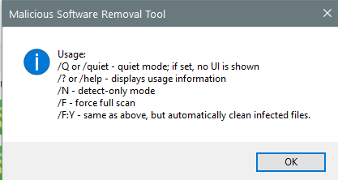

---
title: MRT-KB890830.exe | Microsoft Windows Malicious Software Removal Tool
---

# MRT-KB890830.exe 

* File Path: `C:\WINDOWS\system32\MRT-KB890830.exe`
* Description: Microsoft Windows Malicious Software Removal Tool
* Comments: 

## Screenshot



## Hashes

Type | Hash
-- | --
MD5 | `DEC2E74347F641F3304FE0B71866C79D`
SHA1 | `9902161F741518DD8899186392F273D5E2BF7CCD`
SHA256 | `F3983A95899262AB874172D662F0EA7D5706EBFE3AC9B2EA499793AC73BC8AB9`
SHA384 | `ED466E77AD18E1EE651FE798131D723D877F3FB9727C2A534620171B118DD4E9B0397D36457AF98B318C751690F2837C`
SHA512 | `1F7B052882A7E347C307EADD0A3FEA84FF75AD9BA1E95846DE8276BD6664D4C56B54A70F7DF1AC91387FBDD703F8784B685E59F275DC627CBCE8ECABAB2C639A`
SSDEEP | `3145728:YPt4FZKKL2jif/t/F/K5xB5xj5xw5x//a/D5xe5xR5xY5x55xd5xYiRSb8DKI43n:YPt4F1mYiRS4Mm+`

## Runtime Data

### Usage (stdout):
```Batchfile

```

### Usage (stderr):
```Batchfile

```

### Child Processes:


## Signature

* Status: Signature verified.
* Serial: `33000001797C2E574E52E1CAD6000100000179`
* Thumbprint: `5EAD300DC7E4D637948ECB0ED829A072BD152E17`
* Issuer: CN=Microsoft Code Signing PCA, O=Microsoft Corporation, L=Redmond, S=Washington, C=US
* Subject: CN=Microsoft Corporation, OU=MOPR, O=Microsoft Corporation, L=Redmond, S=Washington, C=US

## File Metadata

* Original Filename: mrt.exe
* Product Name: Microsoft Windows Malicious Software Removal Tool
* Company Name: Microsoft Corporation
* File Version: 5.60.14817.1
* Product Version: 5.60.14817.1
* Language: English (United States)
* Legal Copyright:  Microsoft Corporation. All rights reserved.


MIT License. Copyright (c) 2020 Strontic.


