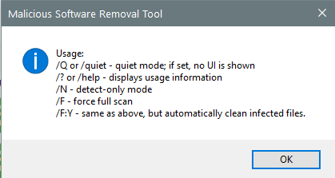

---
title: MRT.exe | Microsoft Windows Malicious Software Removal Tool
excerpt: What is MRT.exe?
---

# MRT.exe 

* File Path: `C:\Windows\system32\MRT.exe`
* Description: Microsoft Windows Malicious Software Removal Tool

## Screenshot

## Hashes

Type | Hash
-- | --
MD5 | `792A4FC72C80CA97C00196B4D8B27A0E`
SHA1 | `D43D28D503A579E9E13F441E4B2B97E1F8B7AED3`
SHA256 | `0E648156E17AEC12C15871C73966A59682B4C0562286EB764FAF2AD256AA4C22`
SHA384 | `CED837D34CCC8EF7975B6348392E0C83D3C081DBA71F9E4C7C5FD184F65076B4744CB1E55487A3131EF2D3B14D56232C`
SHA512 | `54BF1E32C36D7AB05B455D2908F19ABE903C5B7B37F1F6C81F8414C41CC87FD5F01BA989260D8FB4C61A57478F8717732B2ABA364F1AD74A3AE125FC491F0171`
SSDEEP | `3145728:AIjdsgooon1zd/A/G/j5xB/G5xdE5x65xS/W5xV5xh5xr5xT5xM5xw5xR5xb8sBr:tjd+ovT8sBr`

## Runtime Data

### Window Title:
Malicious Software Removal Tool

### Open Handles:

Path | Type
-- | --
(R-D)   C:\Windows\Fonts\StaticCache.dat | File
(R-D)   C:\Windows\System32\en-US\imageres.dll.mui | File
(RW-)   C:\Users\user\Documents | File
(RW-)   C:\Windows\WinSxS\amd64_microsoft.windows.common-controls_6595b64144ccf1df_6.0.17763.1397_none_de7645305346d5dc | File
\BaseNamedObjects\NLS_CodePage_1252_3_2_0_0 | Section
\BaseNamedObjects\NLS_CodePage_437_3_2_0_0 | Section
\Sessions\2\Windows\Theme4283305886 | Section
\Windows\Theme1956823608 | Section

### Loaded Modules:

Path |
-- |
C:\Windows\system32\MRT.exe |
C:\Windows\SYSTEM32\ntdll.dll |

## Signature

* Status: Signature verified.
* Serial: `33000002689ACC74C3B73DBA47000000000268`
* Thumbprint: `26E1ECEDA18F82CCE5EE18F25C98F1AC9C02DA16`
* Issuer: CN=Microsoft Windows Production PCA 2011, O=Microsoft Corporation, L=Redmond, S=Washington, C=US
* Subject: CN=Microsoft Windows, O=Microsoft Corporation, L=Redmond, S=Washington, C=US

## File Metadata

* Original Filename: mrt.exe
* Product Name: Microsoft Windows Malicious Software Removal Tool
* Company Name: Microsoft Corporation
* File Version: 5.82.17046.2
* Product Version: 5.82.17046.2
* Language: English (United States)
* Legal Copyright:  Microsoft Corporation. All rights reserved.

## Possible Misuse

*The following table contains possible examples of `MRT.exe` being misused. While `MRT.exe` is **not** inherently malicious, its legitimate functionality can be abused for malicious purposes.*

Source | Source File | Example | License
-- | -- | -- | --
[sigma](https://github.com/Neo23x0/sigma) | [win_susp_svchost.yml](https://github.com/Neo23x0/sigma/blob/master/rules/windows/process_creation/win_susp_svchost.yml) | `- '*\Mrt.exe'` | [DRL 1.0](https://github.com/Neo23x0/sigma/blob/master/LICENSE.Detection.Rules.md)
[signature-base](https://github.com/Neo23x0/signature-base) | [crime_fireball.yar](https://github.com/Neo23x0/signature-base/blob/master/yara/crime_fireball.yar) | $x1 = "SOFTWARE\\Microsoft\\Windows NT\\CurrentVersion\\Image File Execution Options\\MRT.exe" fullword wide | [CC BY-NC 4.0](https://github.com/Neo23x0/signature-base/blob/master/LICENSE)

MIT License. Copyright (c) 2020 Strontic.

