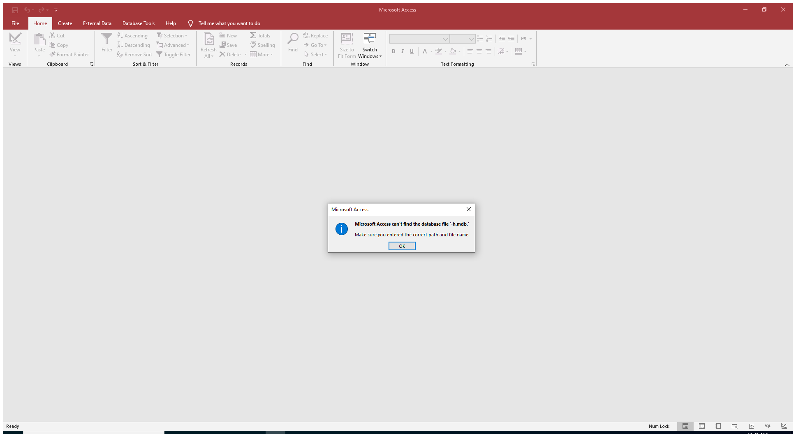

---
title: MSACCESS.EXE | Microsoft Access
excerpt: What is MSACCESS.EXE?
---

# MSACCESS.EXE 

* File Path: `C:\Program Files (x86)\Microsoft Office\root\Office16\MSACCESS.EXE`
* Description: Microsoft Access

## Screenshot

## Hashes

Type | Hash
-- | --
MD5 | `E1154F4BFF6B75573EDC83F59F47DE6B`
SHA1 | `0D6CF8626D7C2C8E34B74F90AEFD43DC6FEDDF81`
SHA256 | `A59BEC6BFEB33CD5BEB8C98F1719BEA48C220E418E47F06824B284B5B943531A`
SHA384 | `A2D4F8F0A05F9083977B57DFDF2B2FE624AD6D2B222705AA836C779BEC11E35CDCD849A42CB2A20EE3E341558F8E5C39`
SHA512 | `CE21A3D3FEB526599DD2AA5369C417D55D7BCD728F0442CFEF75735B56DB56583F341004C26B39F28AA2BBF180F790B47561DC013847BC76B2F10CAC6271595F`
SSDEEP | `393216:Ack6Yquu6rbh5VcJn4FzpgIau1N8YDQQj:AN6quAvKJn4rgIXlMk`
IMP | `EFA5104CE99EC77DFB1FC311BEC1C020`
PESHA1 | `57CB4951BC219BF9F7C883D3A662D7E89288DEFB`
PE256 | `0A5E3CD1E5441DCF322CB99333BEE51D94451DA3C2027701FBBE0B62CA1C135A`

## Runtime Data

### Window Title:
Microsoft Access

### Open Handles:

Path | Type
-- | --
(R--)   C:\ProgramData\Microsoft\Office\ClickToRunPackageLocker | File
(R-D)   C:\Windows\Fonts\StaticCache.dat | File
(R-D)   C:\Windows\System32\en-US\d2d1.dll.mui | File
(R-D)   C:\Windows\System32\en-US\KernelBase.dll.mui | File
(R-D)   C:\Windows\System32\en-US\propsys.dll.mui | File
(R-D)   C:\Windows\System32\en-US\Windows.Security.Authentication.Web.Core.dll.mui | File
(R-D)   C:\Windows\System32\en-US\winnlsres.dll.mui | File
(R-D)   C:\Windows\SystemResources\imageres.dll.mun | File
(R-D)   C:\Windows\SysWOW64\en-US\user32.dll.mui | File
(RW-)   C:\Users\user\Documents | File
(RW-)   C:\Windows | File
(RW-)   C:\Windows\WinSxS\x86_microsoft.windows.common-controls_6595b64144ccf1df_6.0.19041.488_none_11b1e5df2ffd8627 | File
(RW-)   C:\Windows\WinSxS\x86_microsoft.windows.gdiplus_6595b64144ccf1df_1.1.19041.508_none_429cdbca8a8ffa94 | File
(RWD)   C:\Windows\Fonts\segoeui.ttf | File
\BaseNamedObjects\__ComCatalogCache__ | Section
\BaseNamedObjects\C:\*ProgramData\*Microsoft\*Windows\*Caches\*{6AF0698E-D558-4F6E-9B3C-3716689AF493}.2.ver0x000000000000000a.db | Section
\BaseNamedObjects\C:\*ProgramData\*Microsoft\*Windows\*Caches\*{DDF571F2-BE98-426D-8288-1A9A39C3FDA2}.2.ver0x0000000000000002.db | Section
\BaseNamedObjects\C:\*ProgramData\*Microsoft\*Windows\*Caches\*cversions.2 | Section
\BaseNamedObjects\NLS_CodePage_1252_3_2_0_0 | Section
\BaseNamedObjects\NLS_CodePage_437_3_2_0_0 | Section
\Sessions\1\BaseNamedObjects\d54HWNDInterface:4a0488 | Section
\Sessions\1\BaseNamedObjects\windows_shell_global_counters | Section
\Sessions\1\Windows\Theme64749523 | Section
\Windows\Theme1120315852 | Section

### Loaded Modules:

Path |
-- |
C:\Program Files (x86)\Microsoft Office\root\Office16\MSACCESS.EXE |
C:\Windows\SYSTEM32\ntdll.dll |
C:\Windows\System32\wow64.dll |
C:\Windows\System32\wow64cpu.dll |
C:\Windows\System32\wow64win.dll |

## Signature

* Status: Signature verified.
* Serial: `33000002CE7C9ACE7D905ED2B70000000002CE`
* Thumbprint: `B10607FB914700B40F794610850C1DE0A21566C1`
* Issuer: CN=Microsoft Code Signing PCA 2010, O=Microsoft Corporation, L=Redmond, S=Washington, C=US
* Subject: CN=Microsoft Corporation, O=Microsoft Corporation, L=Redmond, S=Washington, C=US

## File Metadata

* Original Filename: MSACCESS.EXE
* Product Name: Microsoft Office
* Company Name: Microsoft Corporation
* File Version: 16.0.12527.20482
* Product Version: 16.0.12527.20482
* Language: Language Neutral
* Legal Copyright: 
* Machine Type: 32-bit

## File Scan

* VirusTotal Detections: 0/69
* VirusTotal Link: https://www.virustotal.com/gui/file/a59bec6bfeb33cd5beb8c98f1719bea48c220e418e47f06824b284b5b943531a/detection/

## Possible Misuse

*The following table contains possible examples of `MSACCESS.EXE` being misused. While `MSACCESS.EXE` is **not** inherently malicious, its legitimate functionality can be abused for malicious purposes.*

Source | Source File | Example | License
-- | -- | -- | --
[sigma](https://github.com/Neo23x0/sigma) | [win_office_shell.yml](https://github.com/Neo23x0/sigma/blob/master/rules/windows/process_creation/win_office_shell.yml) | `- '*\MSACCESS.EXE'`{:.highlight .language-yaml} | [DRL 1.0](https://github.com/Neo23x0/sigma/blob/master/LICENSE.Detection.Rules.md)
[sigma](https://github.com/Neo23x0/sigma) | [win_susp_powershell_parent_process.yml](https://github.com/Neo23x0/sigma/blob/master/rules/windows/process_creation/win_susp_powershell_parent_process.yml) | `- '\msaccess.exe'`{:.highlight .language-yaml} | [DRL 1.0](https://github.com/Neo23x0/sigma/blob/master/LICENSE.Detection.Rules.md)

MIT License. Copyright (c) 2020-2021 Strontic.

