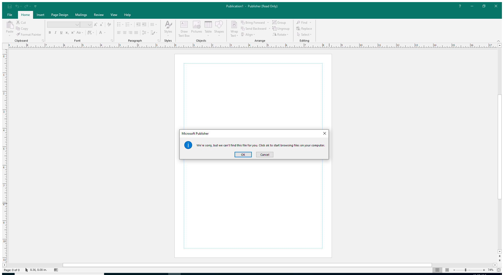

---
title: MSPUB.EXE | Microsoft Publisher
excerpt: What is MSPUB.EXE?
---

# MSPUB.EXE 

* File Path: `C:\Program Files (x86)\Microsoft Office\root\Office16\MSPUB.EXE`
* Description: Microsoft Publisher

## Screenshot

## Hashes

Type | Hash
-- | --
MD5 | `86F2148162BB03986594DD103368D676`
SHA1 | `9BD9995D91082A3F5138F214DE3CB81C6905A9C9`
SHA256 | `D12ACBF9B696B814B909474B859FC9F07BA4A7406A56D60B974E03F4BD810F8F`
SHA384 | `CDC37B55B83D689036AA3F23680F16450C800BD609CEE4F8210934ACBBAB4B6EE14F32BA5FF06831D77F757BC427B1A5`
SHA512 | `5FA21DEA532B6DA8272820849E45212D8AABDC79E51C4267E3F5D75673A7ECF8AEF64ADB4DC0C5DD0A477B9D6971D56115C19A91C9F18F0AB048AE6E965E43E6`
SSDEEP | `196608:d39e6LJwMQfCBQrpfJVoUouqnQBjybSgujMr:R9e+JVQfCBQrpfJyajYbS9jMr`
IMP | `0711AE92D81C416A85668FCB4D8D73C2`
PESHA1 | `45DDB1109FD7821CD7A0F8721FB582DECD82C611`
PE256 | `78CF3E184B61125C5659F4DDAE589E2773927D8873FC5558B344641E4642B017`

## Runtime Data

### Child Processes:
splwow64.exe

### Window Title:
Publication1 - Publisher (Read Only)

### Open Handles:

Path | Type
-- | --
(R--)   C:\ProgramData\Microsoft\Office\ClickToRunPackageLocker | File
(R--)   C:\Users\user\AppData\Local\Temp\~DF04A8241786377E5B.TMP | File
(R--)   C:\Users\user\AppData\Local\Temp\~DFFF013972B4CD481F.TMP | File
(R--)   C:\Users\user\AppData\Local\Temp\~Qil0442.tmp | File
(R-D)   C:\Windows\Fonts\StaticCache.dat | File
(R-D)   C:\Windows\System32\en-US\d2d1.dll.mui | File
(R-D)   C:\Windows\System32\en-US\KernelBase.dll.mui | File
(R-D)   C:\Windows\System32\en-US\Windows.Security.Authentication.Web.Core.dll.mui | File
(R-D)   C:\Windows\System32\en-US\winnlsres.dll.mui | File
(R-D)   C:\Windows\SystemResources\imageres.dll.mun | File
(R-D)   C:\Windows\SysWOW64\en-US\user32.dll.mui | File
(RW-)   C:\Users\user\Documents | File
(RW-)   C:\Windows | File
(RW-)   C:\Windows\WinSxS\x86_microsoft.windows.common-controls_6595b64144ccf1df_6.0.19041.488_none_11b1e5df2ffd8627 | File
(RW-)   C:\Windows\WinSxS\x86_microsoft.windows.gdiplus_6595b64144ccf1df_1.1.19041.508_none_429cdbca8a8ffa94 | File
(RWD)   C:\temp\strontic-xcyclopedia | File
(RWD)   C:\Windows\Fonts | File
(RWD)   C:\Windows\Fonts\segoeui.ttf | File
\BaseNamedObjects\__ComCatalogCache__ | Section
\BaseNamedObjects\C:\*ProgramData\*Microsoft\*Windows\*Caches\*{6AF0698E-D558-4F6E-9B3C-3716689AF493}.2.ver0x000000000000000a.db | Section
\BaseNamedObjects\C:\*ProgramData\*Microsoft\*Windows\*Caches\*{DDF571F2-BE98-426D-8288-1A9A39C3FDA2}.2.ver0x0000000000000002.db | Section
\BaseNamedObjects\C:\*ProgramData\*Microsoft\*Windows\*Caches\*cversions.2 | Section
\BaseNamedObjects\NLS_CodePage_1252_3_2_0_0 | Section
\BaseNamedObjects\NLS_CodePage_437_3_2_0_0 | Section
\BaseNamedObjects\windows_shell_global_counters | Section
\Sessions\1\BaseNamedObjects\8a0HWNDInterface:3c04fe | Section
\Sessions\1\BaseNamedObjects\windows_shell_global_counters | Section
\Sessions\1\Windows\Theme64749523 | Section
\Windows\Theme1120315852 | Section

### Loaded Modules:

Path |
-- |
C:\Program Files (x86)\Microsoft Office\root\Office16\MSPUB.EXE |
C:\Windows\SYSTEM32\ntdll.dll |
C:\Windows\System32\wow64.dll |
C:\Windows\System32\wow64cpu.dll |
C:\Windows\System32\wow64win.dll |

## Signature

* Status: Signature verified.
* Serial: `33000002CE7C9ACE7D905ED2B70000000002CE`
* Thumbprint: `B10607FB914700B40F794610850C1DE0A21566C1`
* Issuer: CN=Microsoft Code Signing PCA 2010, O=Microsoft Corporation, L=Redmond, S=Washington, C=US
* Subject: CN=Microsoft Corporation, O=Microsoft Corporation, L=Redmond, S=Washington, C=US

## File Metadata

* Original Filename: MSPUB.EXE
* Product Name: Microsoft Office
* Company Name: Microsoft Corporation
* File Version: 16.0.12527.20482
* Product Version: 16.0.12527.20482
* Language: Language Neutral
* Legal Copyright: 
* Machine Type: 32-bit

## File Scan

* VirusTotal Detections: 0/73
* VirusTotal Link: https://www.virustotal.com/gui/file/d12acbf9b696b814b909474b859fc9f07ba4a7406a56d60b974e03f4bd810f8f/detection/

## Possible Misuse

*The following table contains possible examples of `MSPUB.EXE` being misused. While `MSPUB.EXE` is **not** inherently malicious, its legitimate functionality can be abused for malicious purposes.*

Source | Source File | Example | License
-- | -- | -- | --
[sigma](https://github.com/Neo23x0/sigma) | [godmode_sigma_rule.yml](https://github.com/Neo23x0/sigma/blob/master/other/godmode_sigma_rule.yml) | `- '\MSPUB.exe'`{:.highlight .language-yaml} | [DRL 1.0](https://github.com/Neo23x0/sigma/blob/master/LICENSE.Detection.Rules.md)
[sigma](https://github.com/Neo23x0/sigma) | [win_office_shell.yml](https://github.com/Neo23x0/sigma/blob/master/rules/windows/process_creation/win_office_shell.yml) | `- '\MSPUB.exe'`{:.highlight .language-yaml} | [DRL 1.0](https://github.com/Neo23x0/sigma/blob/master/LICENSE.Detection.Rules.md)
[sigma](https://github.com/Neo23x0/sigma) | [win_office_spawn_exe_from_users_directory.yml](https://github.com/Neo23x0/sigma/blob/master/rules/windows/process_creation/win_office_spawn_exe_from_users_directory.yml) | `- '\MSPUB.exe'`{:.highlight .language-yaml} | [DRL 1.0](https://github.com/Neo23x0/sigma/blob/master/LICENSE.Detection.Rules.md)
[sigma](https://github.com/Neo23x0/sigma) | [win_susp_powershell_parent_process.yml](https://github.com/Neo23x0/sigma/blob/master/rules/windows/process_creation/win_susp_powershell_parent_process.yml) | `- '\mspub.exe'`{:.highlight .language-yaml} | [DRL 1.0](https://github.com/Neo23x0/sigma/blob/master/LICENSE.Detection.Rules.md)
[signature-base](https://github.com/Neo23x0/signature-base) | [apt_bluetermite_emdivi.yar](https://github.com/Neo23x0/signature-base/blob/master/yara/apt_bluetermite_emdivi.yar) | $s2 = "MSPUB.EXE" fullword ascii | [CC BY-NC 4.0](https://github.com/Neo23x0/signature-base/blob/master/LICENSE)

MIT License. Copyright (c) 2020-2021 Strontic.

