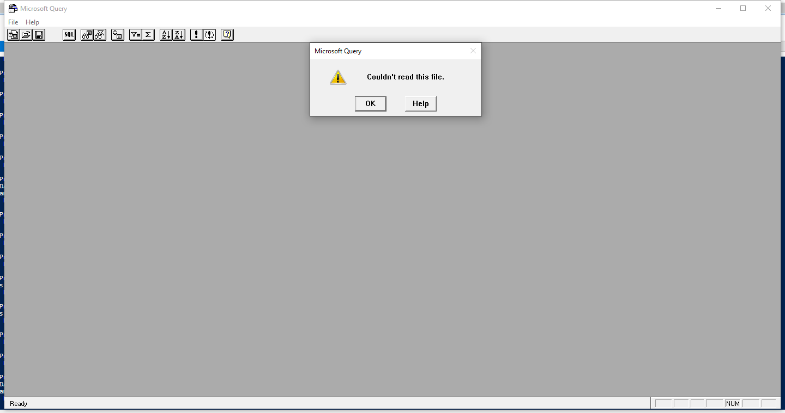

---
title: MSQRY32.EXE | Microsoft Query
excerpt: What is MSQRY32.EXE?
---

# MSQRY32.EXE 

* File Path: `C:\Program Files (x86)\Microsoft Office\root\Office16\MSQRY32.EXE`
* Description: Microsoft Query

## Screenshot

## Hashes

Type | Hash
-- | --
MD5 | `772A75198664682F8871FD7D1BEEB49E`
SHA1 | `48CE0C07FAA20B8F475E3302CF2DF1DCF3C8BE88`
SHA256 | `C5B9830773E3BC8DFC94674B4959CD378A7FFFED5086DACC2A2863B6AE8808BA`
SHA384 | `5F2F8850124B2F3DCFC82158160A6560D7E5ECC001B1FB386A5C0CE8037AA09456B8453A75E1B43BA059597A2FCA7AE3`
SHA512 | `F032152A5B9B522DD22F58F09C8315F8A8D69A508C7D90D94FADE09EE4C55A0F35AD2D4C66ED8C99A14847346DDDB3B11132FCB568B9E8BC88DBB308871A6C05`
SSDEEP | `12288:NnwvVMRZqt8PQayTlJZlj5CuBtiFRQjj27b9UlyoEbR+2:NngV2qsQayFlj5pmHcy7xUly/5`
IMP | `58B9E1D28B16379BE31C83EEA764CD86`
PESHA1 | `074730A4091458A853C8FA2EB396E1E142C04C57`
PE256 | `E50FE51733516D9C03421EE078FB609415DA109F53B4BA78D43028D7F4EC89D3`

## Runtime Data

### Window Title:
Microsoft Query

### Open Handles:

Path | Type
-- | --
(R--)   C:\ProgramData\Microsoft\Office\ClickToRunPackageLocker | File
(R-D)   C:\Windows\Fonts\StaticCache.dat | File
(R-D)   C:\Windows\System32\en-US\crypt32.dll.mui | File
(R-D)   C:\Windows\System32\en-US\mswsock.dll.mui | File
(R-D)   C:\Windows\System32\en-US\odbcint.dll.mui | File
(R-D)   C:\Windows\System32\en-US\winnlsres.dll.mui | File
(R-D)   C:\Windows\SysWOW64\en-US\user32.dll.mui | File
(RW-)   C:\Users\user\Documents | File
(RW-)   C:\Windows | File
(RW-)   C:\Windows\WinSxS\x86_microsoft.windows.common-controls_6595b64144ccf1df_5.82.19041.488_none_89e6152f0b32762e | File
(RW-)   C:\Windows\WinSxS\x86_microsoft.windows.common-controls_6595b64144ccf1df_6.0.19041.488_none_11b1e5df2ffd8627 | File
(RW-)   C:\Windows\WinSxS\x86_microsoft.windows.gdiplus_6595b64144ccf1df_1.1.19041.508_none_429cdbca8a8ffa94 | File
\BaseNamedObjects\__ComCatalogCache__ | Section
\BaseNamedObjects\F932B6C7-3A20-46A0-B8A0-8894AA421973 | Section
\BaseNamedObjects\NLS_CodePage_1252_3_2_0_0 | Section
\BaseNamedObjects\NLS_CodePage_437_3_2_0_0 | Section
\Sessions\1\BaseNamedObjects\UrlZonesSM_user | Section
\Sessions\1\BaseNamedObjects\windows_shell_global_counters | Section
\Sessions\1\BaseNamedObjects\windows_webcache_counters_{9B6AB5B3-91BC-4097-835C-EA2DEC95E9CC}_S-1-5-21-2047949552-857980807-821054962-504 | Section
\Sessions\1\Windows\Theme64749523 | Section
\Windows\Theme1120315852 | Section

### Loaded Modules:

Path |
-- |
C:\Program Files (x86)\Microsoft Office\root\Office16\MSQRY32.EXE |
C:\Windows\SYSTEM32\ntdll.dll |
C:\Windows\System32\wow64.dll |
C:\Windows\System32\wow64cpu.dll |
C:\Windows\System32\wow64win.dll |

## Signature

* Status: Signature verified.
* Serial: `33000002CE7C9ACE7D905ED2B70000000002CE`
* Thumbprint: `B10607FB914700B40F794610850C1DE0A21566C1`
* Issuer: CN=Microsoft Code Signing PCA 2010, O=Microsoft Corporation, L=Redmond, S=Washington, C=US
* Subject: CN=Microsoft Corporation, O=Microsoft Corporation, L=Redmond, S=Washington, C=US

## File Metadata

* Original Filename: MSQRY32.EXE
* Product Name: Microsoft Office
* Company Name: Microsoft Corporation
* File Version: 16.0.12527.20482
* Product Version: 16.0.12527.20482
* Language: Language Neutral
* Legal Copyright: 
* Machine Type: 32-bit

## File Scan

* VirusTotal Detections: Unknown

MIT License. Copyright (c) 2020-2021 Strontic.

