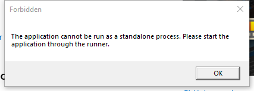

---
title: Microsoft.PowerToys.Settings.UI.Runner.exe | Microsoft.PowerToys.Settings.UI.Runner
excerpt: What is Microsoft.PowerToys.Settings.UI.Runner.exe?
---

# Microsoft.PowerToys.Settings.UI.Runner.exe 

* File Path: `C:\Program Files\PowerToys\SettingsUIRunner\Microsoft.PowerToys.Settings.UI.Runner.exe`
* Description: Microsoft.PowerToys.Settings.UI.Runner
* Comments: PowerToys Settings UI Runner

## Screenshot

## Hashes

Type | Hash
-- | --
MD5 | `AC41EF8F180E8AF6483406690F34B8A6`
SHA1 | `36694187B6E183A89A866A8CB794F5801FCB1003`
SHA256 | `6C504B2828B8A3CB4EBDEA5005F1E99CC8DD21E4C78DD41C64B8800545FB65DB`
SHA384 | `A554BF9A271A938AB48F3302E6FA17518D7BBA89194E01C7A9706FE6D4F744A8C20EFD2415A38A7682CFA95093371FAB`
SHA512 | `07056003D0AB986F1C1042F2924F46E54E31E703CBB6FFAE8C9B8A7ACCEA9A6689959A87D94B3995B08B08EDBFFC2C437C5D3DE2C6393A806917B706F2A67205`
SSDEEP | `3072:+8eBqhy5aV5gwqY8sXwoEHXfwaN+M+/ORSs5G2Ms4f6TFZbude+seUmB3sTK:+hT1sXOfDj+/N6JAde+se5`
IMP | `7D19699275E08B389D5869DC7132EFBC`
PESHA1 | `479FCA843B72D1FD4D163FF98D1E5B9CD7E295F4`
PE256 | `3495B645E1B3719BF0D8ADBE489B0FD6F007231A2EA568D651AC044EA270F14A`

## Runtime Data

### Window Title:
Forbidden

### Open Handles:

Path | Type
-- | --
(R-D)   C:\Program Files\dotnet\shared\Microsoft.NETCore.App\3.1.6\Microsoft.Win32.Primitives.dll | File
(R-D)   C:\Program Files\dotnet\shared\Microsoft.NETCore.App\3.1.6\Microsoft.Win32.Registry.dll | File
(R-D)   C:\Program Files\dotnet\shared\Microsoft.NETCore.App\3.1.6\mscorlib.dll | File
(R-D)   C:\Program Files\dotnet\shared\Microsoft.NETCore.App\3.1.6\netstandard.dll | File
(R-D)   C:\Program Files\dotnet\shared\Microsoft.NETCore.App\3.1.6\System.Buffers.dll | File
(R-D)   C:\Program Files\dotnet\shared\Microsoft.NETCore.App\3.1.6\System.Collections.Concurrent.dll | File
(R-D)   C:\Program Files\dotnet\shared\Microsoft.NETCore.App\3.1.6\System.Collections.dll | File
(R-D)   C:\Program Files\dotnet\shared\Microsoft.NETCore.App\3.1.6\System.Collections.NonGeneric.dll | File
(R-D)   C:\Program Files\dotnet\shared\Microsoft.NETCore.App\3.1.6\System.Collections.Specialized.dll | File
(R-D)   C:\Program Files\dotnet\shared\Microsoft.NETCore.App\3.1.6\System.ComponentModel.dll | File
(R-D)   C:\Program Files\dotnet\shared\Microsoft.NETCore.App\3.1.6\System.ComponentModel.Primitives.dll | File
(R-D)   C:\Program Files\dotnet\shared\Microsoft.NETCore.App\3.1.6\System.ComponentModel.TypeConverter.dll | File
(R-D)   C:\Program Files\dotnet\shared\Microsoft.NETCore.App\3.1.6\System.Diagnostics.Debug.dll | File
(R-D)   C:\Program Files\dotnet\shared\Microsoft.NETCore.App\3.1.6\System.Diagnostics.Process.dll | File
(R-D)   C:\Program Files\dotnet\shared\Microsoft.NETCore.App\3.1.6\System.Diagnostics.StackTrace.dll | File
(R-D)   C:\Program Files\dotnet\shared\Microsoft.NETCore.App\3.1.6\System.Diagnostics.TraceSource.dll | File
(R-D)   C:\Program Files\dotnet\shared\Microsoft.NETCore.App\3.1.6\System.Diagnostics.Tracing.dll | File
(R-D)   C:\Program Files\dotnet\shared\Microsoft.NETCore.App\3.1.6\System.Globalization.dll | File
(R-D)   C:\Program Files\dotnet\shared\Microsoft.NETCore.App\3.1.6\System.IO.FileSystem.dll | File
(R-D)   C:\Program Files\dotnet\shared\Microsoft.NETCore.App\3.1.6\System.Linq.dll | File
(R-D)   C:\Program Files\dotnet\shared\Microsoft.NETCore.App\3.1.6\System.Memory.dll | File
(R-D)   C:\Program Files\dotnet\shared\Microsoft.NETCore.App\3.1.6\System.Net.WebClient.dll | File
(R-D)   C:\Program Files\dotnet\shared\Microsoft.NETCore.App\3.1.6\System.Numerics.Vectors.dll | File
(R-D)   C:\Program Files\dotnet\shared\Microsoft.NETCore.App\3.1.6\System.ObjectModel.dll | File
(R-D)   C:\Program Files\dotnet\shared\Microsoft.NETCore.App\3.1.6\System.Private.CoreLib.dll | File
(R-D)   C:\Program Files\dotnet\shared\Microsoft.NETCore.App\3.1.6\System.Private.Uri.dll | File
(R-D)   C:\Program Files\dotnet\shared\Microsoft.NETCore.App\3.1.6\System.Private.Xml.dll | File
(R-D)   C:\Program Files\dotnet\shared\Microsoft.NETCore.App\3.1.6\System.Reflection.dll | File
(R-D)   C:\Program Files\dotnet\shared\Microsoft.NETCore.App\3.1.6\System.Reflection.Emit.ILGeneration.dll | File
(R-D)   C:\Program Files\dotnet\shared\Microsoft.NETCore.App\3.1.6\System.Reflection.Emit.Lightweight.dll | File
(R-D)   C:\Program Files\dotnet\shared\Microsoft.NETCore.App\3.1.6\System.Reflection.Extensions.dll | File
(R-D)   C:\Program Files\dotnet\shared\Microsoft.NETCore.App\3.1.6\System.Reflection.Primitives.dll | File
(R-D)   C:\Program Files\dotnet\shared\Microsoft.NETCore.App\3.1.6\System.Resources.ResourceManager.dll | File
(R-D)   C:\Program Files\dotnet\shared\Microsoft.NETCore.App\3.1.6\System.Runtime.CompilerServices.Unsafe.dll | File
(R-D)   C:\Program Files\dotnet\shared\Microsoft.NETCore.App\3.1.6\System.Runtime.CompilerServices.VisualC.dll | File
(R-D)   C:\Program Files\dotnet\shared\Microsoft.NETCore.App\3.1.6\System.Runtime.dll | File
(R-D)   C:\Program Files\dotnet\shared\Microsoft.NETCore.App\3.1.6\System.Runtime.Extensions.dll | File
(R-D)   C:\Program Files\dotnet\shared\Microsoft.NETCore.App\3.1.6\System.Runtime.InteropServices.dll | File
(R-D)   C:\Program Files\dotnet\shared\Microsoft.NETCore.App\3.1.6\System.Runtime.InteropServices.WindowsRuntime.dll | File
(R-D)   C:\Program Files\dotnet\shared\Microsoft.NETCore.App\3.1.6\System.Runtime.WindowsRuntime.dll | File
(R-D)   C:\Program Files\dotnet\shared\Microsoft.NETCore.App\3.1.6\System.Runtime.WindowsRuntime.UI.Xaml.dll | File
(R-D)   C:\Program Files\dotnet\shared\Microsoft.NETCore.App\3.1.6\System.Security.Cryptography.Algorithms.dll | File
(R-D)   C:\Program Files\dotnet\shared\Microsoft.NETCore.App\3.1.6\System.Text.Encoding.Extensions.dll | File
(R-D)   C:\Program Files\dotnet\shared\Microsoft.NETCore.App\3.1.6\System.Text.Json.dll | File
(R-D)   C:\Program Files\dotnet\shared\Microsoft.NETCore.App\3.1.6\System.Threading.dll | File
(R-D)   C:\Program Files\dotnet\shared\Microsoft.NETCore.App\3.1.6\System.Threading.Tasks.dll | File
(R-D)   C:\Program Files\dotnet\shared\Microsoft.NETCore.App\3.1.6\System.Threading.Thread.dll | File
(R-D)   C:\Program Files\dotnet\shared\Microsoft.NETCore.App\3.1.6\System.Threading.ThreadPool.dll | File
(R-D)   C:\Program Files\dotnet\shared\Microsoft.NETCore.App\3.1.6\System.Xml.ReaderWriter.dll | File
(R-D)   C:\Program Files\dotnet\shared\Microsoft.WindowsDesktop.App\3.1.6\DirectWriteForwarder.dll | File
(R-D)   C:\Program Files\dotnet\shared\Microsoft.WindowsDesktop.App\3.1.6\PresentationCore.dll | File
(R-D)   C:\Program Files\dotnet\shared\Microsoft.WindowsDesktop.App\3.1.6\PresentationFramework.Aero2.dll | File
(R-D)   C:\Program Files\dotnet\shared\Microsoft.WindowsDesktop.App\3.1.6\PresentationFramework.dll | File
(R-D)   C:\Program Files\dotnet\shared\Microsoft.WindowsDesktop.App\3.1.6\System.Configuration.ConfigurationManager.dll | File
(R-D)   C:\Program Files\dotnet\shared\Microsoft.WindowsDesktop.App\3.1.6\System.IO.Packaging.dll | File
(R-D)   C:\Program Files\dotnet\shared\Microsoft.WindowsDesktop.App\3.1.6\System.Windows.Extensions.dll | File
(R-D)   C:\Program Files\dotnet\shared\Microsoft.WindowsDesktop.App\3.1.6\System.Xaml.dll | File
(R-D)   C:\Program Files\dotnet\shared\Microsoft.WindowsDesktop.App\3.1.6\UIAutomationProvider.dll | File
(R-D)   C:\Program Files\dotnet\shared\Microsoft.WindowsDesktop.App\3.1.6\UIAutomationTypes.dll | File
(R-D)   C:\Program Files\dotnet\shared\Microsoft.WindowsDesktop.App\3.1.6\WindowsBase.dll | File
(R-D)   C:\Program Files\PowerToys\SettingsUIRunner\Assets\Modules\PT.png | File
(R-D)   C:\Program Files\PowerToys\SettingsUIRunner\ManagedCommon.dll | File
(R-D)   C:\Program Files\PowerToys\SettingsUIRunner\Microsoft.PowerToys.Settings.UI.exe | File
(R-D)   C:\Program Files\PowerToys\SettingsUIRunner\Microsoft.PowerToys.Settings.UI.Lib.dll | File
(R-D)   C:\Program Files\PowerToys\SettingsUIRunner\Microsoft.PowerToys.Settings.UI.Runner.dll | File
(R-D)   C:\Program Files\PowerToys\SettingsUIRunner\Microsoft.Toolkit.Uwp.UI.dll | File
(R-D)   C:\Program Files\PowerToys\SettingsUIRunner\Microsoft.Toolkit.Win32.UI.XamlHost.Managed.dll | File
(R-D)   C:\Program Files\PowerToys\SettingsUIRunner\Microsoft.Toolkit.Win32.UI.XamlHost.winmd | File
(R-D)   C:\Program Files\PowerToys\SettingsUIRunner\Microsoft.Toolkit.Wpf.UI.XamlHost.dll | File
(R-D)   C:\Program Files\PowerToys\SettingsUIRunner\Microsoft.UI.Xaml.winmd | File
(R-D)   C:\Program Files\PowerToys\SettingsUIRunner\Microsoft.Xaml.Interactions.dll | File
(R-D)   C:\Program Files\PowerToys\SettingsUIRunner\Microsoft.Xaml.Interactivity.dll | File
(R-D)   C:\Program Files\PowerToys\SettingsUIRunner\PowerToysInterop.dll | File
(R-D)   C:\Program Files\PowerToys\SettingsUIRunner\Telemetry.dll | File
(R-D)   C:\Windows\Fonts\StaticCache.dat | File
(R-D)   C:\Windows\System32\en-US\KernelBase.dll.mui | File
(R-D)   C:\Windows\System32\en-US\msctfui.dll.mui | File
(R-D)   C:\Windows\System32\en-US\windows.ui.xaml.dll.mui | File
(R-D)   C:\Windows\System32\WinMetadata\Windows.ApplicationModel.winmd | File
(R-D)   C:\Windows\System32\WinMetadata\Windows.Data.winmd | File
(R-D)   C:\Windows\System32\WinMetadata\Windows.Foundation.winmd | File
(R-D)   C:\Windows\System32\WinMetadata\Windows.Globalization.winmd | File
(R-D)   C:\Windows\System32\WinMetadata\Windows.System.winmd | File
(R-D)   C:\Windows\System32\WinMetadata\Windows.UI.winmd | File
(R-D)   C:\Windows\System32\WinMetadata\Windows.UI.Xaml.winmd | File
(RW-)   C:\Program Files\PowerToys\SettingsUIRunner | File
(RW-)   C:\Windows\System32 | File
(RW-)   C:\xCyclopedia | File
(RWD)   C:\Windows\Fonts\segoeui.ttf | File
(RWD)   C:\Windows\Fonts\segoeuib.ttf | File
(RWD)   C:\Windows\Fonts\seguisb.ttf | File
\BaseNamedObjects\__ComCatalogCache__ | Section
\BaseNamedObjects\NLS_CodePage_1252_3_2_0_0 | Section
\BaseNamedObjects\NLS_CodePage_437_3_2_0_0 | Section
\Sessions\1\BaseNamedObjects\1714HWNDInterface:2e0394 | Section
\Sessions\1\BaseNamedObjects\1714HWNDInterface:330526 | Section
\Sessions\1\BaseNamedObjects\1714HWNDInterface:330528 | Section
\Sessions\1\BaseNamedObjects\SessionImmersiveColorPreference | Section
\Sessions\1\BaseNamedObjects\windows_shell_global_counters | Section
\Sessions\1\Windows\Theme289354956 | Section
\Windows\Theme1665484522 | Section

### Loaded Modules:

Path |
-- |
C:\Program Files\dotnet\host\fxr\3.1.6\hostfxr.dll |
C:\Program Files\PowerToys\SettingsUIRunner\Microsoft.PowerToys.Settings.UI.Runner.exe |
C:\Windows\System32\ADVAPI32.dll |
C:\Windows\System32\GDI32.dll |
C:\Windows\System32\gdi32full.dll |
C:\Windows\System32\IMM32.DLL |
C:\Windows\System32\KERNEL32.DLL |
C:\Windows\System32\KERNELBASE.dll |
C:\Windows\System32\msvcp_win.dll |
C:\Windows\System32\msvcrt.dll |
C:\Windows\SYSTEM32\ntdll.dll |
C:\Windows\System32\RPCRT4.dll |
C:\Windows\System32\sechost.dll |
C:\Windows\System32\SHELL32.dll |
C:\Windows\System32\ucrtbase.dll |
C:\Windows\System32\USER32.dll |
C:\Windows\System32\win32u.dll |

## Signature

* Status: Signature verified.
* Serial: `33000001864D2175A0D907BE2C000000000186`
* Thumbprint: `8EE1E4E037942BE5BC7E58B061FB559BDC381D82`
* Issuer: CN=Microsoft Code Signing PCA 2011, O=Microsoft Corporation, L=Redmond, S=Washington, C=US
* Subject: CN=Microsoft Corporation, O=Microsoft Corporation, L=Redmond, S=Washington, C=US

## File Metadata

* Original Filename: Microsoft.PowerToys.Settings.UI.Runner.dll
* Product Name: PowerToys
* Company Name: Microsoft Corporation
* File Version: 0.23.2.0
* Product Version: 0.23.2.0
* Language: Language Neutral
* Legal Copyright: Copyright (C) 2020 Microsoft Corporation
* Machine Type: 64-bit

## File Scan

* VirusTotal Detections: 0/70
* VirusTotal Link: https://www.virustotal.com/gui/file/6c504b2828b8a3cb4ebdea5005f1e99cc8dd21e4c78dd41c64b8800545fb65db/detection/

## File Similarity (ssdeep match)

File | Score
-- | --
[C:\Program Files\PowerToys\modules\launcher\PowerLauncher.exe](PowerLauncher.exe-0831705DB7DA6426E602950F1DFF6343.md) | 82

MIT License. Copyright (c) 2020 Strontic.

