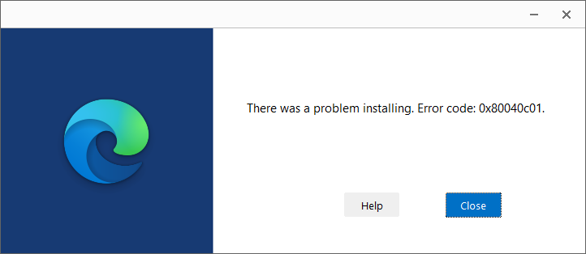

---
title: MicrosoftEdgeUpdate.exe | Microsoft Edge Update
excerpt: What is MicrosoftEdgeUpdate.exe?
---

# MicrosoftEdgeUpdate.exe 

* File Path: `C:\Program Files (x86)\Microsoft\EdgeUpdate\MicrosoftEdgeUpdate.exe`
* Description: Microsoft Edge Update

## Screenshot

## Hashes

Type | Hash
-- | --
MD5 | `0F11E6717C1FE6DD20AE2D12F63AF3F7`
SHA1 | `B7F856842320D7BE1E4D6E098B979B4658092742`
SHA256 | `6737D628504E1AD1B117600383D137BD975F51D0CDF351F6FDB9C714EDB45D14`
SHA384 | `2C56B5A4BA8487628C4069A5EFF74493B770DC85C0530B0D970BA67A05EB2761CB68C9D6D8EDF9E5F2B0F8ECF51E8350`
SHA512 | `A12E4AD5B6DD85CD179BFA0FFA9BF2D958C1217EDCA061534C7A1145DE490180AD62EBB4C7155395530EE5BA7C2169EA0F6FA39499E5AB94A61FE3D693F1EBEF`
SSDEEP | `3072:ZgNpVWuxi/7gKNkhSC+t+MMCTs0kH+Bkx6uyXnZeiB+P+HNmYy95ZbmEfhzrgeoX:F7gKNkhSR/5kHouyXnZhB+x8WHW`
IMP | `E00D60405A249A05D3B09AA7FE924B17`
PESHA1 | `1FD9346019ACBB7D1509FF6CA5436D2FF4BE6F64`
PE256 | `1D44DC03207D528BDBCD78E115945881914424177A736C094EB6130E61CD3C34`

## Runtime Data

### Window Title:
Microsoft Edge Update Installer

### Open Handles:

Path | Type
-- | --
(R-D)   C:\Windows\Fonts\StaticCache.dat | File
(R-D)   C:\Windows\System32\en-US\wer.dll.mui | File
(R-D)   C:\Windows\SysWOW64\en-US\user32.dll.mui | File
(RW-)   C:\Program Files (x86)\Microsoft\EdgeUpdate\1.3.153.47 | File
(RW-)   C:\ProgramData\Microsoft\EdgeUpdate\Log\MicrosoftEdgeUpdate.log | File
(RW-)   C:\Windows | File
(RW-)   C:\Windows\WinSxS\x86_microsoft.windows.common-controls_6595b64144ccf1df_6.0.19041.1110_none_a8625c1886757984 | File
\BaseNamedObjects\__ComCatalogCache__ | Section
\BaseNamedObjects\C:\*ProgramData\*Microsoft\*Windows\*Caches\*{6AF0698E-D558-4F6E-9B3C-3716689AF493}.2.ver0x0000000000000002.db | Section
\BaseNamedObjects\C:\*ProgramData\*Microsoft\*Windows\*Caches\*{DDF571F2-BE98-426D-8288-1A9A39C3FDA2}.2.ver0x0000000000000002.db | Section
\BaseNamedObjects\C:\*ProgramData\*Microsoft\*Windows\*Caches\*cversions.2 | Section
\BaseNamedObjects\NLS_CodePage_1252_3_2_0_0 | Section
\BaseNamedObjects\NLS_CodePage_437_3_2_0_0 | Section
\Sessions\1\BaseNamedObjects\windows_shell_global_counters | Section
\Sessions\1\Windows\Theme449731986 | Section
\Windows\Theme1396518710 | Section

### Loaded Modules:

Path |
-- |
C:\Program Files (x86)\Microsoft\EdgeUpdate\MicrosoftEdgeUpdate.exe |
C:\Windows\SYSTEM32\ntdll.dll |
C:\Windows\System32\wow64.dll |
C:\Windows\System32\wow64cpu.dll |
C:\Windows\System32\wow64win.dll |

## Signature

* Status: Signature verified.
* Serial: `33000001E2F17D92020E49F87F0000000001E2`
* Thumbprint: `C774204049D25D30AF9AC2F116B3C1FB88EE00A4`
* Issuer: CN=Microsoft Code Signing PCA 2011, O=Microsoft Corporation, L=Redmond, S=Washington, C=US
* Subject: CN=Microsoft Corporation, O=Microsoft Corporation, L=Redmond, S=Washington, C=US

## File Metadata

* Original Filename: msedgeupdate.dll
* Product Name: Microsoft Edge Update
* Company Name: Microsoft Corporation
* File Version: 1.3.153.47
* Product Version: 1.3.153.47
* Language: English (United States)
* Legal Copyright: Copyright Microsoft Corporation
* Machine Type: 32-bit

## File Scan

* VirusTotal Detections: 0/73
* VirusTotal Link: https://www.virustotal.com/gui/file/6737d628504e1ad1b117600383d137bd975f51d0cdf351f6fdb9c714edb45d14/detection

## File Similarity (ssdeep match)

File | Score
-- | --
[C:\Program Files (x86)\Microsoft\EdgeUpdate\1.3.153.47\MicrosoftEdgeUpdate.exe](MicrosoftEdgeUpdate.exe-0F11E6717C1FE6DD20AE2D12F63AF3F7.md) | 100

MIT License. Copyright (c) 2020-2021 Strontic.

