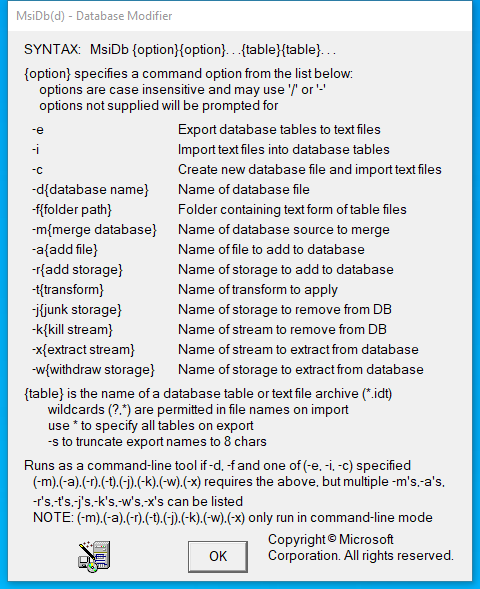

---
title: MsiDb.exe | Windows Installer Table Creator
excerpt: What is MsiDb.exe?
---

# MsiDb.exe 

* File Path: `C:\Program Files (x86)\Windows Kits\10\bin\10.0.19041.0\arm\MsiDb.exe`
* Description: Windows Installer Table Creator

## Screenshot

## Hashes

Type | Hash
-- | --
MD5 | `4A21D0F8A054564AED061B01DF002903`
SHA1 | `A8F1E92FA6D0FEBF932AAFF53E3FA732E600BF52`
SHA256 | `45F961231439AB96488E302504D8F926533DEB86C671E04611BCB57AABF9377A`
SHA384 | `09A96D6A8BDE86F5A08E82628939F198B0A9BCD7CB241C8DDE99F2E6ABAEB2B3AD22C1599FC0052F1C782238F058119A`
SHA512 | `466F046F64D6011A5191BC9166479C6BCC2D761FEA7FB211B0F3A576FFBF1367C50F1C2CF490B6C985F7641BD93035FA79604A9A16522F4D7ABEB5689A4BD1B2`
SSDEEP | `1536:IHIfv5WPfpenYmCfBA3mPx88EqzvBq/XWHlgQ/XG2B:IHIfvYy+fBVJ88eXkyV2B`
IMP | `E59C781E7983F5291F92727084E40794`
PESHA1 | `2EA58ED7BADDA066B05B859E993748C6547F8713`
PE256 | `BF237D386D4A1831433D882AC0EEE60E36F5C0E40F1870C48AE0B65E521B2E1A`

## Signature

* Status: Signature verified.
* Serial: `33000002B7E8E007A82AEF13150000000002B7`
* Thumbprint: `5A68625F1A516670A744F7EF919500A479D32A5B`
* Issuer: CN=Microsoft Code Signing PCA 2010, O=Microsoft Corporation, L=Redmond, S=Washington, C=US
* Subject: CN=Microsoft Windows Kits Publisher, O=Microsoft Corporation, L=Redmond, S=Washington, C=US

## File Metadata

* Original Filename: msidb.exe
* Product Name: Windows Installer
* Company Name: Microsoft Corporation
* File Version: 5.0.19041.1 (WinBuild.160101.0800)
* Product Version: 5.0.19041.1
* Language: English (United States)
* Legal Copyright:  Microsoft Corporation. All rights reserved.
* Machine Type: 452

## File Scan

* VirusTotal Detections: Unknown
* VirusTotal Link: n/a

## File Similarity (ssdeep match)

File | Score
-- | --
[C:\Program Files (x86)\Windows Kits\10\bin\10.0.19041.0\x86\MsiDb.exe](MsiDb.exe-A8F07B6C9038A150566C3086F48AA79A.md) | 30

MIT License. Copyright (c) 2020 Strontic.

