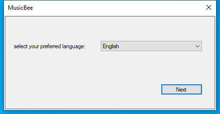

---
title: MusicBee.exe | MusicBee
---

# MusicBee.exe 

* File Path: `C:\program files (x86)\MusicBee\MusicBee.exe`
* Description: MusicBee
* Comments: Music Manager and Player

## Screenshot

## Hashes

Type | Hash
-- | --
MD5 | `926B416FECBB852FA6FD376F6BFE74CA`
SHA1 | `44DFBD1541601918EBF7718B1AC072994C5ADD2F`
SHA256 | `53B88A664A0CCA4ADBCEA2496FAD471E99C895E0291A0F0D1CA9759A53720560`
SHA384 | `4BD233542A48C9DA68EA3905754E4ECFD83FD38DDD6671B5E46FDC00925191EBFB810608E5C714708676B8E83EF6A293`
SHA512 | `AC4C11D48CC4D48ADDD08E14290B886A093045A97C9DC645FDFC0BF28663DA7ADCE909533BABBD9136C200F566C4F4DBC7D320164034148866B7CAAC92B24B20`
SSDEEP | `49152:2yX+XG5V9pbQiJrW/3iKulASogr4QVxVouJXPEAdQOEH2+GOkZW:xoKrUSG4rfRdp`

## Runtime Data

### Window Title:
MusicBee

### Open Handles:

Path | Type
-- | --
(R--)   C:\Windows\assembly\pubpol5.dat | File
(R-D)   C:\Windows\Fonts\StaticCache.dat | File
(R-D)   C:\Windows\Microsoft.NET\assembly\GAC_MSIL\Microsoft.VisualBasic\v4.0_10.0.0.0__b03f5f7f11d50a3a\Microsoft.VisualBasic.dll | File
(R-D)   C:\Windows\System32\en-US\winnlsres.dll.mui | File
(R-D)   C:\Windows\SysWOW64\en-US\user32.dll.mui | File
(RW-)   C:\Users\user\Documents | File
(RW-)   C:\Windows | File
(RW-)   C:\Windows\WinSxS\x86_microsoft.windows.common-controls_6595b64144ccf1df_5.82.19041.1_none_92e69152510a8cb1 | File
(RW-)   C:\Windows\WinSxS\x86_microsoft.windows.common-controls_6595b64144ccf1df_6.0.19041.1_none_fd031af45b0106f2 | File
(RW-)   C:\Windows\WinSxS\x86_microsoft.windows.gdiplus_6595b64144ccf1df_1.1.19041.450_none_4294d6e08a97344a | File
\...\Cor_SxSPublic_IPCBlock | Section
\BaseNamedObjects\__ComCatalogCache__ | Section
\BaseNamedObjects\Cor_Private_IPCBlock_v4_3628 | Section
\BaseNamedObjects\NLS_CodePage_1252_3_2_0_0 | Section
\BaseNamedObjects\NLS_CodePage_437_3_2_0_0 | Section
\Sessions\1\BaseNamedObjects\windows_shell_global_counters | Section
\Sessions\1\Windows\Theme4048709601 | Section
\Windows\Theme603176458 | Section

### Loaded Modules:

Path |
-- |
C:\program files (x86)\MusicBee\MusicBee.exe |
C:\Windows\SYSTEM32\ntdll.dll |
C:\Windows\System32\wow64.dll |
C:\Windows\System32\wow64cpu.dll |
C:\Windows\System32\wow64win.dll |

## Signature

* Status: The file C:\program files (x86)\MusicBee\MusicBee.exe is not digitally signed. You cannot run this script on the current system. For more information about running scripts and setting execution policy, see about_Execution_Policies at https:/go.microsoft.com/fwlink/?LinkID=135170
* Serial: ``
* Thumbprint: ``
* Issuer: 
* Subject: 

## File Metadata

* Original Filename: MusicBee.exe
* Product Name: MusicBee
* Company Name: Steven Mayall
* File Version: 3.3.7491.38139
* Product Version: 3.3.7491.38139
* Language: Language Neutral
* Legal Copyright: Copyright  Steven Mayall, 2008-2020

MIT License. Copyright (c) 2020 Strontic.

