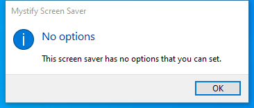

---
title: Mystify.scr | Mystify Screen Saver
excerpt: What is Mystify.scr?
---

# Mystify.scr 

* File Path: `C:\Windows\system32\Mystify.scr`
* Description: Mystify Screen Saver

## Screenshot

## Hashes

Type | Hash
-- | --
MD5 | `21A2D48B7C52402865119A4D8DA73372`
SHA1 | `B6D10B53C810C635165D1FA78CBC5C44774E81FB`
SHA256 | `55203F7478D1D999E35D6F9E027B925B21A337BDEF81C1C8AC2849D1BED5508A`
SHA384 | `3548C66A51573F4AAAA38ECCA9188CA1E986D02280A044D99235CDFC9F1B776F40A5342717EB81A27D826C1235C6A44A`
SHA512 | `007B96F61307F5F54B1D955AEBBB5B7D67ECC7853E9A196B920674AF2EDA64E736500D6EFBB948C538514D2F02043EA368181106B4F3D7097F2D0D2EAF6264C9`
SSDEEP | `3072:yYx23CIx9fvN7AihnW/VB8eeuOGefIG0uVsC7Pq8SMj5L:C9NzhW/8dUtk5`
IMP | `312ED91925987430077FE1E3BB4ADF2B`
PESHA1 | `C4B4C59B006D6B48B090CC94254FDCCF1C5525CB`
PE256 | `4AFF96F9A06B53D799FFE533CFC1004D4CCFB5E32CD83E4FE2FA9889B6DDE884`

## Runtime Data

### Window Title:
Mystify

### Open Handles:

Path | Type
-- | --
(R-D)   C:\Windows\System32\en-US\Mystify.scr.mui | File
(RW-)   C:\Users\user | File
(RW-)   C:\Windows\WinSxS\amd64_microsoft.windows.common-controls_6595b64144ccf1df_6.0.19041.746_none_ca02b4b61b8320a4 | File
\BaseNamedObjects\C:\*ProgramData\*Microsoft\*Windows\*Caches\*{6AF0698E-D558-4F6E-9B3C-3716689AF493}.2.ver0x0000000000000002.db | Section
\BaseNamedObjects\C:\*ProgramData\*Microsoft\*Windows\*Caches\*{DDF571F2-BE98-426D-8288-1A9A39C3FDA2}.2.ver0x0000000000000002.db | Section
\BaseNamedObjects\C:\*ProgramData\*Microsoft\*Windows\*Caches\*cversions.2 | Section
\BaseNamedObjects\NLS_CodePage_1252_3_2_0_0 | Section
\BaseNamedObjects\NLS_CodePage_437_3_2_0_0 | Section
\Sessions\1\Windows\Theme3205582532 | Section
\Windows\Theme3800351183 | Section

### Loaded Modules:

Path |
-- |
C:\Windows\System32\ADVAPI32.dll |
C:\Windows\System32\KERNEL32.DLL |
C:\Windows\System32\KERNELBASE.dll |
C:\Windows\System32\msvcrt.dll |
C:\Windows\system32\Mystify.scr |
C:\Windows\SYSTEM32\ntdll.dll |
C:\Windows\System32\RPCRT4.dll |
C:\Windows\System32\sechost.dll |

## Signature

* Status: Signature verified.
* Serial: `3300000266BD1580EFA75CD6D3000000000266`
* Thumbprint: `A4341B9FD50FB9964283220A36A1EF6F6FAA7840`
* Issuer: CN=Microsoft Windows Production PCA 2011, O=Microsoft Corporation, L=Redmond, S=Washington, C=US
* Subject: CN=Microsoft Windows, O=Microsoft Corporation, L=Redmond, S=Washington, C=US

## File Metadata

* Original Filename: Mystify
* Product Name: Microsoft Windows Operating System
* Company Name: Microsoft Corporation
* File Version: 10.0.19041.1 (WinBuild.160101.0800)
* Product Version: 10.0.19041.1
* Language: English (United States)
* Legal Copyright:  Microsoft Corporation. All rights reserved.
* Machine Type: 64-bit

## File Scan

* VirusTotal Detections: 0/74
* VirusTotal Link: https://www.virustotal.com/gui/file/55203f7478d1d999e35d6f9e027b925b21a337bdef81c1c8ac2849d1bed5508a/detection

MIT License. Copyright (c) 2020-2021 Strontic.

