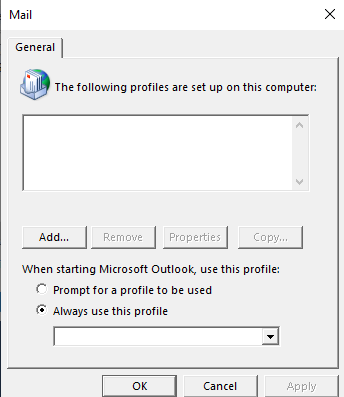

---
title: OLCFG.EXE | Outlook Mail Setup
excerpt: What is OLCFG.EXE?
---

# OLCFG.EXE 

* File Path: `C:\Program Files (x86)\Microsoft Office\root\Office16\OLCFG.EXE`
* Description: Outlook Mail Setup

## Screenshot

## Hashes

Type | Hash
-- | --
MD5 | `42E2F4DDA96F52886DE79A2451C5D853`
SHA1 | `92CBE0B15613933023ABE274674CE607378F4E56`
SHA256 | `668FFFB1E104F12885165B013E34BAA02F83AAE8C43E396CB2890950466946B4`
SHA384 | `45A8F10E04783B5FE84F6340DB48AE8FED7FB17A15F67E8516E3B10328A3FE563F82C07ED24BDCAA23126260D19B5CB7`
SHA512 | `723D6C5649AB94693C66A09554C35313616FE0EF05A19D457D51670DCF134C48888E790AC512EB8F4BFF8A491801580EDF24AB1CAFF7899C0898CC080299A3D0`
SSDEEP | `1536:fML0O07/x3d1+7BV5PDnb1VXHrLzLytUWeDoX1uLsWK1WzcdGfwkjQoU5brG:fFO07/V+lV5NVXHrLzL2Uk1VDGfw+8bq`
IMP | `3B8AE118F44AC450B140359C94239EA1`
PESHA1 | `DADE09F4D4B6EA5F75ABFE63C5319333EB010BDA`
PE256 | `75DB5ED6ADC6BA4F82DAFBDEDD4BCDF8921F6EB3E4477B39E48B98DFA0F39D63`

## Runtime Data

### Window Title:
Mail

### Open Handles:

Path | Type
-- | --
(R--)   C:\ProgramData\Microsoft\Office\ClickToRunPackageLocker | File
(R-D)   C:\Users\user\AppData\Local\Temp\Outlook Logging\OLCFG_16_0_12228_20098-20201004T1152030617.etl | File
(R-D)   C:\Windows\Fonts\StaticCache.dat | File
(R-D)   C:\Windows\System32\en-US\crypt32.dll.mui | File
(R-D)   C:\Windows\System32\en-US\KernelBase.dll.mui | File
(R-D)   C:\Windows\System32\en-US\mswsock.dll.mui | File
(R-D)   C:\Windows\System32\en-US\Windows.Security.Authentication.Web.Core.dll.mui | File
(R-D)   C:\Windows\System32\en-US\winnlsres.dll.mui | File
(R-D)   C:\Windows\WinSxS\x86_microsoft.windows.c..-controls.resources_6595b64144ccf1df_5.82.19041.1_en-us_a8f1da377db0be9e\comctl32.dll.mui | File
(RW-)   C:\Users\user\Documents | File
(RW-)   C:\Windows | File
(RW-)   C:\Windows\WinSxS\x86_microsoft.windows.c..-controls.resources_6595b64144ccf1df_5.82.19041.1_en-us_a8f1da377db0be9e | File
(RW-)   C:\Windows\WinSxS\x86_microsoft.windows.common-controls_6595b64144ccf1df_5.82.19041.488_none_89e6152f0b32762e | File
(RW-)   C:\Windows\WinSxS\x86_microsoft.windows.common-controls_6595b64144ccf1df_6.0.19041.488_none_11b1e5df2ffd8627 | File
(RW-)   C:\Windows\WinSxS\x86_microsoft.windows.gdiplus_6595b64144ccf1df_1.1.19041.508_none_429cdbca8a8ffa94 | File
\BaseNamedObjects\__ComCatalogCache__ | Section
\BaseNamedObjects\F932B6C7-3A20-46A0-B8A0-8894AA421973 | Section
\BaseNamedObjects\NLS_CodePage_1252_3_2_0_0 | Section
\BaseNamedObjects\NLS_CodePage_437_3_2_0_0 | Section
\Sessions\1\BaseNamedObjects\MAPI-1612527!4D4170490000001C1EF98E14_S-1-5-21-2047949552-857980807-821054962-504 | Section
\Sessions\1\BaseNamedObjects\MAPI-1612527!80453B260000001C1EF98E14_S-1-5-21-2047949552-857980807-821054962-504 | Section
\Sessions\1\BaseNamedObjects\OfficeSharedLocks_SharedHeap_Pages_00_01_S-1-5-21-2047949552-857980807-821054962-504 | Section
\Sessions\1\BaseNamedObjects\OfficeSharedLocks_SharedHeap_SharedMem_00_S-1-5-21-2047949552-857980807-821054962-504 | Section
\Sessions\1\BaseNamedObjects\UrlZonesSM_user | Section
\Sessions\1\BaseNamedObjects\windows_shell_global_counters | Section
\Sessions\1\BaseNamedObjects\windows_webcache_counters_{9B6AB5B3-91BC-4097-835C-EA2DEC95E9CC}_S-1-5-21-2047949552-857980807-821054962-504 | Section
\Sessions\1\Windows\Theme64749523 | Section
\Windows\Theme1120315852 | Section

### Loaded Modules:

Path |
-- |
C:\Program Files (x86)\Microsoft Office\root\Office16\OLCFG.EXE |
C:\Windows\SYSTEM32\ntdll.dll |
C:\Windows\System32\wow64.dll |
C:\Windows\System32\wow64cpu.dll |
C:\Windows\System32\wow64win.dll |

## Signature

* Status: Signature verified.
* Serial: `33000002CF6D2CC57CAA65A6D80000000002CF`
* Thumbprint: `1A221B3B4FEF088B17BA6704FD088DF192D9E0EF`
* Issuer: CN=Microsoft Code Signing PCA 2010, O=Microsoft Corporation, L=Redmond, S=Washington, C=US
* Subject: CN=Microsoft Corporation, O=Microsoft Corporation, L=Redmond, S=Washington, C=US

## File Metadata

* Original Filename: olcfg.exe
* Product Name: Microsoft Outlook
* Company Name: Microsoft Corporation
* File Version: 16.0.12228.20098
* Product Version: 16.0.12228.20098
* Language: Language Neutral
* Legal Copyright: 
* Machine Type: 32-bit

## File Scan

* VirusTotal Detections: 0/68
* VirusTotal Link: https://www.virustotal.com/gui/file/668fffb1e104f12885165b013e34baa02f83aae8c43e396cb2890950466946b4/detection/

MIT License. Copyright (c) 2020 Strontic.

