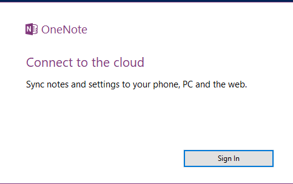
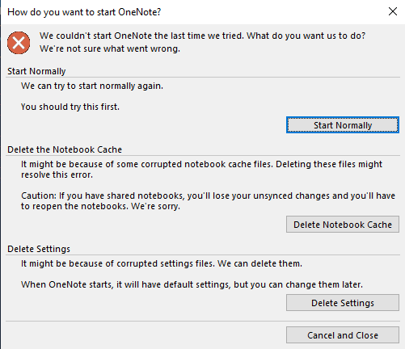

---
title: ONENOTE.EXE | Microsoft OneNote
excerpt: What is ONENOTE.EXE?
---

# ONENOTE.EXE 

* File Path: `C:\Program Files (x86)\Microsoft Office\root\Office16\ONENOTE.EXE`
* Description: Microsoft OneNote

## Screenshot

## Hashes

Type | Hash
-- | --
MD5 | `E3207E686D99D7A8ADCCE75C0B8D34C7`
SHA1 | `CE2D6CE24A4EE7E23797C8FCDDDDA05DDEECE91D`
SHA256 | `2F63DB466304AF3FD6CB25C02F9DC1ABF5D6DF44681CB83A8B8B1F124B5211BD`
SHA384 | `FDB515AF00AC5CF8C99DE15D8A528FCAA5BA033AD1E9A03773244F9307A766AA77456DBBDD881A739B36A370A78E2A19`
SHA512 | `A3E7190E360D9AC50675E544BEA354052F362A4515ED059E5DCD004F1EA4D4F134B2EB38F025987F1228D9C167E5528370DD87711659CBD7449BD8FE56A5C5EF`
SSDEEP | `1536:fGa4P6o+0tZLpg/frxOUp1IHpwFYTPlGdyRnjTceP5zhCiXXXXXX80iRtAiZZfti:+Pb+a0jN1IH4wRnjnzhCiXXXXXX4m5QY`
IMP | `3F550863DD03A709DAADBF6052FF486D`
PESHA1 | `A79152EC837D466126DC25A035FA7996DB6BBDA4`
PE256 | `167B788B9DAC615B069C4A1D7EAD56505D76701068B7A8B07CD564DE35B62482`

## Runtime Data

### Window Title:
How do you want to start OneNote?

### Open Handles:

Path | Type
-- | --
(R--)   C:\ProgramData\Microsoft\Office\ClickToRunPackageLocker | File
(R-D)   C:\Windows\System32\en-US\KernelBase.dll.mui | File
(R-D)   C:\Windows\System32\en-US\mswsock.dll.mui | File
(R-D)   C:\Windows\System32\en-US\Windows.Security.Authentication.Web.Core.dll.mui | File
(R-D)   C:\Windows\System32\en-US\winnlsres.dll.mui | File
(R-D)   C:\Windows\SysWOW64\en-US\user32.dll.mui | File
(RW-)   C:\Users\user\Documents | File
(RW-)   C:\Windows | File
(RW-)   C:\Windows\WinSxS\x86_microsoft.windows.common-controls_6595b64144ccf1df_6.0.19041.488_none_11b1e5df2ffd8627 | File
(RW-)   C:\Windows\WinSxS\x86_microsoft.windows.gdiplus_6595b64144ccf1df_1.1.19041.508_none_429cdbca8a8ffa94 | File
\BaseNamedObjects\__ComCatalogCache__ | Section
\BaseNamedObjects\C:\*ProgramData\*Microsoft\*Windows\*Caches\*{6AF0698E-D558-4F6E-9B3C-3716689AF493}.2.ver0x000000000000000a.db | Section
\BaseNamedObjects\C:\*ProgramData\*Microsoft\*Windows\*Caches\*{DDF571F2-BE98-426D-8288-1A9A39C3FDA2}.2.ver0x0000000000000002.db | Section
\BaseNamedObjects\C:\*ProgramData\*Microsoft\*Windows\*Caches\*cversions.2 | Section
\BaseNamedObjects\F932B6C7-3A20-46A0-B8A0-8894AA421973 | Section
\BaseNamedObjects\NLS_CodePage_1252_3_2_0_0 | Section
\BaseNamedObjects\NLS_CodePage_437_3_2_0_0 | Section
\BaseNamedObjects\windows_shell_global_counters | Section
\Sessions\1\BaseNamedObjects\Microsoft Office OneNote16:ONAppSharedFile | Section
\Sessions\1\BaseNamedObjects\UrlZonesSM_user | Section
\Sessions\1\BaseNamedObjects\windows_shell_global_counters | Section
\Sessions\1\BaseNamedObjects\windows_webcache_counters_{9B6AB5B3-91BC-4097-835C-EA2DEC95E9CC}_S-1-5-21-2047949552-857980807-821054962-504 | Section
\Sessions\1\Windows\Theme64749523 | Section
\Windows\Theme1120315852 | Section

### Loaded Modules:

Path |
-- |
C:\Program Files (x86)\Microsoft Office\root\Office16\ONENOTE.EXE |
C:\Windows\SYSTEM32\ntdll.dll |
C:\Windows\System32\wow64.dll |
C:\Windows\System32\wow64cpu.dll |
C:\Windows\System32\wow64win.dll |

## Signature

* Status: Signature verified.
* Serial: `33000002CE7C9ACE7D905ED2B70000000002CE`
* Thumbprint: `B10607FB914700B40F794610850C1DE0A21566C1`
* Issuer: CN=Microsoft Code Signing PCA 2010, O=Microsoft Corporation, L=Redmond, S=Washington, C=US
* Subject: CN=Microsoft Corporation, O=Microsoft Corporation, L=Redmond, S=Washington, C=US

## File Metadata

* Original Filename: OneNote.exe
* Product Name: Microsoft OneNote
* Company Name: Microsoft Corporation
* File Version: 16.0.12527.20482
* Product Version: 16.0.12527.20482
* Language: Language Neutral
* Legal Copyright: 
* Machine Type: 32-bit

## File Scan

* VirusTotal Detections: 0/74
* VirusTotal Link: https://www.virustotal.com/gui/file/2f63db466304af3fd6cb25c02f9dc1abf5d6df44681cb83a8b8b1f124b5211bd/detection/

## File Similarity (ssdeep match)

File | Score
-- | --
[C:\Program Files (x86)\Microsoft Office\root\vfs\Windows\Installer\{90160000-000F-0000-0000-0000000FF1CE}\joticon.exe](joticon.exe-1AF8AB01BA94F2612E0A0826BDE27323.md) | 69

MIT License. Copyright (c) 2020 Strontic.

