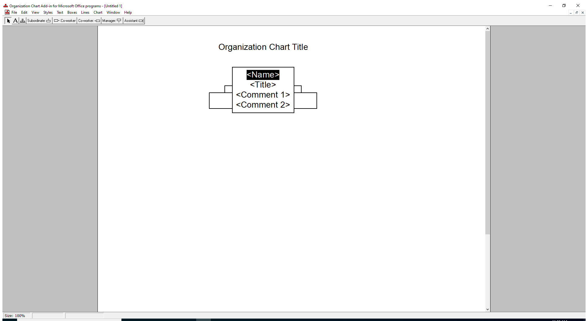

---
title: ORGCHART.EXE | Organization Chart Add-in for Microsoft Office programs
excerpt: What is ORGCHART.EXE?
---

# ORGCHART.EXE 

* File Path: `C:\Program Files (x86)\Microsoft Office\root\Office16\ORGCHART.EXE`
* Description: Organization Chart Add-in for Microsoft Office programs

## Screenshot

## Hashes

Type | Hash
-- | --
MD5 | `44EE480313C5BCBE9283CEEED2CBA233`
SHA1 | `919C9F7FADAFE8E977D6B1889F8CE2F64B5F5C51`
SHA256 | `9483089E7D951E91F84FEBC631C16E8F35DCE1903FE801D862412F9F1159ACC0`
SHA384 | `1E927BA8350B9E3DAC57B6D80AF0C9297A004B0595344582B3D942529E3953BD4BAB4B2C1598DF655105756D2A79368E`
SHA512 | `949763EBCC68A40D543F62B70FDA5887F6643D8BA2E19FB2761720A50EC4DD688509570BABB4302B65624A847E2CF6078CF4F2CFABCDD6B91FFADA62B0F5ECA4`
SSDEEP | `12288:73TnJ2ytsRA7g1UnaibXKusQlEq1zYSPoVVyfk9a:7392ytEA7NaibXAQeezYqoVE8`
IMP | `1758832107619DABD0642661E3CDF481`
PESHA1 | `842AE6BB1913FE15BC5D0EBD6C0F8AFB536A441D`
PE256 | `E58458294244EBD20115C7D16E600209CDED5C0A5051516152C2203DA1F67F0A`

## Runtime Data

### Child Processes:
splwow64.exe

### Window Title:
Organization Chart Add-in for Microsoft Office programs - [calc.dll]

### Open Handles:

Path | Type
-- | --
(R--)   C:\ProgramData\Microsoft\Office\ClickToRunPackageLocker | File
(R--)   C:\Users\user\AppData\Local\Microsoft\Office\OrgChartPref.dat | File
(R--)   C:\Users\user\AppData\Local\Temp\OPW292E.tmp | File
(R--)   C:\Users\user\AppData\Local\Temp\OrgChartClip.dat | File
(R-D)   C:\Windows\Fonts\StaticCache.dat | File
(R-D)   C:\Windows\SysWOW64\en-US\user32.dll.mui | File
(RW-)   C:\Users\user\Documents | File
(RW-)   C:\Windows | File
(RW-)   C:\Windows\WinSxS\x86_microsoft.windows.common-controls_6595b64144ccf1df_5.82.19041.488_none_89e6152f0b32762e | File
\BaseNamedObjects\__ComCatalogCache__ | Section
\BaseNamedObjects\NLS_CodePage_1252_3_2_0_0 | Section
\BaseNamedObjects\NLS_CodePage_437_3_2_0_0 | Section
\Sessions\1\BaseNamedObjects\SessionImmersiveColorPreference | Section
\Sessions\1\BaseNamedObjects\windows_shell_global_counters | Section
\Sessions\1\Windows\Theme64749523 | Section
\Windows\Theme1120315852 | Section

### Loaded Modules:

Path |
-- |
C:\Program Files (x86)\Microsoft Office\root\Office16\ORGCHART.EXE |
C:\Windows\SYSTEM32\ntdll.dll |
C:\Windows\System32\wow64.dll |
C:\Windows\System32\wow64cpu.dll |
C:\Windows\System32\wow64win.dll |

## Signature

* Status: Signature verified.
* Serial: `33000002CE7C9ACE7D905ED2B70000000002CE`
* Thumbprint: `B10607FB914700B40F794610850C1DE0A21566C1`
* Issuer: CN=Microsoft Code Signing PCA 2010, O=Microsoft Corporation, L=Redmond, S=Washington, C=US
* Subject: CN=Microsoft Corporation, O=Microsoft Corporation, L=Redmond, S=Washington, C=US

## File Metadata

* Original Filename: OrgChart.Exe
* Product Name: Microsoft Office
* Company Name: Microsoft Corporation
* File Version: 16.0.12527.20482
* Product Version: 16.0.12527.20482
* Language: Language Neutral
* Legal Copyright: 
* Machine Type: 32-bit

## File Scan

* VirusTotal Detections: Unknown
* VirusTotal Link: n/a

MIT License. Copyright (c) 2020 Strontic.

