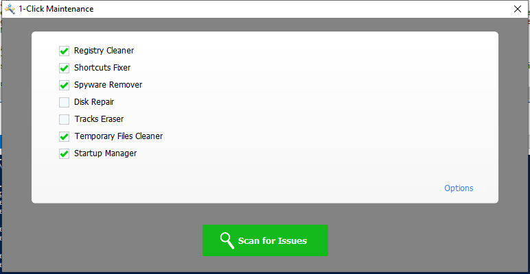

---
title: OneClickMaintenance.exe | OneClickMaintenance
excerpt: What is OneClickMaintenance.exe?
---

# OneClickMaintenance.exe 

* File Path: `C:\Program Files (x86)\Glary Utilities 5\OneClickMaintenance.exe`
* Description: OneClickMaintenance

## Screenshot

## Hashes

Type | Hash
-- | --
MD5 | `35B31CFAB6C5F771734F0AC7FE87BC92`
SHA1 | `A9F6296D00C51DE6EEEFBD094240940280EE1226`
SHA256 | `28F3F37804E1C75D39EC32651E8410FD813C7F2E251A7067171BA2104E09D770`
SHA384 | `25863AE3A91A0F13CB76307B7B993EAF74B6C34E0CAB3F54024760117C2CA46E5FE0EC017FF1C2E08A5918B609C313B1`
SHA512 | `BF8965D0E7D9D65D41060C2591191522AF59BF7610034A7A60A15B6D9E74683A0D123A077C80E00115B5B735AB3871EFC3ED5CE898276FD8127DECDADF0B814D`
SSDEEP | `6144:ynajhUq0cSk73vw3hB2fQO5SoPxkv+lAF:ynazvQhBroPxtCF`

## Signature

* Status: Signature verified.
* Serial: `0F05AE21CDC17B9F3CF09D7BFC659BA3`
* Thumbprint: `362EBB303E088105BDCC07D94E6B7875D30C0D06`
* Issuer: CN=DigiCert Assured ID Code Signing CA-1, OU=www.digicert.com, O=DigiCert Inc, C=US
* Subject: CN=Glarysoft LTD, O=Glarysoft LTD, S=Beijing, C=CN

## File Metadata

* Original Filename: OneClickMaintenance.exe
* Product Name: Glary Utilities
* Company Name: Glarysoft Ltd
* File Version: 5, 0, 0, 8
* Product Version: 5.0.0.0
* Language: Chinese (Simplified, China)
* Legal Copyright: Copyright (c) 2003-2020 Glarysoft Ltd

## File Similarity (ssdeep match)

File | Score
-- | --
[C:\program files (x86)\Glary Utilities 5\OneClickMaintenance.exe](OneClickMaintenance.exe-CCBB825CC9F62057C88C80550422D998.md) | 94
[C:\Program Files (x86)\Glary Utilities 5\OneClickMaintenance.exe](OneClickMaintenance.exe-EF6CF6D0DF545300EE144F02F0BADCF9.md) | 96

MIT License. Copyright (c) 2020 Strontic.

