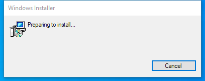

---
title: PdnRepair.exe | paint.net Repair Utility
---

# PdnRepair.exe 

* File Path: `C:\program files\paint.net\PdnRepair.exe`
* Description: paint.net Repair Utility
* Comments: Image and photo editing software.


## Screenshot



## Hashes

Type | Hash
-- | --
MD5 | `0644EB64FE3FF3E2840FC380AE8480A8`
SHA1 | `E38996B7EFB84B6CF2F05EAF47BB07BD6208AEA5`
SHA256 | `F791BBC0C046F691208A583FE94C1A74AB3A760D56E73BF52AE899B5C1211B82`
SHA384 | `C54AE6DEC74684842D99E79C065BEF5310D897D663E687F6C23580CA0AAF73EC6A02AF7BE3C995BE54A3F393393BE4A2`
SHA512 | `6FDF795460379BE36FEFA33176B666DC5D450E186A85182BF8317067E24BE9F4ABEE3FDE354536E7E773A511526E923D3A495A04BC7D5FB2337820A329E483C0`
SSDEEP | `384:UhjNjBTnA9z0SD29bEip8ZpHqGb5hikHW:3oSDebEipiR9rik2`

## Runtime Data

### Usage (stdout):
```cmhg
paint.net Repair Tool

The return code from this utility is 0 (success), 1 (fail), or an MSI error code like ERROR_SUCCESS_REBOOT_REQUIRED (3010).
Use /nopause to avoid 'Press Enter to exit...' at completion.

* Opening registry key, HKEY_LOCAL_MACHINE\SOFTWARE\paint.net: ok
* Retrieving MSI product code GUID from ProductCode value: {2025DAA7-0653-4F18-B66F-900E6F2320EC}
* Attempting to repair with MsiReinstallProductW(REINSTALLMODE_FILEREPLACE) (same as msiexec.exe /fa): failed, dwResult=1618

Return code is 1618
Press Enter to exit...

```

### Child Processes:
conhost.exe

### Window Title:
paint.net

### Open Handles:

Path | Type
-- | --
(R--)   C:\Windows\assembly\pubpol5.dat | File
(R-D)   C:\Windows\Fonts\StaticCache.dat | File
(R-D)   C:\Windows\System32\en-US\msimsg.dll.mui | File
(RW-)   C:\Users\user\Documents | File
(RW-)   C:\Windows\WinSxS\amd64_microsoft.windows.common-controls_6595b64144ccf1df_6.0.19041.1_none_b555e41d4684ddec | File
\...\Cor_SxSPublic_IPCBlock | Section
\BaseNamedObjects\__ComCatalogCache__ | Section
\BaseNamedObjects\Cor_Private_IPCBlock_v4_6232 | Section
\BaseNamedObjects\NLS_CodePage_1252_3_2_0_0 | Section
\BaseNamedObjects\NLS_CodePage_437_3_2_0_0 | Section
\Sessions\1\Windows\Theme4048709601 | Section
\Windows\Theme603176458 | Section


### Loaded Modules:

Path |
-- |
C:\program files\paint.net\PdnRepair.exe |
C:\Windows\System32\KERNEL32.dll |
C:\Windows\System32\KERNELBASE.dll |
C:\Windows\SYSTEM32\MSCOREE.DLL |
C:\Windows\SYSTEM32\ntdll.dll |


## Signature

* Status: Signature verified.
* Serial: `00A38E256C85B282401495B7097855228A`
* Thumbprint: `0DF057FD2C1C69CF096AF1BC9DA07CC8B764BAC9`
* Issuer: CN=COMODO RSA Code Signing CA, O=COMODO CA Limited, L=Salford, S=Greater Manchester, C=GB
* Subject: CN=DOTPDN LLC, O=DOTPDN LLC, STREET=3925 NE 72nd Ave Ste 107-1, L=Vancouver, S=WA, PostalCode=98661, C=US

## File Metadata

* Original Filename: PdnRepair.exe
* Product Name: paint.net
* Company Name: dotPDN LLC
* File Version: 4.213.7521.38873
* Product Version: 4.213.7521.38873
* Language: Language Neutral
* Legal Copyright: Copyright  2020 dotPDN LLC, Rick Brewster, and contributors. All Rights Reserved.

## File Similarity (ssdeep match)

File | Score
-- | --
[C:\program files\GIMP 2\bin\gimp-test-clipboard-2.0.exe](gimp-test-clipboard-2.0.exe-3229BE4DA4CA387E19B4A40711AF5A4A.md) | 35
[C:\program files\GIMP 2\bin\gimptool-2.0.exe](gimptool-2.0.exe-87B7C31E5673B73C53A738F280DA7AC7.md) | 27
[C:\program files\GIMP 2\lib\gimp\2.0\plug-ins\blur\blur.exe](blur.exe-20E354BFAF6B82E1DEF36B73DA590FFF.md) | 32
[C:\program files\GIMP 2\lib\gimp\2.0\plug-ins\busy-dialog\busy-dialog.exe](busy-dialog.exe-30B45C14253E7377A50D14F6DAF8450A.md) | 30
[C:\program files\GIMP 2\lib\gimp\2.0\plug-ins\color-enhance\color-enhance.exe](color-enhance.exe-03DA3D790F21006B83C5BAC917666DAF.md) | 27
[C:\program files\GIMP 2\lib\gimp\2.0\plug-ins\colorify\colorify.exe](colorify.exe-EA79617EDA8E5F55DBD78CEB6A1A4FC6.md) | 35
[C:\program files\GIMP 2\lib\gimp\2.0\plug-ins\crop-zealous\crop-zealous.exe](crop-zealous.exe-05F6FC0B2620715E85FD4D99F5EA4A24.md) | 33
[C:\program files\GIMP 2\lib\gimp\2.0\plug-ins\despeckle\despeckle.exe](despeckle.exe-F1B2645423E7D5FEECED550712FEC034.md) | 25
[C:\program files\GIMP 2\lib\gimp\2.0\plug-ins\file-compressor\file-compressor.exe](file-compressor.exe-3136FF9EC1EF49022742350409657A59.md) | 24
[C:\program files\GIMP 2\lib\gimp\2.0\plug-ins\file-csource\file-csource.exe](file-csource.exe-F18C8CF4964BC9E8895884F90077C94D.md) | 30
[C:\program files\GIMP 2\lib\gimp\2.0\plug-ins\file-desktop-link\file-desktop-link.exe](file-desktop-link.exe-0792FB0399ECC0853D3D02F50FA42ADE.md) | 35
[C:\program files\GIMP 2\lib\gimp\2.0\plug-ins\file-gbr\file-gbr.exe](file-gbr.exe-24057EE0337A2F2226FAB3DAC2FC512F.md) | 32
[C:\program files\GIMP 2\lib\gimp\2.0\plug-ins\file-gif-load\file-gif-load.exe](file-gif-load.exe-8A6D9DABA7803D7C6869993ACDE27B2D.md) | 27
[C:\program files\GIMP 2\lib\gimp\2.0\plug-ins\file-glob\file-glob.exe](file-glob.exe-AAECB691A0759F561D3B99504BCCA327.md) | 35
[C:\program files\GIMP 2\lib\gimp\2.0\plug-ins\file-header\file-header.exe](file-header.exe-089EE6DD917023936135BCCAC9CAC0CE.md) | 32
[C:\program files\GIMP 2\lib\gimp\2.0\plug-ins\file-html-table\file-html-table.exe](file-html-table.exe-E87646D24FEF13BE6F8027CAEA7D8C8C.md) | 25
[C:\program files\GIMP 2\lib\gimp\2.0\plug-ins\file-raw-placeholder\file-raw-placeholder.exe](file-raw-placeholder.exe-AD7F2F4E94DF97448FDE24E381F101AC.md) | 27
[C:\program files\GIMP 2\lib\gimp\2.0\plug-ins\goat-exercise\goat-exercise.exe](goat-exercise.exe-75A7DF6151015C34194399E56D5A66FE.md) | 30
[C:\program files\GIMP 2\lib\gimp\2.0\plug-ins\gradient-map\gradient-map.exe](gradient-map.exe-C7F26A2FD518038620D73B699F69948B.md) | 30
[C:\program files\GIMP 2\lib\gimp\2.0\plug-ins\guillotine\guillotine.exe](guillotine.exe-DEB46BA0D214D3A791C450AA6C3CA6D6.md) | 29
[C:\program files\GIMP 2\lib\gimp\2.0\plug-ins\hot\hot.exe](hot.exe-FBE6F4A0492BE99C01527E552EC2A8FE.md) | 27
[C:\program files\GIMP 2\lib\gimp\2.0\plug-ins\max-rgb\max-rgb.exe](max-rgb.exe-A972C81A4C76DCBDA487FE3F9F079572.md) | 30
[C:\program files\GIMP 2\lib\gimp\2.0\plug-ins\procedure-browser\procedure-browser.exe](procedure-browser.exe-7C2B54450E1DC9D6C118363D4621724A.md) | 27
[C:\program files\GIMP 2\lib\gimp\2.0\plug-ins\tile-small\tile-small.exe](tile-small.exe-40DA7E4EEDF8FB9A1DBCCD65A34350A9.md) | 27
[C:\program files\GIMP 2\lib\gimp\2.0\plug-ins\twain\twain.exe](twain.exe-C23997105AA15348BD1F1F6439E16E9A.md) | 29
[C:\program files\GIMP 2\lib\gimp\2.0\plug-ins\wavelet-decompose\wavelet-decompose.exe](wavelet-decompose.exe-04FF2DBC3AC674E5494C51ECAD5710A6.md) | 29
[C:\program files\GIMP 2\lib\gimp\2.0\plug-ins\web-browser\web-browser.exe](web-browser.exe-74EBC9205E8832310A6B4A34A1E09540.md) | 29
[C:\program files\paint.net\SetupNgen.exe](SetupNgen.exe-3A16E356C6CA089DCD45F877A9B89B68.md) | 43
[C:\program files\paint.net\UpdateMonitor.exe](UpdateMonitor.exe-649EAA80D8759902667E3E84A23DE491.md) | 60


MIT License. Copyright (c) 2020 Strontic.


