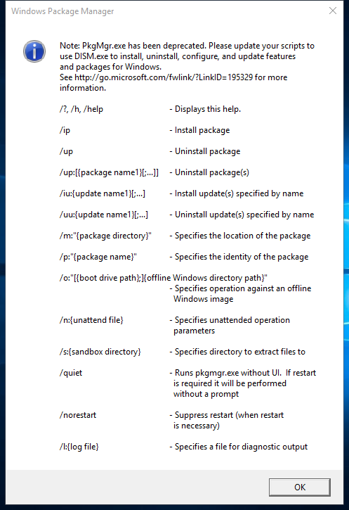
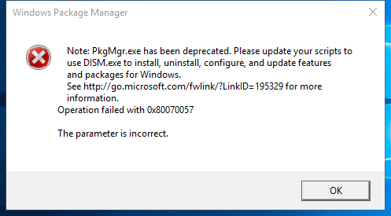

---
title: PkgMgr.exe | Windows Package Manager
excerpt: What is PkgMgr.exe?
---

# PkgMgr.exe 

* File Path: `C:\Windows\system32\PkgMgr.exe`
* Description: Windows Package Manager

## Screenshot

## Hashes

Type | Hash
-- | --
MD5 | `DC51BE58FEAF1A400DA1BBFC16219C10`
SHA1 | `3B5E0FFCF76D1AAECD9344774BB05E6E79EF124C`
SHA256 | `C48CD3943AC941E88C089CF3245F4C7903030EA5B7DBAF59B8D6E69CF454A06D`
SHA384 | `8F5F9B7ADFF6663D4C346EB9D43153BAC4406BF3B5048EC075097B5289A515A929E1E7F0826CC7A29DB51A63B6FBD037`
SHA512 | `2CD75CFF603EF3CDBD0E7733FE0627E8A415AF239BC4D17ECC901307A2195F9DAED36B809480FE41B546959993378065102ECEC451D3DA9852354B161BE5FCC3`
SSDEEP | `3072:SvyBycg/kAZlJETmbDS7oBl4OpbhENXK6JRAqs4xjw8m1IzS5bwuAQkx:OTcgcAZ5Xfl4MbhMHxM8cyS5bwuLk`

## Signature

* Status: Signature verified.
* Serial: `3300000266BD1580EFA75CD6D3000000000266`
* Thumbprint: `A4341B9FD50FB9964283220A36A1EF6F6FAA7840`
* Issuer: CN=Microsoft Windows Production PCA 2011, O=Microsoft Corporation, L=Redmond, S=Washington, C=US
* Subject: CN=Microsoft Windows, O=Microsoft Corporation, L=Redmond, S=Washington, C=US

## File Metadata

* Original Filename: PkgMgr.exe
* Product Name: Microsoft Windows Operating System
* Company Name: Microsoft Corporation
* File Version: 10.0.14393.2457 (rs1_release_inmarket.180822-1743)
* Product Version: 10.0.14393.2457
* Language: English (United States)
* Legal Copyright:  Microsoft Corporation. All rights reserved.

## File Similarity (ssdeep match)

File | Score
-- | --
[C:\Windows\system32\ocsetapi.dll](ocsetapi.dll-23BC4F98A5F7B0810CA560BF3DF76EF7.md) | 46
[C:\WINDOWS\system32\PkgMgr.exe](PkgMgr.exe-16C0DDFCE82A53516E634F691689EBB6.md) | 49
[C:\windows\system32\PkgMgr.exe](PkgMgr.exe-B212B2FE6910AF8B2068F2FF2242204F.md) | 40
[C:\Windows\system32\PkgMgr.exe](PkgMgr.exe-DDE0B63F2E276B969C9C1E6983990CB2.md) | 46
[C:\Windows\system32\wusa.exe](wusa.exe-59701FE9C8BA85BCEB73A9B1B3E8E1C4.md) | 43

MIT License. Copyright (c) 2020 Strontic.

