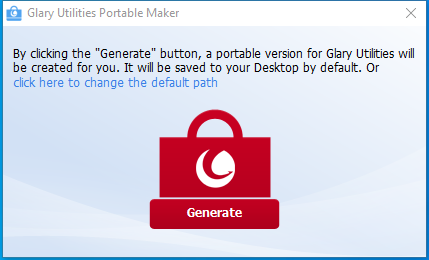

---
title: PortableMaker.exe | Glary Utilities Portable Maker
---

# PortableMaker.exe 

* File Path: `C:\program files (x86)\Glary Utilities 5\PortableMaker.exe`
* Description: Glary Utilities Portable Maker

## Screenshot

## Hashes

Type | Hash
-- | --
MD5 | `CC6C2606CCCFF0D248727221AE74990D`
SHA1 | `3C082DB6F2E8542269B9F6BD688B7EC877BC1C1E`
SHA256 | `3B9E1C7012C03237D576D0C80AE92B334EF32F197972B8E93B4C45B469145FE8`
SHA384 | `FAF249293CED0127457BBCB539491C634DD61D88DAA52653C68AB314D2993BD37C56668BE41DFB1598567C0D063E5E63`
SHA512 | `7ABEE9C7C9C0E5DE596E0EB377F712628B98537790C5234EA356702853BBDEC38141F75C0A32233994B51D0ABC3A896514724AD07BBD33E4FCF703B77DA19043`
SSDEEP | `3072:SoDstICpwxRoUy0OpOeeV7YNnRLFCSWKHuQY9OBXuGWINVV:SniC/Uy0Ok5a3HWOB4IB`

## Runtime Data

### Window Title:
Glary Utilities Portable Maker

### Open Handles:

Path | Type
-- | --
(R-D)   C:\Windows\Fonts\StaticCache.dat | File
(RW-)   C:\Program Files (x86)\Glary Utilities 5 | File
(RW-)   C:\Users\user\Documents | File
(RW-)   C:\Windows | File
(RW-)   C:\Windows\WinSxS\x86_microsoft.vc90.crt_1fc8b3b9a1e18e3b_9.0.30729.9625_none_508ef7e4bcbbe589 | File
(RW-)   C:\Windows\WinSxS\x86_microsoft.windows.common-controls_6595b64144ccf1df_6.0.19041.1_none_fd031af45b0106f2 | File
(RW-)   C:\Windows\WinSxS\x86_microsoft.windows.gdiplus_6595b64144ccf1df_1.1.19041.450_none_4294d6e08a97344a | File
\BaseNamedObjects\NLS_CodePage_1252_3_2_0_0 | Section
\BaseNamedObjects\NLS_CodePage_437_3_2_0_0 | Section
\Sessions\1\BaseNamedObjects\windows_shell_global_counters | Section
\Sessions\1\Windows\Theme4048709601 | Section
\Windows\Theme603176458 | Section

### Loaded Modules:

Path |
-- |
C:\program files (x86)\Glary Utilities 5\PortableMaker.exe |
C:\Windows\SYSTEM32\ntdll.dll |
C:\Windows\System32\wow64.dll |
C:\Windows\System32\wow64cpu.dll |
C:\Windows\System32\wow64win.dll |

## Signature

* Status: Signature verified.
* Serial: `0F05AE21CDC17B9F3CF09D7BFC659BA3`
* Thumbprint: `362EBB303E088105BDCC07D94E6B7875D30C0D06`
* Issuer: CN=DigiCert Assured ID Code Signing CA-1, OU=www.digicert.com, O=DigiCert Inc, C=US
* Subject: CN=Glarysoft LTD, O=Glarysoft LTD, S=Beijing, C=CN

## File Metadata

* Original Filename: PortableMaker.exe
* Product Name: Glary Utilities
* Company Name: Glarysoft Ltd
* File Version: 5, 0, 0, 5
* Product Version: 5.0.0.1
* Language: Chinese (Simplified, China)
* Legal Copyright: Copyright (c) 2014-2020 Glarysoft Ltd

## File Similarity (ssdeep match)

File | Score
-- | --
[C:\Program Files (x86)\Glary Utilities 5\PortableMaker.exe](PortableMaker.exe-9973A44C74BB1E367784190D548E9275.md) | 91

MIT License. Copyright (c) 2020 Strontic.

