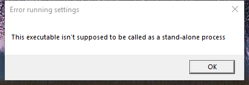

---
title: PowerToysSettings.exe | PowerToys Settings
excerpt: What is PowerToysSettings.exe?
---

# PowerToysSettings.exe 

* File Path: `C:\Program Files\PowerToys\PowerToysSettings.exe`
* Description: PowerToys Settings

## Screenshot

## Hashes

Type | Hash
-- | --
MD5 | `8130FC9F772BABBA70A2805F32193673`
SHA1 | `FFCC32DF0B41393018FE7B603F222CE6C79AFD4F`
SHA256 | `081B2E251566A5DEC34CDC490743BBA5681839A0542FBC6CD6D14FBB32241FFD`
SHA384 | `25F0B21684B3F19B789C6E2E18192DB8BC588EB01BB97B13880C01E2601B670D1FA636092E59BC33C143808A6127CBE5`
SHA512 | `D644590C4B106497DEA93562793F389E0D6051757A7BC187F651ACF87330E8C40050780434B0A923C3F46C30AC3C5073B0C798060E9DCEEB623D6406BF561A1A`
SSDEEP | `6144:+gjn5Xx7uBM8VbGgtnhX+NbpMD3J13Usqk6nckk+iKNzuvzxoKDCe+seg9t:LlxsM8bhuNwXUs96ny+bPU`
IMP | `D946DF6D8FF364E24FF118D53A8C8F4F`
PESHA1 | `B777A9064C0C7FE963C235F72142EC93806D631D`
PE256 | `AB73B1FB2F4AEEDFD4CCEB0B55E84CD61FB59B216BA2002D124D0B1F6F5AA59C`

## Runtime Data

### Window Title:
Error running settings

### Open Handles:

Path | Type
-- | --
(R-D)   C:\Windows\Fonts\StaticCache.dat | File
(RW-)   C:\xCyclopedia | File
\BaseNamedObjects\NLS_CodePage_1252_3_2_0_0 | Section
\BaseNamedObjects\NLS_CodePage_437_3_2_0_0 | Section
\Sessions\1\Windows\Theme289354956 | Section
\Windows\Theme1665484522 | Section

### Loaded Modules:

Path |
-- |
C:\Program Files\PowerToys\PowerToysSettings.exe |
C:\Windows\System32\ADVAPI32.dll |
C:\Windows\System32\combase.dll |
C:\Windows\System32\GDI32.dll |
C:\Windows\System32\gdi32full.dll |
C:\Windows\System32\KERNEL32.DLL |
C:\Windows\System32\KERNELBASE.dll |
C:\Windows\System32\msvcp_win.dll |
C:\Windows\System32\msvcrt.dll |
C:\Windows\SYSTEM32\ntdll.dll |
C:\Windows\System32\ole32.dll |
C:\Windows\System32\OLEAUT32.dll |
C:\Windows\System32\RPCRT4.dll |
C:\Windows\System32\sechost.dll |
C:\Windows\System32\shcore.dll |
C:\Windows\System32\SHELL32.dll |
C:\Windows\System32\SHLWAPI.dll |
C:\Windows\System32\ucrtbase.dll |
C:\Windows\System32\USER32.dll |
C:\Windows\System32\win32u.dll |

## Signature

* Status: Signature verified.
* Serial: `33000001864D2175A0D907BE2C000000000186`
* Thumbprint: `8EE1E4E037942BE5BC7E58B061FB559BDC381D82`
* Issuer: CN=Microsoft Code Signing PCA 2011, O=Microsoft Corporation, L=Redmond, S=Washington, C=US
* Subject: CN=Microsoft Corporation, O=Microsoft Corporation, L=Redmond, S=Washington, C=US

## File Metadata

* Original Filename: PowerToysSettings.exe
* Product Name: PowerToys
* Company Name: Microsoft Corporation
* File Version: 0.23.2.0
* Product Version: 0.23.2.0
* Language: English (United States)
* Legal Copyright: Copyright (C) 2020 Microsoft Corporation
* Machine Type: 64-bit

## File Scan

* VirusTotal Detections: 0/57
* VirusTotal Link: https://www.virustotal.com/gui/file/081b2e251566a5dec34cdc490743bba5681839a0542fbc6cd6d14fbb32241ffd/detection/

MIT License. Copyright (c) 2020 Strontic.

