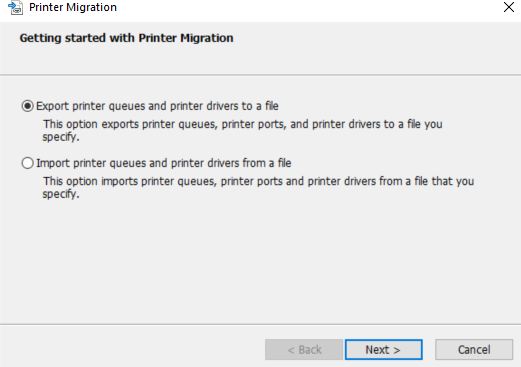

---
title: PrintBrmUi.exe | PrintBrm Application
---

# PrintBrmUi.exe 

* File Path: `C:\Windows\system32\PrintBrmUi.exe`
* Description: PrintBrm Application

## Screenshot

## Hashes

Type | Hash
-- | --
MD5 | `1CE2DC4F305AF5AC353165CF25639D2E`
SHA1 | `0F27DE2552EFF768DBB4E0151F979FE6BE79722D`
SHA256 | `DA986C8EE401BE63202F3E4FEE92342709222D88D5DB15EE3930DC8A3E332C24`
SHA384 | `EC5859FC5B664DCEED5D576546524EE4E9B781D192642B819311A7AC89A1EB270A642AD41483073053258900DC87972A`
SHA512 | `5ECF47611A689737E58B36BC36D1A8EC62D4E212345DD715F0D8344C6E562E5F39FA072580EDD214348471A92881AE4A73CA4A65B1985319DB77C2B785E0FF39`
SSDEEP | `1536:MjMQCWE1SzuGoWh0Gtl2FKr6pk+mUizvvKayD7:MJCWEHGoWh0GtlWKry1mUiznD6`

## Signature

* Status: Signature verified.
* Serial: `330000023241FB59996DCC4DFF000000000232`
* Thumbprint: `FF82BC38E1DA5E596DF374C53E3617F7EDA36B06`
* Issuer: CN=Microsoft Windows Production PCA 2011, O=Microsoft Corporation, L=Redmond, S=Washington, C=US
* Subject: CN=Microsoft Windows, O=Microsoft Corporation, L=Redmond, S=Washington, C=US

## File Metadata

* Original Filename: PrintBrmUi.exe.mui
* Product Name: Microsoft Windows Operating System
* Company Name: Microsoft Corporation
* File Version: 10.0.19041.1 (WinBuild.160101.0800)
* Product Version: 10.0.19041.1
* Language: English (United States)
* Legal Copyright:  Microsoft Corporation. All rights reserved.

MIT License. Copyright (c) 2020 Strontic.

