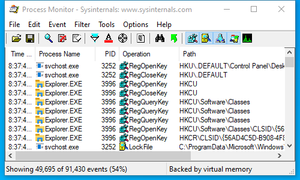
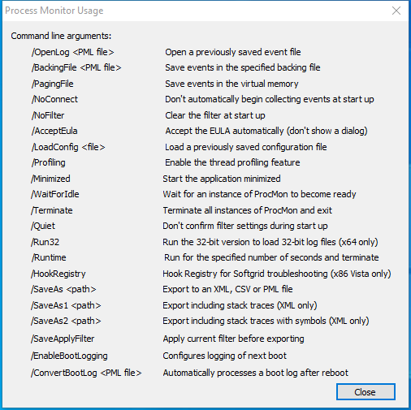

---
title: Procmon64.exe | Process Monitor
excerpt: What is Procmon64.exe?
---

# Procmon64.exe 

* File Path: `C:\SysinternalsSuite\Procmon64.exe`
* Description: Process Monitor

## Screenshot

## Hashes

Type | Hash
-- | --
MD5 | `39899AFCF9F1B338AE97B7B407951BEA`
SHA1 | `45B99F3BE269A356EF22EB285A42F890699FAA6F`
SHA256 | `446477F6ADA7D89E6DC5A429E2A8AB7F9073A0C7674DB264768BE98986C866D5`
SHA384 | `A97CEACDBFE7B3BA2D78685BFCF2CFCC5787262D823E089F1A5F38F5E52A122CD85B616A7BAB8AD5B172BDA0C3A959EF`
SHA512 | `3B6EDFB7F9A5228BE0FABEBC0C062AF72DC049882135FA8FB930746EF71A7E214BDFAA14F312DAC355116C9A940E82514E0ABB28AB8E1963D4BF92C51BF74A3B`
SSDEEP | `24576:SQqEDVMeGZsvdVcSuzr0yYUspxUzmMOaF:SQLVMeGZsvdVcSuPgBptMf`
IMP | `3FDD2E5731A42EE9F41C91AE1FBEFFB8`
PESHA1 | `7CA95616499862641B1F4A545DC8E58A36E694E0`
PE256 | `FE3F95C34D0B9FA94E9784889E41706D23CA8839E045E619B7AC18333ED971F5`

## Runtime Data

### Window Title:
Process Monitor - Sysinternals: www.sysinternals.com

### Open Handles:

Path | Type
-- | --
(R-D)   C:\Windows\Fonts\StaticCache.dat | File
(R-D)   C:\Windows\SystemResources\imageres.dll.mun | File
(RW-)   C:\Windows\WinSxS\amd64_microsoft.windows.common-controls_6595b64144ccf1df_6.0.19041.488_none_ca04af081b815d21 | File
(RW-)   C:\xCyclopedia | File
\BaseNamedObjects\__ComCatalogCache__ | Section
\BaseNamedObjects\NLS_CodePage_1252_3_2_0_0 | Section
\BaseNamedObjects\NLS_CodePage_437_3_2_0_0 | Section
\Sessions\1\BaseNamedObjects\414HWNDInterface:a3043a | Section
\Sessions\1\BaseNamedObjects\windows_shell_global_counters | Section
\Sessions\1\Windows\Theme2036293991 | Section
\Windows\Theme1324212991 | Section

### Loaded Modules:

Path |
-- |
C:\SysinternalsSuite\Procmon64.exe |
C:\Windows\System32\ADVAPI32.dll |
C:\Windows\System32\combase.dll |
C:\Windows\System32\COMDLG32.dll |
C:\Windows\SYSTEM32\FLTLIB.DLL |
C:\Windows\System32\GDI32.dll |
C:\Windows\System32\gdi32full.dll |
C:\Windows\System32\KERNEL32.DLL |
C:\Windows\System32\KERNELBASE.dll |
C:\Windows\System32\msvcp_win.dll |
C:\Windows\System32\msvcrt.dll |
C:\Windows\SYSTEM32\ntdll.dll |
C:\Windows\System32\ole32.dll |
C:\Windows\System32\OLEAUT32.dll |
C:\Windows\System32\RPCRT4.dll |
C:\Windows\System32\sechost.dll |
C:\Windows\System32\shcore.dll |
C:\Windows\System32\SHELL32.dll |
C:\Windows\System32\SHLWAPI.dll |
C:\Windows\System32\ucrtbase.dll |
C:\Windows\System32\USER32.dll |
C:\Windows\SYSTEM32\VERSION.dll |
C:\Windows\System32\win32u.dll |
C:\Windows\System32\WS2_32.dll |
C:\Windows\WinSxS\amd64_microsoft.windows.common-controls_6595b64144ccf1df_6.0.19041.488_none_ca04af081b815d21\COMCTL32.dll |

## Signature

* Status: Signature verified.
* Serial: `3300000187721772155940C709000000000187`
* Thumbprint: `2485A7AFA98E178CB8F30C9838346B514AEA4769`
* Issuer: CN=Microsoft Code Signing PCA 2011, O=Microsoft Corporation, L=Redmond, S=Washington, C=US
* Subject: CN=Microsoft Corporation, O=Microsoft Corporation, L=Redmond, S=Washington, C=US

## File Metadata

* Original Filename: Process Monitor
* Product Name: Sysinternals Procmon
* Company Name: Sysinternals - www.sysinternals.com
* File Version: 3.60
* Product Version: 3.60
* Language: English (United States)
* Legal Copyright: Copyright  1996-2020 Mark Russinovich
* Machine Type: 64-bit

## File Scan

* VirusTotal Detections: 0/69
* VirusTotal Link: https://www.virustotal.com/gui/file/446477f6ada7d89e6dc5a429e2a8ab7f9073a0c7674db264768be98986c866d5/detection/

## File Similarity (ssdeep match)

File | Score
-- | --
[C:\SysinternalsSuite\Procmon.exe](Procmon.exe-EB2A0D7AC44B9B66E884EE5087305ACC.md) | 71

## Possible Misuse

*The following table contains possible examples of `Procmon64.exe` being misused. While `Procmon64.exe` is **not** inherently malicious, its legitimate functionality can be abused for malicious purposes.*

Source | Source File | Example | License
-- | -- | -- | --
[sigma](https://github.com/Neo23x0/sigma) | [win_user_driver_loaded.yml](https://github.com/Neo23x0/sigma/blob/master/rules/windows/builtin/win_user_driver_loaded.yml) | `- '*\procmon64.exe'`{:.highlight .language-yaml} | [DRL 1.0](https://github.com/Neo23x0/sigma/blob/master/LICENSE.Detection.Rules.md)
[sigma](https://github.com/Neo23x0/sigma) | [sysmon_susp_procexplorer_driver_created_in_tmp_folder.yml](https://github.com/Neo23x0/sigma/blob/master/rules/windows/file_event/sysmon_susp_procexplorer_driver_created_in_tmp_folder.yml) | `- '*\procmon64.exe'`{:.highlight .language-yaml} | [DRL 1.0](https://github.com/Neo23x0/sigma/blob/master/LICENSE.Detection.Rules.md)
[sigma](https://github.com/Neo23x0/sigma) | [sysmon_susp_service_installed.yml](https://github.com/Neo23x0/sigma/blob/master/rules/windows/registry_event/sysmon_susp_service_installed.yml) | `- '*\procmon64.exe'`{:.highlight .language-yaml} | [DRL 1.0](https://github.com/Neo23x0/sigma/blob/master/LICENSE.Detection.Rules.md)
[signature-base](https://github.com/Neo23x0/signature-base) | [apt_apt41.yar](https://github.com/Neo23x0/signature-base/blob/master/yara/apt_apt41.yar) | $x1 = ";procmon64.exe;netmon.exe;tcpview.exe;MiniSniffer.exe;smsniff.exe" ascii | [CC BY-NC 4.0](https://github.com/Neo23x0/signature-base/blob/master/LICENSE)

MIT License. Copyright (c) 2020-2021 Strontic.

