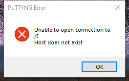

---
title: PuTTYNG.exe | SSH, Telnet and Rlogin client
excerpt: What is PuTTYNG.exe?
---

# PuTTYNG.exe 

* File Path: `C:\Program Files (x86)\mRemoteNG\PuTTYNG.exe`
* Description: SSH, Telnet and Rlogin client

## Screenshot

## Hashes

Type | Hash
-- | --
MD5 | `4B72D2A0D937D678AA5C89DF45A58A6E`
SHA1 | `601E9EBBA183CA409D8B175F4DF29C80BA931CD3`
SHA256 | `FE4748B5B538933442C5681F126090F87E56AA1F6907FEA0C480497B9E4EE4A6`
SHA384 | `3E89DFBE1494E72A11EBF46B0BB289D1BC63A1AD8472C3AE47CDA2BA8CC53D55B8F9A0AA1107B41802073F85C0BBE63A`
SHA512 | `48EF94B22C2CFE92E41210EF95D36125A27A826BB38A6BA48A7FA784AD755940744503DD843D2C0CFE7087A34FBF5A677F78D80A00843EAB5E6570CFD4BAEB15`
SSDEEP | `24576:BRNIhe68XUm3EjQDyWy/2crLWxBJbOWZ5ZxaoS6EGA:BRMKYQb22+WZ5kG`
IMP | `F2B227A5A3682CDF0538DBC87F949168`
PESHA1 | `C20BDC55F4577CFEB41621B4D92C200753D38370`
PE256 | `E17C0C3927A71C9EDCFB5BA73542506339109500214C5A1534C2368CEBC5D8E7`

## Runtime Data

### Window Title:
PuTTYNG Command Line Error

### Open Handles:

Path | Type
-- | --
(R-D)   C:\Windows\Fonts\StaticCache.dat | File
(R-D)   C:\Windows\SystemResources\imageres.dll.mun | File
(RW-)   C:\Windows | File
(RW-)   C:\Windows\WinSxS\x86_microsoft.windows.common-controls_6595b64144ccf1df_5.82.19041.488_none_89e6152f0b32762e | File
(RW-)   C:\Windows\WinSxS\x86_microsoft.windows.common-controls_6595b64144ccf1df_6.0.19041.488_none_11b1e5df2ffd8627 | File
(RW-)   C:\xCyclopedia | File
\BaseNamedObjects\NLS_CodePage_1252_3_2_0_0 | Section
\BaseNamedObjects\NLS_CodePage_437_3_2_0_0 | Section
\Sessions\1\Windows\Theme289354956 | Section
\Windows\Theme1665484522 | Section

### Loaded Modules:

Path |
-- |
C:\Program Files (x86)\mRemoteNG\PuTTYNG.exe |
C:\Windows\SYSTEM32\ntdll.dll |
C:\Windows\System32\wow64.dll |
C:\Windows\System32\wow64cpu.dll |
C:\Windows\System32\wow64win.dll |

## Signature

* Status: The file C:\Program Files (x86)\mRemoteNG\PuTTYNG.exe is not digitally signed. You cannot run this script on the current system. For more information about running scripts and setting execution policy, see about_Execution_Policies at https:/go.microsoft.com/fwlink/?LinkID=135170
* Serial: ``
* Thumbprint: ``
* Issuer: 
* Subject: 

## File Metadata

* Original Filename: PuTTYNG.exe
* Product Name: PuTTYNG
* Company Name: Simon Tatham
* File Version: Release 0.71 (without embedded help)
* Product Version: Release 0.71
* Language: English (United Kingdom)
* Legal Copyright: Copyright  1997-2019 Simon Tatham.
* Machine Type: 32-bit

## File Scan

* VirusTotal Detections: 2/71
* VirusTotal Link: https://www.virustotal.com/gui/file/fe4748b5b538933442c5681f126090f87e56aa1f6907fea0c480497b9e4ee4a6/detection/

MIT License. Copyright (c) 2020-2021 Strontic.

