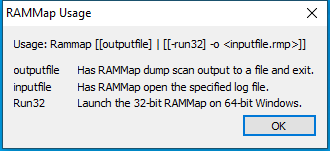

---
title: RAMMap.exe | RamMap - physical memory analyzer
excerpt: What is RAMMap.exe?
---

# RAMMap.exe 

* File Path: `C:\SysinternalsSuite\RAMMap.exe`
* Description: RamMap - physical memory analyzer

## Screenshot

## Hashes

Type | Hash
-- | --
MD5 | `64DC28478F3F1E8BD747EA2A9A4B92CC`
SHA1 | `30108E33BF85CE354CAA03AC1ECD2E1A1684FAF9`
SHA256 | `CF3D67843A3FC93AA51BBDF15B425B5920835F997A1B0EE165451D83A0C08FE7`
SHA384 | `15283EF9219908A0A5660F4AE8282BB61E115454F0A54F6154102855713778F9E2DBADDDF37194D0E97C4126C938098E`
SHA512 | `4195EBE24EF97E088608D5253EF8978FCB10195FF8F5801FD4C9DA16259C845B11869C446FC82BCE62F94BC0F9252D68D3E39664B0B1890A76EFE850DA641CB7`
SSDEEP | `12288:a0OpaWdM8LDZ/rwEVdbnOh/Op5MRd6zeFH3/3y56M7mNoZK6h6:bMM8L7BnOROp54AzeRP3s6M7muZK6A`
IMP | `D2A7EECEFE6778CB074E5E26CB7EC759`
PESHA1 | `93747E8F7C25B6CEE6CD044F7BE0E430A1387374`
PE256 | `E7870284A6A54539BEBAEC80A150464E80EC39BD1DD9862D8AA364F79E33892E`

## Runtime Data

### Child Processes:
RAMMap64.exe

### Window Title:
RAMMap Usage

### Open Handles:

Path | Type
-- | --
(RW-)   C:\Windows | File
(RW-)   C:\Windows\WinSxS\x86_microsoft.windows.common-controls_6595b64144ccf1df_6.0.19041.488_none_11b1e5df2ffd8627 | File
(RW-)   C:\xCyclopedia | File
\BaseNamedObjects\NLS_CodePage_1252_3_2_0_0 | Section
\BaseNamedObjects\NLS_CodePage_437_3_2_0_0 | Section
\Sessions\1\BaseNamedObjects\windows_shell_global_counters | Section

### Loaded Modules:

Path |
-- |
C:\SysinternalsSuite\RAMMap.exe |
C:\Windows\SYSTEM32\ntdll.dll |
C:\Windows\System32\wow64.dll |
C:\Windows\System32\wow64cpu.dll |
C:\Windows\System32\wow64win.dll |

## Signature

* Status: Signature verified.
* Serial: `33000001E37DA31F8284DCE4A10002000001E3`
* Thumbprint: `C82273A065EC470FB1EBDE846A91E6FFB29E9C12`
* Issuer: CN=Microsoft Code Signing PCA, O=Microsoft Corporation, L=Redmond, S=Washington, C=US
* Subject: CN=Microsoft Corporation, O=Microsoft Corporation, L=Redmond, S=Washington, C=US

## File Metadata

* Original Filename: RamMap
* Product Name: RamMap
* Company Name: Sysinternals - www.sysinternals.com
* File Version: 1.52
* Product Version: 1.52
* Language: English (United States)
* Legal Copyright: Copyright  2010-2019 Mark Russinovich
* Machine Type: 32-bit

## File Scan

* VirusTotal Detections: 1/68
* VirusTotal Link: https://www.virustotal.com/gui/file/cf3d67843a3fc93aa51bbdf15b425b5920835f997a1b0ee165451d83a0c08fe7/detection/

MIT License. Copyright (c) 2020-2021 Strontic.

